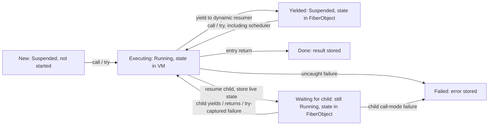

# Focused concurrency-control audit

Date: 2026-09-09 (Europe/Istanbul). Audited commit: `b84da68fededc4b9e5b6e4841f0e1cb74ffcf7ad`.

## Executive Findings

**The existing model is coherent for manually driven coroutines, but is not sound as a combined Fiber/Future/Scheduler control model.** Stack switching and terminal capture largely work; suspension reason, wake authority, and durable completion observation are missing at their composition boundaries.

1. **High — `Future.async` fulfills on suspension.** Its driver treats the first `action.try()` result as terminal. A pending `await` yields `None`, so the outer Future becomes `Some(None)` before its computation finishes. Later returns and failures do not repair it. [D1](AUD-CONCURRENCY-001-async-completion-observer.md)
2. **High — checking `isDone` alone loses completion observation.** The driver then exits without settling; the scheduler subsequently replaces the action's resumer and consumes its terminal outcome. The outer Future stays pending forever. A generator's post-`await` yield is likewise consumed by the pump. [Deep dive](#futureasync-deep-dive)
3. **High — wake authority is not enforced.** A Fiber parked in `await` can be resumed with `call`, `try`, or `schedule`. `await` does not recheck readiness after yielding. Old waiter registrations can resume execution through a different pending Future or a later coroutine yield. [D3](AUD-CONCURRENCY-003-waiter-wake-ownership.md)
4. **High — pending `then`, `map`, and `catch` repeat the async defect.** Their callback Fibers can suspend through ordinary block calls; all three prematurely fulfill with `None` and lose later results. `flatten` cannot recover an outcome it never receives. [D2](AUD-CONCURRENCY-002-continuation-suspension.md)
5. **High — duplicate/stale ready entries abort scheduler draining.** Enqueue accepts any Fiber state and duplicates; neither dequeue nor execution revalidates or skips stale entries. A terminal resume error aborts the pump before healthy later work executes. Both manual and automatic root-drive paths reproduce this. [D4](AUD-CONCURRENCY-004-stale-ready-queue.md)
6. **Medium — `Running` does not mean currently executing.** Resuming a child parks the caller without changing its status. A runtime probe observes two `Running` Fibers, one with parked frames and stack. This currently also prevents re-entering an active ancestor, so simply marking callers `Suspended` would be unsafe. [D5](AUD-CONCURRENCY-005-fiber-running-state.md)
7. **Medium — a fresh non-root Fiber reports `isRoot == true`.** The predicate tests absence of a resumer, which also describes every unstarted Fiber. The branch used by `await` on the *current* Fiber remains correct under the tested paths. [D6](AUD-CONCURRENCY-006-fiber-root-identity.md)
8. **Failure and native-boundary semantics need precise wording.** `call` causes linked terminal failure, not ordinary exception delivery at a call expression. Surrounding handlers cannot currently test the distinction by catching child failure because the resume itself is forbidden under their native frame. Conversely, ordinary `List.each` and stored block calls now permit suspension; older concurrency prose says otherwise.

No runtime implementation was changed. This report and its probes are audit artifacts, not regression fixes or workspace release certification.

**Stopped checkpoint:** the user requested a graceful stop to preserve the usage window. All reported observations and probe outputs are retained. The final documentation/link review and a full replay through the newly added convenience runner are incomplete; resume with those checks before further investigation. The individual probes and focused corpus were executed as recorded below.

## Actual Control Model

### State and ownership

Source anchors:

- [FiberObject fields and lifecycle](../../../phalcom-core/src/heap/fiber.rs)
- [store/load live state](../../../phalcom-core/src/primitive/fiber.rs#L30), [resume](../../../phalcom-core/src/primitive/fiber.rs#L387), [yield](../../../phalcom-core/src/primitive/fiber.rs#L485)
- [terminal capture and scheduler root drive](../../../phalcom-core/src/vm/dispatch.rs#L660), [delivery](../../../phalcom-core/src/vm/dispatch.rs#L938)
- [queue operations](../../../phalcom-core/src/primitive/system.rs#L51), [Future and manual pump](../../../phalcom-core/core/universe/src/concurrency/fiber.ph)



`W` is an actual ownership condition, **not an explicit enum variant**. There is no distinction in the stored status between a plain yield, a Future wait, and a ready-queued suspended Fiber. The ready queue and Future waiter lists can contain the same handle simultaneously.

### Transition ledger

Here `P` is the current caller, `F` the target, and `R = F.resumer`. Store/load moves `stack`, `frames`, `open_upvalues`, and invariant-check bookkeeping together. `resume_slot` is a stack truncation position, not a terminal-result channel.

| Operation | Validation and actual transition | Live/parked state and value destination |
|---|---|---|
| `Fiber.new(body)` | Body must be Block/Closure. Creates Suspended, `started=false`, `resumer=None`, default Call mode | Empty buffers, entry retained; no activation or delivery yet |
| First `P -> F.call/try(args)` | Native depth must be zero; target must be Suspended; entry arity checked before parking P | P records call receiver index as its resume slot, parks buffers **without status change**. F gets `resumer=P`, requested mode, fresh entry frame/arguments; F becomes current Running |
| Subsequent resume | Same native/status guard; uses saved activation | P parks at call slot; F's buffers load; F's saved yield slot is truncated/replaced with supplied value or None. F's resumer and mode are overwritten |
| `F.yield(value)` | Requires resumer and floor-depth match; Running -> Suspended | F records yield receiver index, parks buffers; R loads and becomes current Running; R's call/try slot receives value or None |
| F entry return | Non-root activation drains; Running -> Done | F.result stores return value. R loads; R's call/try slot receives that value. Entry/other references are not a completion subscription |
| F uncaught error, last mode Try | Running -> Failed | Close F's live upvalues, store captured error, clear failed parked execution state; R loads and receives error value at call/try slot |
| F uncaught error, last mode Call | F and each Call-linked ancestor become Failed | Close each ancestor's upvalues from its own parked stack before discarding it. Stop at a Try edge and deliver the same captured value to its resumer, or reach root and return host error |
| `Fiber.abort(e)` | Reject root; otherwise emits ordinary runtime Raise | Can be caught inside the current Fiber; uncaught case takes the same floor path as raise. It is not an unconditional terminal transition |
| Resume Running | Reject before ownership mutation | Includes self and active ancestors; invalid `try()` invocation is an error in the caller, not a captured target outcome |
| Resume Done/Failed | Reject before ownership mutation | `try` does not make an invalid resume valid; terminal execution cannot restart |
| `System.schedule(F)` | No state/duplicate/wait validation; returns F | Adds raw handle only; no immediate switch, no reservation, no resumer change until execution |
| Pump executes F | Pops handle, invokes `F.try()` | Pump's current Fiber becomes F's latest resumer, mode Try. No value supplied; F's yield receives None. Manual pump ignores F's yielded/terminal/error result |
| Root program ends | Root with no resumer drains ready queue | Synthetic receiver stack slot supplies ordinary resume convention; errors from invalid queue resumes return to host. Normal root finish leaves root Running, not Done |

`VM.current` uniquely identifies the executing Fiber; `FiberStatus::Running` does not. The current Fiber's buffers are empty on its heap object while VM buffers hold execution state. Waiting ancestors have real parked buffers despite their Running status. Non-root Done/Failed Fibers cannot resume. Root `yield`/`abort` are rejected; a child trying to resume root sees root as already Running. Root exhaustion is host lifecycle, not the non-root Done transition.

### Validation before mutation

The normal type, state, native-depth, and first-entry arity refusals happen before the caller's buffers move. Probe 12 verifies a bad first resume leaves the target usable with the correct argument. `push_frame()?` occurs after parking, but the first-entry branch has just emptied VM frames; its only refusal is the positive call-depth ceiling, so that path does not expose a reachable ordinary depth failure here ([push_frame](../../../phalcom-core/src/vm/api.rs#L242)). No additional corruption-on-validation defect was demonstrated.

### What `resumer` means

It is the **most recent dynamic coroutine caller**, assigned on every resume at `primitive/fiber.rs:445`, including scheduler `try` resumes. It simultaneously determines where yield, return, and failure go. There is no separately represented terminal observer or failure parent in FiberObject. Future has only `_state`, `_value`, `_waiters`; async's driver is a local, not a durable completion subscription.

Probe 01 executes A -> F -> A, B -> F -> B, C -> F -> C, using Call, Try, then Call. Every value reaches the most recent resumer; terminal Error-as-data remains success. A second sequence yields to one caller and fails under another caller's Try; only the latter receives the error. This behavior is coherent for coroutine calls. It does **not** preserve a previous logical owner across scheduler resumption.

The `result` field is written on terminal success/failure; `yield` delivers directly and does **not** update it, despite comments describing a last-yielded slot. Surface consumers can distinguish terminal success/failure with `isDone` and `error`, but have no public getter for a successful terminal Fiber result after the direct delivery was lost.

## Confirmed Correct Semantics

- Manual two-way coroutine transfer works: initial argument enters the entry; a subsequent argument becomes the previous yield expression's value; the next yield/return becomes the current call expression's value. Probe 01 also covers None and an identical Error object as ordinary data, with state inspected separately.
- `isDone` means Done **or Failed**; `error` is Some only for Failed. A yielded or returned Error does not become a failure because of its value class. `try` can return an Error as ordinary successful data or as captured failure; use lifecycle/error metadata, not the returned value's class.
- Terminal targets and Running targets cannot be resumed. First-entry arity refusal does not steal the caller's state. Probe 12 and the focused negative corpus cover these boundaries.
- An ordinarily parked Future waiter resumes after settlement, rereads the Future's value, continues, and completes (probe 04). Settlement itself does not run its Fiber immediately.
- Future settlement is at most once: readiness is changed before draining; later settlement calls are no-ops. Existing settle-once success and rejection fixtures pass. This invariant unfortunately preserves the *wrong first settlement* from async/continuation suspension.
- Uncaught explicit Error identity survives Call cascades and Try delivery. Probe 02 checks the exact original object in three failed Fibers and the returned value. Intermediate bytecode does not execute. The first Try boundary survives and continues.
- Floor failure closes live-origin and parked-ancestor upvalues before their stack storage is discarded. The focused corpus includes both floor-close regression fixtures; probe 02 additionally reads an escaped ancestor capture as `77` after cascading failure. Normal bytecode return closes upvalues before stack truncation ([dispatch](../../../phalcom-core/src/vm/dispatch.rs#L2077)). These are focused evidence, not a proof of every GC/capture interaction.
- Native switch guards refuse before changing Fiber ownership. The guarded-await case captures CannotYieldAcrossNativeFrame, terminates cleanly under Try, and its dead waiter is skipped on later settlement (probe 07).

### Failure cascade, precisely

| Invocation chain (root uses A.try) | Failed Fibers | Who receives error as value? | Intermediate continuation |
|---|---|---|---|
| A.call -> B.call -> C raises | C, B, A | root | Neither B nor A continues |
| A.call -> B.try -> C raises | C only | B | B and A can return normally |
| A.try -> B.call -> C raises | C, B | A | A continues; B does not |

Probe 02's first chain has two intermediate Call edges. Its other two sequences exercise capture at the inner edge and at an outer edge respectively. The mode belongs to the **callee's latest resume**, not the caller's entry instruction.

**Assessment: linked terminal failure of callers.** The floor loop explicitly marks ancestors Failed without restoring them to run normal handler lookup. The implementation comment's “as if raised at the call site” is too strong.

A normal `try { child.call() } catch ...` does not currently intercept a child failure: `block_on` drives the protected block through native `block_call`, and `fiber_resume` rejects the switch first. Probe 02 prints that guard error, executes ensure cleanup for the guard failure, confirms child remains uncompleted, then starts it successfully outside the handler. Consequently, this audit does not claim that an actually active ordinary ensure was skipped by child failure: the resume guard prevents that configuration. Floor cascade runs no ancestor bytecode/cleanup of its own. `Fiber.abort` *can* be caught within its Fiber (probe 02 returns 99 without Failed), so its stronger “abort at floor” interpretation is ambiguous.

## Confirmed Defects

Each finding follows the previous runtime audit format: classification, contract/implementation, executable failure scenario, actual versus expected behavior, root cause, local versus architectural scope, verification criteria, and evidence limitations.

| Finding | Severity / confidence | Confirmed defect |
| --- | --- | --- |
| [AUD-CONCURRENCY-001](AUD-CONCURRENCY-001-async-completion-observer.md) | High / executed | Incorrect early settlement and lost terminal observation |
| [AUD-CONCURRENCY-002](AUD-CONCURRENCY-002-continuation-suspension.md) | High / executed | Pending then/map/catch fulfill on callback suspension |
| [AUD-CONCURRENCY-003](AUD-CONCURRENCY-003-waiter-wake-ownership.md) | High / executed | Unauthorized wakes and stale registrations cross wait boundaries |
| [AUD-CONCURRENCY-004](AUD-CONCURRENCY-004-stale-ready-queue.md) | High / executed | Duplicate/stale entries abort unrelated scheduled work |
| [AUD-CONCURRENCY-005](AUD-CONCURRENCY-005-fiber-running-state.md) | Medium / executed | Executing and active-ancestor waiting share Running status |
| [AUD-CONCURRENCY-006](AUD-CONCURRENCY-006-fiber-root-identity.md) | Medium / executed | Unstarted non-root Fibers report isRoot |

## Ambiguous Semantics

1. **`call` as raise versus linked failure.** Source comments promise both. Live behavior is the linked terminal cascade described above; the current native handler restriction prevents normal catch-at-call composition. Preserve or change this only with an explicit semantic decision.
2. **`abort` strength.** It behaves as catchable Raise within the current Fiber, not an irrevocable abort. Root abort is disallowed. Decide whether the name/docs intend the actual behavior; do not invent cancellation semantics.
3. **Scheduled generator outcomes.** Pump results are intentionally unused for ordinary fire-and-forget tasks, but that convention loses user-visible generator values once await hands its Fiber to the scheduler. The current surface offers no separate “park without returning a generator element” mechanism. This is a demonstrated composition gap, not evidence that uncolored suspension is impossible.
4. **Root terminal status and result retention.** Normal root exhaustion leaves Running; root-drive can replace the host-returned value with a queued task outcome. Root lifetime across host entry points is not specified here. Non-root result is terminal-only despite last-yield comments.
5. **Native-boundary documentation.** [current concurrency chapter](../../../docs/spec/current/concurrency.md) still says ordinary each/map/reduce create native callback frames and contains contradictory pending-continuation status prose. Current [block gateway](../../../phalcom-core/src/primitive/block.rs#L138) uses `activate_function`; [Iterable.each](../../../phalcom-core/core/universe/src/collections/iterable.ph#L10) uses ordinary calls. Probe 07 confirms both `for` and List.each yield successfully, and List.each can await pending Futures. Actual `block_on`/`block_ensure` still call re-entrant `block_call` ([368](../../../phalcom-core/src/primitive/block.rs#L368), [448](../../../phalcom-core/src/primitive/block.rs#L448), [467](../../../phalcom-core/src/primitive/block.rs#L467)). Await or resume under those frames fails. A caught failed await has already registered a waiter; if the Fiber survives to another wait, the stale registration has D3's ownership problem. Dead-only filtering covers only terminal survivors.

This audit uses the live implementation as requested; the specification README establishes documentary authority but does not make outdated implementation descriptions into test evidence.

## `Future.async` Deep Dive

### End-to-end trace

[Probe 03 trace](evidence/probes/03-async.stderr) records driver #2 and action #3:

1. Root creates pending outer Future O and queues driver D. The action has not run.
2. Root's pump calls D.try, giving D resumer=root and mode=Try.
3. D creates action F and calls F.try. D's execution state parks at that expression; F has resumer=D, mode=Try.
4. F executes `a.await`. Pending a appends **F**, not D, to its waiter list. F yields None.
5. F becomes Suspended with its continuation parked inside await. D restores, receiving None as its try result. This was suspension, not entry completion.
6. F.error is None because F is not Failed. D fulfills O with None, then returns and becomes Done. The trace explicitly records D Done before F's later wakes.
7. a settles and schedules F. Root's pump calls F.try, overwriting F.resumer from D to root and supplying None to the saved yield expression.
8. F ignores that yield-expression value; await rereads a's stored value. F prints A and parks on b; its next yield returns to root's pump, which ignores it. Repeating for b/c does not recreate D or an observer for O.
9. F finally returns FINAL. The VM stores FINAL in F.result and delivers it to root's pump's try expression. The pump ignores it. O remains fulfilled with None. Late failure instead sets F Failed and delivers its captured Error to that same ignored try expression.

This is a deterministic single-threaded ownership loss, not a timing race or native-frame restriction.

### Would `if fib.isDone` fix it?

No. [09-guard-only.ph](evidence/probes/09-guard-only.ph) implements that proposed guard in an otherwise equivalent driver without changing production code. Its output is:

```text
false       # outer pending after first suspension
true        # driver already Done
action done # later action reaches its terminal path
false       # outer still pending
```

The guard fixes premature settlement but creates permanent non-settlement. There is no code waiting to execute the original test again. Scheduler resumption changes the dynamic resumer, and the scheduler cannot recover O from F: neither FiberObject nor the ready entry contains that association. Repeatedly calling F from D until it is Done would instead resume through pending awaits without authorization, reproducing D3.

### Where all outcomes go

| Phase | Current Fiber | Suspended continuation | Dynamic delivery destination | Outer Future |
|---|---|---|---|---|
| Before action runs | D | root's pump slot | D's eventual output -> root | pending |
| Action awaiting a | F, then D after yield | F.stack/frames at await's yield | None -> D's action.try slot | incorrectly fulfilled None |
| Action awaiting b/c after wake | F, then root | F at newest await | None -> root's pump slot | unchanged |
| Action terminal return | F, then root | no resumable action activation | FINAL -> root's pump slot; also F.result | unchanged |
| Action terminal failure | F, then root | failed execution discarded after closing captures | Error -> root's pump slot; also F.result/error | unchanged |

**Terminal completion ownership is not independently represented.** The dynamic resumer is a valid single handoff destination at each switch but is insufficient as a durable logical completion observer.

### Generator with await

[Probe 04](evidence/probes/04-waiter-generator.ph) implements yield(1), await pending Future, yield(x), terminal return:

- Consumer's first call receives 1.
- Its second call receives None from await's internal yield, with `isDone=false`; this is indistinguishable from an intentional yield(None) through the available lifecycle surface.
- Settlement schedules the same Fiber. Scheduler's try makes its own current Fiber the resumer.
- The Fiber reads 42 and yields it **to the pump**, not to the original consumer. Trace records `value=42` followed by a switch to root at `runScheduled`'s try slot; stdout never contains 42.
- The pump returns; Fiber remains Suspended at yield(42). A later consumer call replaces its resumer again and receives the terminal string. The element 42 is already lost to the consumer.

In this probe the pump and consumer happen to share root identity; the destination is still the wrong **continuation slot**. When a non-root pump drives the queue, its Fiber identity is also substituted. Distinguishing only resumer object identity would not solve the delivery problem.

### Inventory of production outcome consumers in scope

| Consumer | Checks lifecycle? | Assessment |
|---|---|---|
| Future.async driver `fib.try`, line 262 | error only | incorrect completion inference |
| Pending then/map/catch `fib.try`, lines 299/328/358 | error only | same defect |
| System.runScheduled `f.try`, line 60 | no; ignores outcome | adequate only for explicitly discarded task outcomes; loses resumed computation observations |
| Root Future.await pump `f.try`, line 242 | checks own Future readiness, not Fiber state | does not infer Fiber completion, but cannot repair lost settlement; invalid ready entry aborts it |
| VM root-drive `fiber_try`, dispatch line 702 | resume primitive validates; no subsequent completion subscription | raw task return/yield/error has no Future observer; stale invocation error escapes |
| Already-settled then/map/catch callback `.call` | no Fiber lifecycle check | ordinary Function call on same activation; can suspend through flat gateway; native guard applies where genuinely nested |
| `Future.flatten` | checks value is Future only | no Fiber outcome available; cannot distinguish yielded None from terminal None |

The ordinary callback calls inside the pending callback Fiber are Function calls, not another independent completion protocol. No additional production Fiber-call completion adapter was found in the scoped core library/native resume paths.

## Candidate Invariant Verdicts

| Candidate | Verdict and evidence |
|---|---|
| Exactly one Fiber is Running | **False as status** — probe 10; true only as unique VM.current execution |
| Running Fiber's live stack/frames belong to VM | **False if read for every Running status** — waiting ancestor stores them on FiberObject (10). True for VM.current |
| Parked state belongs to FiberObject | Supported on store/load paths and probe 10; includes waiting ancestors whose status is misleading |
| Done and Failed never resume | Supported by validation (12 and negative corpus) |
| Resume result is not necessarily terminal | Supported by None/Error yield and return (01) |
| Yielded value is not completion value | Supported at primitive layer (01); **violated by Future consumers** (03,08) |
| Awaiting does not imply completion | **Violated by async/continuation adapters** (03,08) |
| Future settles at most once | Supported by source and focused corpus; no liveness guarantee implied |
| Async settles only after terminal Done/Failed | **False** (03) |
| No concurrent or duplicate independent wake | No simultaneous execution demonstrated; **independent duplicate wake accepted** (05,06,11) |
| Suspended Fiber has one unambiguous wake authority | **False** (05) |
| Terminal completion has one unambiguous observer | Dynamic direct recipient exists; **logical async observer is lost** (03,09), generator continuation receives wrong outcome (04) |
| Changing resumer preserves logical completion owner | **False** (03,04,09) |
| Failure leaves no open captures into discarded stacks | Supported for live and parked cascade paths; probe 02 and both existing floor-upvalue fixtures |

Every falsified candidate is linked to an executable probe; no value sentinel is used as evidence of termination without lifecycle or trace context.

## Minimal Architectural Conclusions

1. A stop reason and terminal outcome must remain distinguishable at every adapter that turns a Fiber execution into a Future. `isDone`/`error` suffice to classify the just-observed stop, but not to ensure somebody observes a later stop.
2. Durable completion observation must survive changes to the coroutine resumer. The evidence requires an association/protocol, not necessarily a new VM object or a particular field layout. Any library solution must also observe uncaught terminal failure without placing suspension under a native catch frame.
3. Future parking and ready admission need a single coherent wake-ownership protocol. State validation, current-wait identity, and stale/duplicate handling must agree. Neither a bare Suspended state nor dead-only waiter filtering provides it.
4. An active ancestor must remain non-resumable while its child owns the call continuation, independently of whether its status is called Running. Repairing the state diagram must preserve this protection.
5. Coroutine yield delivery and scheduler parking cannot currently compose transparently. Choose and enforce a routing contract for generator-with-await before declaring that composition supported.

None of these findings requires TaskGroups, cancellation, an I/O reactor, threads, a new async syntax, or abandoning direct-style uncolored suspension.

## Recommended Next Work

1. Specify the minimal stop/completion and wake-ownership contracts using probes 03–06/08/09 as acceptance cases. Avoid shipping the isDone-only change as a complete fix.
2. Repair async and pending continuation terminal observation together; test late failure and multiple awaits, not only immediate returns.
3. Enforce wait validity and queue admission/execution rules together; preserve progress for healthy queued work after stale requests.
4. Separate active-child waiting from executing status, and make root identity explicit; retain self/ancestor re-entry rejection.
5. Resolve call/abort wording and document actual native boundaries. Add focused regression coverage for the chosen semantics, including escaped captures and generator result routing.

## Evidence and Reproduction

- Built current binary with `RUSTFLAGS='' RUSTC_WRAPPER='' cargo build -p phalcom-core --bin phalcom` using the pinned nightly. Build passed. An initial attempt named the CLI under phalcom-repl and was corrected; it did not build that target.
- `RUSTFLAGS='' RUSTC_WRAPPER='' cargo test -p phalcom-core --test language-corpus concurrency -- --nocapture` passed: **2 selected aggregate tests**, 63 filtered out. Both positive and negative concurrency groups ran. [Captured log](evidence/concurrency-corpus.log). Do not interpret this as only two individual language fixtures or as workspace certification.
- Standalone source probes retain `.stdout`, `.stderr`, and `.exit` alongside the source. Nonzero stale-queue exits are **confirmed reproductions**, not successful semantic behavior. Probes 03/04/09 include Fiber traces; timestamps are UTC on the preceding calendar date.
- Probe 10 uses an inspection primitive only in its standalone VM; production source is unchanged. Compile it with `rustup run nightly-2026-07-10 rustc --edition=2024 ... -L dependency=target/debug/deps --extern phalcom_core=<matching freshly built rlib> -o <temporary executable>`. Run that executable. Using the shell's unrelated default rustc initially produced a compiler-version mismatch; the explicit pinned compiler passed.
- [run-probes.py](evidence/run-probes.py) reruns the source probes with per-process timeouts and prints/optionally checks saved evidence. It does not rebuild the runtime or overwrite snapshots.
- At audit start, unrelated changes were `docs/spec/reflection/Untitled.md` and `examples/type-related.ph`; neither was edited. Concurrent work later also appeared in the docs workspace settings, a separate type-system audit, and semantic audit tests; it was left untouched. No commits, pushes, implementation patches, or delegated work were performed.
- This is a focused runtime audit. Workspace build/test/lint/release gates and a general exception/GC audit were not run.
