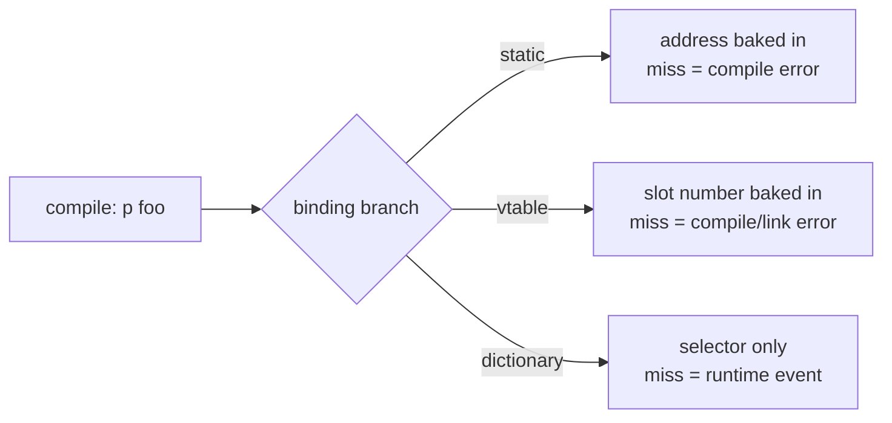
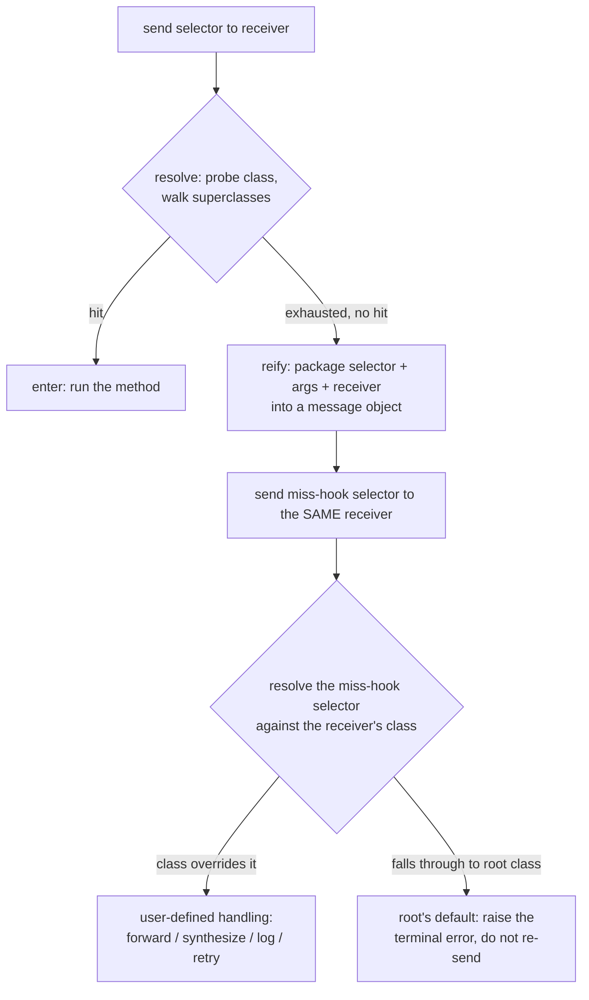

# Message send: selector-to-method binding

Source text says `p foo`. Somewhere between that text and the instructions the processor
executes, something decides *which code* runs when `foo` is asked of `p`. Call that decision
**selector-to-method binding**: the moment a name written at a call site gets tied to an actual
body of executable code. The question this document is about is not "what is dynamic dispatch" —
assume the reader has used it — but *when* that tie is made, *what* it is made against, and what
each answer buys and forecloses.

Name the axis precisely, because it gets blurred constantly: **binding time** (when is `foo` tied
to a method — at compile time, at class-load time, or at the moment of the send) is a different
question from **type-checking time** (when does the language verify the call is even sensible).
A language can be statically *typed* and still dynamically *dispatched* — Java checks at compile
time that some type in `p`'s hierarchy declares `foo`, then defers *which* override runs until
the object's runtime type is known. Conflating the two axes is the single most common confusion
in this territory; keep them separate throughout.

## The reframe: sending is not calling

The vocabulary "message send" instead of "method call" is not decoration. It is the founding
conceptual move of the branch of language design that takes binding latest, and it is worth
recovering why the distinction was drawn at all.

Alan Kay, designing Smalltalk at Xerox PARC in the early-to-mid 1970s, borrowed the metaphor from
biology, not from procedural programming: an object is like a cell, autonomous, with its own
internal state hidden behind a membrane, and the only way to interact with it is to send it a
signal and let *it* decide how to respond. **[flagged — moderate confidence]** Kay's own later
retrospectives (his often-quoted remark, paraphrased here rather than reproduced verbatim, that he
regretted popularizing the term "object" over "messaging" as the central idea) are widely cited
but I don't have the exact wording pinned down with high confidence; treat the substance — that
Kay considered message-passing, not object-bundling, the actual insight — as reliable, and any
specific quotation of his words as needing a citation check.

The formalization the field actually inherited is **Smalltalk-80**, documented in Goldberg and
Robson's 1983 "Blue Book," which is where terms like **selector** (the name identifying a message,
independent of any particular receiver or method), **method dictionary**, and
**`doesNotUnderstand:`** get their canonical shape. Smalltalk-80 is the direct ancestor of the
whole dynamic-dictionary branch discussed below; **[flagged — moderate confidence]** Simula 67 is
worth naming as an *earlier*, independent ancestor of dynamic dispatch generally — it introduced
virtual procedures, i.e., table-indexed dispatch — predating Smalltalk and influencing Kay's
thinking, but Simula's dispatch shape is closer to the vtable branch than the dictionary branch;
the two branches below have genuinely separate lineages, not one linear history.

The reframe itself: "calling a method" presumes the caller knows, at least in principle, what code
will execute — the caller is naming a piece of code. "Sending a message" presumes only that the
caller is naming *what it wants*, addressed to a receiver, and the receiver's class decides how —
or whether — to answer. That "whether" is not rhetorical. A message can go unanswered, and what
happens next is itself part of the design, not a crash the language apologizes for. Everything
that follows is really an elaboration of that one sentence.

## The coarse fork: three answers to "when"

Between `p foo` and running code sits a genuine three-way fork, and each branch has real,
non-strawman occupants. To understand why anyone would choose a slower, later-binding branch, the
earlier, faster branches have to be argued for honestly first.

### Static / early binding

The compiler resolves the call directly to a fixed code address (or, in a linked build, the linker
does), and the runtime never revisits the question. This is not a marginal case: it is how most
function calls in most software ever written are resolved — plain C function calls, non-virtual
C++ member functions, ordinary function calls in the overwhelming majority of languages.

The case for it is not merely "it's fast," though it is: a direct call is a single jump
instruction, with none of the indirection the other branches pay for. The deeper win is what
compilers can do *because* the target is known: a statically bound call can be inlined outright,
which means the compiler can see straight through the call boundary — constant-fold across it,
eliminate dead branches on the far side, keep values in registers instead of spilling them across
a call it can no longer prove is opaque. None of the other two branches offer this for free, because
in both of them the target genuinely isn't known until later, and a compiler cannot inline what it
cannot yet name.

The other, easily underrated win: because the target is resolved before the program exists as a
runnable artifact, a name that doesn't resolve is a **compile-time or link-time error** — the
program simply never becomes an executable that could exhibit the failure. An entire category of
failure (send to a name nothing implements) is retired before any user, tester, or production
system ever sees it.

What it forecloses, precisely: the target is frozen the instant it's chosen, with no reference at
all to what the program's data looks like at runtime. There is no language-level mechanism here
for a receiver's runtime identity to steer which code runs — no polymorphism through this
mechanism (C's function-pointer tables and tagged unions get you hand-rolled polymorphism, but
that's a different, user-built mechanism layered on top of static calls, not this branch doing the
work). And once the call site is compiled, it cannot be retargeted: there is no way to define the
referenced function later and have this call site notice.

### Vtable / offset binding

The compiler doesn't resolve to an address; it resolves to a **fixed slot number** within a table
whose *contents* vary per runtime class. Every polymorphic object carries (directly, or via a
class/type descriptor it points to) a pointer to its class's table — the **vtable** — and a call
compiles to "read the receiver's table pointer, index by the slot the compiler already picked,
call through whatever's there." C++ virtual member functions, the JVM's `invokevirtual`
instruction, and Go's interface method calls (via an **itable**) are the standing occupants.

This is the classic engineering answer to "I want real subtype polymorphism without paying a
lookup cost proportional to how big the class hierarchy is." The cost is one pointer chase plus
one array index — small, bounded at compile time, and predictable for the branch predictor and
cache in a way an open-ended search isn't. And it delivers genuine dispatch, not an illusion of
it: a `Shape*` that happens to point at a `Circle` calls `Circle::draw`; the same pointer type
pointing at a `Square` calls `Square::draw` — decided by which vtable the object's own header
points to, discovered at the moment of the call, not baked in by the caller. The *slot number* is
static; the *code sitting in that slot* is dynamic. That combination buys back nearly all of static
binding's speed while restoring the polymorphism static binding forecloses.

What it forecloses is the layout commitment underneath the speed: the number and order of virtual
slots for a class has to be fixed at the moment that class itself is compiled (or, in JIT'd hosts,
at class-load time — earlier than any individual call site actually needs an answer). Two
consequences follow directly. First, you cannot hand an already-compiled class a genuinely new
method from outside and have already-compiled callers find it: there is no slot to put it in, and
growing the table without breaking every subclass's downstream layout isn't generally possible.
Monkeypatching is foreclosed by the representation itself, not by a rule someone could relax.
Second — and this is the sharper cut relative to what comes next — a *miss*, a selector the class
genuinely does not implement, cannot happen at the vtable layer in its pure form at all, because
the compiler already proved the slot exists before it would let the call compile. The failure mode
this branch has instead is a **link error** (the slot exists, but the linker never found a body to
put there) or a **compile-time type error** (the static type in view has no such member) — neither
of which is something a *running* program observes and can respond to.

### Dynamic dictionary lookup

Compile only the **selector** — the name — at the call site. At send time, take the receiver's
actual runtime class, probe that class's own per-class **method dictionary** (a map from selector
to method body), and on a miss walk to the superclass and probe again, repeating until either a
hit or the chain runs out. Smalltalk, Objective-C, Ruby, and (with the caveats discussed under
CPython below) Python are the standing occupants.

This is the latest binding of the three: nothing is resolved until the exact instant of the send,
against the exact receiver in hand. The direct payoff is that a call site never commits to
anything beyond a question — which means a method can be defined, or redefined, on a class *after*
every caller of it has already been compiled, and every one of those callers — including the ones
compiled long before the (re)definition — picks up the new answer the next time they execute,
because none of them ever cached a commitment. The receiver's class decides not just *which* code
answers but *whether* any code answers at all, and a failure to answer is not the compiler's
problem to have caught in advance — it is a value that shows up at the receiver, at runtime, as an
ordinary further message the receiver's class can choose to handle. That reframes "no such method"
from an impossible state a type checker rules out in advance into a **first-class runtime event**,
interceptable by ordinary code the same way any other message is. This is the branch's real prize,
and it gets a full section below.

The bill is not subtle: a hash probe plus a possible walk up the superclass chain, on *every*
send, unless something intervenes. Naively implemented, that is not a rounding error against a
direct call or an indexed vtable load — it can be one to two orders of magnitude more expensive
per send. There's a second-order cost layered on top of the first: because the world this branch
describes really can change at runtime (new methods defined, existing ones redefined, hierarchies
edited), any shortcut that remembers "selector S means this method for this class" has to have a
story for what happens the instant that stops being true — an **invalidation** cost that only
exists because the binding really is this late. The standard industrial answer that brings this
branch's steady-state cost back down near the vtable branch's is the **monomorphic inline cache** —
named here only as vocabulary, not explained: it is an optimization layered *on top of* dictionary
dispatch, not a different point on this fork, and its mechanism belongs to a later document.

## Two programs that separate the branches

Theory about "when" is easiest to lose the thread of without something concrete to run. Two small
programs make the fork observable rather than definitional.

### Program 1 — define after the call site is compiled

```
class Greeter { }

let g = Greeter.new()
g.hello()                 // (A) compiled here — Greeter has no `hello` yet

// ... later, elsewhere, the class is reopened ...
class Greeter {
  hello() { print("hi") }
}

g.hello()                 // (B) same call shape as (A), compiled at the same time as (A)
```

Concretely, in Ruby (which permits reopening any class, including built-ins):

```ruby
class Greeter; end
g = Greeter.new
begin
  g.hello
rescue NoMethodError => e
  puts "miss: #{e.message}"
end

class Greeter
  def hello
    "hi"
  end
end

puts g.hello   # => "hi" — same object, same call shape, now answered
```

Under **dynamic dictionary lookup**, this is unremarkable: the call site never held anything but
the selector `hello`; each execution of `g.hello` re-asks the question against `Greeter`'s *current*
method dictionary. The first call misses because the dictionary is empty at that point in time; the
second hits because the class was reopened in between. The striking part isn't that this program
works — it's that **the same compiled call site**, executed twice, textually identical both times,
resolves differently depending only on *when* it ran relative to the redefinition. That is what
"late binding" cashes out to operationally: the binding event is not a single moment fixed by the
text, it is re-decided at every execution.

Under **vtable binding**, this program mostly doesn't parse as written: C++ and Java give a class
no syntax for "reopen this class and add a method after the fact" — a class's shape is closed once
compiled. Languages that simulate something like it (C# partial classes, extension methods, Swift
extensions) resolve the addition at *compile time*, folded into the same build that produces the
vtable — so they don't actually test late binding at all; they test whether the compiler saw the
addition before it finalized the layout, which is a different, weaker property.

Under **static binding**, the program is simply not expressible: there is no receiver-relative
notion of "class" available at the call site to reopen in the first place.

### Program 2 — the miss

```
let x = SomeObject.new()
x.thisSelectorDoesNotExist()
```

- **Static binding**: compile error. `thisSelectorDoesNotExist` names nothing the compiler can
  resolve to an address; the program never becomes a runnable artifact. There is no running
  program that "hits" this case — the miss is not a runtime concept in this branch at all.
- **Vtable binding**: in the pure, direct-call form, also a compile-time error — the static type of
  `x` has no such member, checked before the vtable is even consulted. The one door this branch
  opens to a *runtime* miss is reflection off to the side of the ordinary call path — e.g. Java's
  `getMethod("thisSelectorDoesNotExist")` throwing `NoSuchMethodException` at runtime — but that's
  a deliberately separate, slower API, not the `invokevirtual` path the compiler emits for an
  ordinary call.
- **Dynamic dictionary lookup**: this is the payoff case. The call *compiles cleanly* — the
  compiler had nothing to check, it only recorded a selector — and at send time the chain walk
  exhausts every superclass without a match. What happens next, in every member of this branch, is
  *not* a bare crash by default: the failure is caught by the dispatch mechanism itself and turned
  into one more ordinary message, addressed back to the original receiver, telling it explicitly
  what was asked and giving it one more chance to answer. That handoff is the subject of the next
  section, because it is the single highest-value idea this whole fork produces.



## Reification: the miss as a first-class object

Naming this precisely matters: **reification** means taking something that would otherwise be a
transient, internal event — here, a dictionary probe that came back empty — and turning it into
*data*: an ordinary object the running program can hold, inspect, pass around, and act on. The
canonical shape, from Smalltalk, is to package the entire failed send — selector, argument list,
and the original receiver — into a **`Message`** object, and dispatch *that* as the sole argument
of a second, ordinary send: `receiver doesNotUnderstand: aMessage`.

Every member of the dynamic-dictionary branch has a namesake for this hook, and the names are
themselves useful vocabulary:

- Smalltalk: **`doesNotUnderstand:`**, receiving a reified `Message`.
- Ruby: **`method_missing`**, receiving the selector as a symbol plus the argument list.
- Python: an `__getattr__`-family hook, discussed with a real subtlety under CPython below.
- Objective-C: a staged sequence culminating in **`forwardInvocation:`**, receiving a reified
  `NSInvocation` — the direct structural cousin of Smalltalk's `Message` object, in a
  statically-typed host language.

Why this is the fork's highest-value idea, not just a convenient error path: it means the dispatch
mechanism has **no privileged, inaccessible failure mode**. Every send — hit or miss — bottoms out
in another ordinary send. There is no separate error channel bolted onto the side of the dispatch
loop; the error channel *is* the message-send mechanism, applied to itself one more time. That
uniformity is what makes a whole family of runtime techniques possible with no special-case
machinery required from the language: a proxy object that implements no real methods except the
miss hook and forwards everything it receives to a wrapped object (used for lazy loading, stub
objects standing in for a not-yet-materialized remote object, and mocks in tests); on-the-fly
method synthesis, where a class fabricates behavior for selectors it never declared — Ruby's
`method_missing` is the standard vehicle for dynamic-name accessor patterns (e.g., `find_by_name`
style methods whose full name isn't known until the class or a config file is examined at load
time); and controlled degradation, where an otherwise-fatal typo becomes a caught, loggable event
in exploratory or REPL-driven development rather than a crash.

### The recursion hazard

The miss handler is itself invoked by an ordinary send — `receiver doesNotUnderstand: aMessage` is
dispatched by the exact same resolve-then-probe machinery that produced the original miss. So: what
happens if the receiver's class *also* has no implementation of the miss hook itself? Naively, that
looks like it should be a second miss, which would try to report *that* failure by sending the miss
hook again, and so on.

The way every member of this branch actually closes this off is structural, not a dynamic guard
bolted onto the dispatch loop: the miss hook is defined exactly once, near the root of the class
hierarchy — on the universal base class every class chain eventually reaches — with a default body
that does **not** attempt to re-send anything; it directly raises or signals the terminal failure
(in Smalltalk-derived image environments, historically by opening a debugger on the spot). Because
single inheritance guarantees every class chain terminates at that one root, and the root's
implementation is present by construction, the walk that resolves the miss-hook selector *itself*
is guaranteed to hit — it cannot itself miss, because it was placed at the one point in the
hierarchy every chain is guaranteed to pass through. The hazard is real in principle (an ordinary
message dispatched through the ordinary mechanism could in principle fail to resolve) and it's
closed by placement — guarantee the floor exists everywhere — rather than by adding a second kind
of dispatch reserved for misses-of-misses. **[flagged — moderate confidence]** Some concrete
implementations additionally layer a dynamic re-entrancy or depth guard as belt-and-suspenders
defense against bugs in this floor guarantee (e.g., a user accidentally shadowing the root
implementation with something broken); I don't have high confidence on which specific
implementations do this versus rely purely on the structural guarantee, so treat "the root class
is the load-bearing floor" as the reliable claim and "some runtimes also add a runtime check" as a
plausible but unverified addition.



## Mechanism: two decoupled moves

Worth separating explicitly, even though a single send usually runs them back-to-back with nothing
visible in between: **resolve** and **enter**.

**Resolve** is a pure question: given a selector and the receiver's runtime class, is there a
method, and if so, which one? Mechanically: probe the receiver's own class's method dictionary; on
a miss, move to its superclass and probe there; repeat until either a hit or the chain is
exhausted. **Enter** is what happens with a resolved method in hand: bind the arguments, transfer
control, eventually produce a value back to the sender.

Separating them matters because the interesting mechanism tends to live *at the seam*, not inside
either move. The miss-reification machinery above is exactly "what happens when resolve comes back
empty, before enter ever gets a method to run." A cache — flagged here only as a name, its
mechanism deferred — is a fast path that skips a *repeated* resolve when nothing about the
receiver's class has changed since the last time this same call site asked; it sits at the seam
between the two moves, not as a modification to either one on its own.

One structural fact about resolve's chain walk is worth pinning precisely because it explains a
piece of vocabulary the reader will meet elsewhere: in a **single-inheritance** world, every class
has exactly one parent, so the chain from any class to the root is a straight line, and "walk up"
has one unambiguous order with nothing further to decide. **Multiple inheritance** breaks that:
a class can have several immediate parents that themselves share a common ancestor (the classic
diamond), so "walk up" no longer names a single path, and something has to fix one consistent
total order before resolve can even begin — which is exactly why multiple-inheritance languages
need a linearization algorithm (an **MRO**, computed for Python via **C3 linearization**) to pin
that order down, a need a single-inheritance language simply does not have.

Two further, smaller places where "resolve" takes a parameter rather than being fixed to "the
receiver's own class" are worth naming without expanding, since each is its own topic elsewhere:
a `super` send is an ordinary send whose resolve step deliberately starts one level above the
*statically enclosing* class the sending method is defined in — not the receiver's dynamic class —
which is what lets an overriding method call the version it overrides without infinitely recursing
into itself. And in any runtime where the class itself is an object with its own method dictionary
(a metaclass), constructing an instance (`new`) can be resolved by the identical machine used for
every other selector, on the class-side dictionary rather than the instance-side one, with no
special case inside resolve for "this one is a constructor" — which is a small but telling
reinforcement of "everything here really is a selector."

## The finer fork: what goes into the dictionary key

Committing to a per-class method dictionary settles *when* binding happens but not *what identifies
an entry in it*. Two real answers exist, and the choice between them is a genuinely deliberated,
non-obvious design decision independent of the coarse fork above.

**Name plus arity.** The key is (method name, argument count) — e.g. a method named `move` taking
two arguments is one dictionary slot, full stop, regardless of what those two arguments are called
at the call site.

**Name plus the full label sequence.** The key is the complete surface shape of the message,
including every keyword/argument label — Smalltalk's actual selectors are literally strings like
`at:put:`, where the colons *are* the arity spelled out textually, and two messages with the same
name and the same argument count but different keyword labels are different selectors, full stop.

Why label-encoding earns real weight rather than being a cosmetic preference: consider
`move(to:, duration:)` versus `move(dx:, dy:)` — two operations that happen to share a name and an
argument count but mean genuinely different things (move to an absolute point over a duration,
versus move by a relative offset). Under arity-only keying these collide into one dictionary slot;
whichever definition compiles last silently wins, or the language has to forbid this pattern
outright — and this pattern is not exotic, it's the entire point of keyword-message syntax as a
readability device (`array insert: x at: 3` is meant to read like a sentence; the labels are meant
to carry meaning, not decoration). If the dictionary only keys on arity, the labels are parsed,
maybe displayed in error messages, but not *semantically load-bearing* — which undercuts the reason
keyword syntax exists at all. If the dictionary keys on the full label sequence, the labels *are*
part of a method's identity: two methods with the same name and arity but different labels are as
distinct in the dictionary as two methods with different names outright.

The sharpest payoff of label-encoding is its interaction with **overloading**. Statically-typed
languages with overloading (C++, Java) resolve an overloaded call with a dedicated compile-time
step: gather every method with a matching name, filter by argument count and (where applicable)
argument types, rank the candidates by an overload-resolution algorithm, and bake the winner into
the call site — a whole extra compiler phase, and the well-known source of ambiguous-call errors
and implicit-conversion tiebreak rules. If the selector *already* encodes the labels, there is no
separate resolution step to run at all: the parser already produced a different key for
`move(to:, duration:)` than for `move(dx:, dy:)`, so "pick the right overload" and "look up the
selector" collapse into the same single act, performed once, with no ranking or ambiguity
machinery required anywhere. The cost moves rather than disappears: it shifts from a compile-time
resolution *algorithm* to a design *discipline* — the language now has to make label sequences part
of a method's identity everywhere a selector is produced or matched (declaration, call site,
reflective lookup, `respond_to?`-style introspection), and any place in that pipeline that gets the
encoding wrong — declaring one selector shape while calling with a differently-labeled one, or two
independent code paths building "the same" textual selector in subtly different ways (extra
whitespace, a dropped colon, an off-by-one on which argument position a label belongs to) — becomes
a silent dictionary miss or a silent collision rather than a compile error, precisely because this
branch, by design, no longer has a forgiving second pass to catch a near-miss the way overload
resolution's ranking step would.

The corresponding cost on the other side: arity-only keying is simpler — no label parsing feeds
into the key, dictionaries are plain (name, count) maps — but it either forecloses the
keyword-overloaded style of API entirely, or it forces whoever names methods to fold the
distinction into the name string itself (`moveTo:duration:` as one conventionally-punctuated
identifier rather than a message with independently-meaningful labels) — which is exactly what
full selector strings already are. That observation reframes the fork slightly: the real question
underneath "arity vs. labels" is not whether the distinguishing information exists — it has to,
either way, or `move(to:,duration:)` and `move(dx:,dy:)` truly cannot coexist — but whether the
*key itself* is structured enough to carry it, or whether a flat name string has to carry it by
convention alone.

## Tempting comparisons, argued rather than tabulated

A language earns a place here only if it took a different branch with a real bill attached, carries
a genuine scar, names something the theory above otherwise has to describe anonymously, or is a
direct ancestor. That filter cuts hard; the survivors are worth going deep on rather than skimming
a dozen languages one line each.

### Smalltalk — the ancestor

Already threaded through the sections above: **selector**, **method dictionary**,
**`doesNotUnderstand:`**, and the reified **`Message`** all get their names here. One more piece of
vocabulary worth surfacing explicitly: **`perform:`** (and its arity-suffixed siblings,
`perform:with:`, `perform:with:with:`) — a regular method that takes a selector *as data* and
performs exactly the send the compiler would otherwise have emitted for that selector written
literally at a call site. That perform: is expressible as an ordinary method at all is itself
evidence for how uniformly "send" is treated in this lineage: if sending really is nothing more
than resolve-then-enter against a selector, then exposing "do a send" as a callable operation taking
the selector as a first-class value is not a special case, it's just calling the mechanism directly
instead of going through the compiler's shorthand for it.

Even primitive arithmetic is, in the pure semantic model, an ordinary send — `3 + 4` really is "send
the selector `+` to `3` with argument `4`," dispatched exactly like any user-defined message.
**[flagged — moderate confidence]** Production Smalltalk virtual machines special-case small-integer
arithmetic as VM primitives specifically because paying a full dictionary walk on every arithmetic
operation would be unacceptable; the exact primitive-numbering and fallback mechanics differ across
Smalltalk-80, Squeak, and Pharo implementations, and I don't have high confidence pinning down any
one of those without a citation — treat "arithmetic is a performance-motivated shortcut layered on
top of the same conceptual model" as the reliable claim.

### Objective-C — the send made literal

The sharpest concrete artifact in this whole design space: every message send the Objective-C
compiler emits compiles to a call to one actual C function, **`objc_msgSend`** (plus a handful of
ABI-specialized siblings for struct- and float-returning sends, `objc_msgSend_stret` and
`objc_msgSend_fpret`). The signature is, in essence, `id objc_msgSend(id self, SEL op, ...)` —
receiver, selector, and the rest of the arguments, exactly what resolve-then-enter needs and
nothing more. This is worth dwelling on because it collapses "sending a message" from an
abstraction the reader has to take on faith into the plainest possible artifact: a function you
could, and people occasionally do, call yourself. Note also that the selector here (`SEL`) is not a
plain C string but an interned type, chosen specifically so that comparing two selectors for
equality — the operation the dictionary probe needs constantly — is a pointer comparison, not a
string comparison.

`objc_msgSend` does the real work: consult the receiver's class's method cache (a fast path keyed
on recently-resolved selectors — **[flagged — moderate confidence]** on the exact cache structure
without a source to check), fall back to the class's full method list on a cache miss, walk the
superclass chain if still unresolved, and on a hit, tail-call the found **`IMP`** — the raw C
function pointer that is the actual implementation, keyed by selector, the direct analogue of a
dictionary "value."

Message forwarding is the miss path, and because Objective-C is hosted inside a statically-typed C
superset, the miss story is two-layered. Sent through a statically-typed pointer whose declared
interface has no such method, the *compiler* historically only warns — reflecting that the
underlying dispatch really is dynamic and the static check is advisory, not load-bearing.
**[flagged — moderate confidence]** whether this is a warning or a hard error has shifted across
compiler versions and flags; don't take a specific claim here as current without checking. Sent
through `id` — Objective-C's untyped object reference — there is no compile-time check at all, and
the runtime gives an unresolved selector a staged escalation before giving up: first
`+resolveInstanceMethod:` (a chance to install an `IMP` lazily, on first use), then
`-forwardingTargetForSelector:` (a cheap chance to name an *entirely different object* that should
receive this message instead), and only then the full `-forwardInvocation:` path, which receives a
reified **`NSInvocation`** object — encoding the selector, the arguments, and a slot to set the
return value into — the direct structural cousin of Smalltalk's `Message`, adapted to a
statically-typed host. Only after all of that is exhausted does the runtime call
`-doesNotRecognizeSelector:`, whose default terminates the program with the familiar
`"unrecognized selector sent to instance …"` crash.

The scar: this staged fallback is exactly what makes `NSProxy`-style distributed objects and mocking
frameworks possible, but the same staging is a widely-felt performance and complexity cost — the
*slow* path here (cache miss → method list → superclass walk → resolve hooks → forwarding target →
full invocation forwarding → crash) is genuinely slow, and easy to hit by accident in code that
relies on forwarding for legitimate reasons. One adjacent, orthogonal quirk worth a single sentence
rather than a derailment: sending any message to `nil` in Objective-C is *defined* to silently
return zero/nil rather than crash or forward — a deliberate, separate design choice, not a
consequence of the dispatch mechanism itself.

### C++ virtual — the vtable branch, made concrete

The general vtable bill above, given its standing occupant's actual shape: a polymorphic class gets
a compiler-synthesized array of function pointers (the vtable); a polymorphic object carries a
hidden pointer to its class's table, set by the constructor; a virtual call compiles to
`obj->vptr[fixed_slot](obj, args...)`.

The monkeypatch bill, made concrete, is also the seed of the **fragile base class problem**: you
cannot add a virtual method to `class Shape` after a separately-compiled `class Circle : Shape` has
already shipped as a linked library, without recompiling every translation unit that embedded an
assumption about `Shape`'s vtable layout — and *reordering or inserting* a virtual method in the
base class shifts every subsequent slot index, silently breaking any independently-compiled
subclass or caller built against the old layout. In practice this is mostly managed by discipline
("don't touch a shipped virtual interface") rather than a language guarantee against it.

The miss-is-a-link-error contrast is worth stating precisely because this branch actually has *three*
distinguishable failure stages where the other two branches mostly need one or none: calling a
member that doesn't exist on the static type is a **compile-time** error (name lookup against the
declared type fails); declaring a virtual method but never providing a body anywhere in the linked
program is a **link-time** error (the slot exists, nothing filled an address into it); and a genuine
**runtime** miss — a selector arriving that the receiver's actual class simply doesn't have — is,
in the pure direct-call form, not reachable at all, because the compiler already proved it would be
there before it would let the call compile.

### Ruby — open classes and their bill

`method_missing` is Ruby's namesake for the miss hook, structurally identical to Smalltalk's
`doesNotUnderstand:`: the default implementation on `BasicObject` raises `NoMethodError`, and
overriding it is the standard mechanism behind dynamic-attribute objects (`OpenStruct`), internal
DSLs, and dynamic-finder-style APIs (e.g., the pattern of synthesizing `find_by_<column>` methods
whose exact names aren't known until a schema is inspected at load time).

A real, well-known correctness trap rides along with it: **`respond_to?`** answers introspective
questions ("does this object handle selector `foo`?") by consulting the *actual* method dictionary,
which knows nothing about selectors an object only answers via `method_missing`. Any class that
overrides `method_missing` without also overriding **`respond_to_missing?`** will report `false` to
`respond_to?(:foo)` for a selector it demonstrably handles when called directly — which silently
breaks anything downstream that relies on introspection rather than direct calls (duck-typing
checks, some serializers, some object-relational mapping layers). **[flagged — moderate confidence]**
This is a widely documented Ruby gotcha in the general literature and community knowledge; I don't
have a specific citation or incident to point at, so treat the mechanism as reliable and "widely
known" as a characterization rather than a sourced fact.

The reason open classes carry the invalidation cost named earlier as the dictionary branch's
second-order bill: in Ruby, *any* class — including built-ins like `Integer`, `String`, and
`Array` — can be reopened and modified at any point during execution. Anything that speculatively
remembers "selector S resolves to method M for this class" has to have an answer for what happens
the instant the class is reopened out from under it; a language that forbade reopening classes
after their initial definition simply wouldn't have this problem, which is the direct link between
"open classes" as a language feature and "cache invalidation" as a mandatory cost, not an optional
optimization detail.

### CPython — MRO and a real subtlety

Python supports multiple inheritance, so `class D(B, C)` where both `B` and `C` derive from a
common `A` produces the diamond shape referenced above in the single-sentence form; CPython
resolves it with **C3 linearization** (adopted for Python's MRO computation starting around
**[flagged — moderate confidence]** Python 2.3), which computes one single, deterministic
resolution order for `D` honoring both local precedence and monotonicity, so attribute lookup walks
one fixed list rather than an ambiguous graph.

A genuine subtlety worth a precise paragraph rather than a passing mention: **`__getattribute__`**
is invoked for *every* attribute access on the object — it is the actual, always-run entry point of
Python's attribute machinery — and overriding it without care is dangerous precisely because it sits
in the path of *everything*, including the object's own internal bookkeeping. **`__getattr__`**, by
contrast, is only ever invoked by the default `__getattribute__` implementation as a fallback,
*after* the normal lookup path (instance `__dict__`, then the class's MRO) has already come up
empty — which makes `__getattr__` Python's actual miss-hook, shaped exactly like `method_missing`
or `doesNotUnderstand:`: cheap to add, safe by default, and only invoked on a genuine miss.
Confusing the two — overriding `__getattribute__` when a plain miss-only hook was intended — is the
recurring bug shape. Worth one scope note alongside this: Python's attribute lookup covers both
methods and plain data attributes through the same uniform path, which is broader than the pure
"selector send" model this document otherwise assumes; the miss-hook shape carries over intact, but
the surrounding machinery is doing more than dispatch alone.

### Wren — a lineage note, kept short

Worth naming briefly as a small, readable example of the finer fork rather than a large production
system taken on faith: Wren, a compact class-based embeddable scripting language, keys its dispatch
on the full method signature — name, arity, and (for keyword-shaped calls) the argument layout —
putting it concretely on the label-encoded side of the finer fork discussed above, in an
implementation small enough to read start to finish. **[flagged — moderate confidence]** on the
precise encoding details without a source in front of me; treat this as a pointer to a real,
checkable example rather than a claim about its exact mechanics.

### The cut list, argued

**Java** is cut deliberately rather than covered as a sixth vtable example. Mechanically,
`invokevirtual` is the same story as C++ virtual dispatch — a fixed slot, resolved by the JVM
verifier at class-load/link time, no dictionary walk on the hot path — and covering both at equal
depth would be redundant rather than additive; it doesn't occupy a new *position* in the design
space. The one thing that earns Java a single sentence rather than nothing: **`invokedynamic`**
(added in Java 7, expanded to carry lambdas in Java 8) is a genuinely different call-site shape — a
call site that starts unlinked and is bound at first execution by a bootstrap method the language
implementer supplies, closer in spirit to the late-binding branch than to `invokevirtual` — but
because it's a special-purpose escape hatch layered onto an otherwise-static-dispatch language
rather than that language's default answer to "how do calls resolve," it doesn't move Java on the
coarse fork and doesn't earn more room than this note.

**JavaScript's prototype chain** is also cut, on a sharper argument than "it's just another chain
walk with different vocabulary." Class-based dictionary dispatch keeps the receiver and the thing
that owns the method dictionary — the receiver's *class*, a distinct object — separate; a miss
walks a chain of *classes*. JavaScript's prototype chain instead makes the receiver's own prototype
object (or an object standing in for "what this shape of object shares") the very first link in the
same chain being walked for lookup — there is no separate class object with its own dictionary in
the classical sense, and even post-ES6 `class` syntax is sugar compiled down to prototype-object
wiring underneath. Superficially the two look alike — both walk a chain, probe a table, stop on
first hit or exhaust and fail — but they answer a structurally different question about *what kind
of thing owns behavior*, and folding JS's model into "dictionary dispatch with different names"
would understate a real difference: prototypal delegation supports per-object method overrides and
dynamically re-parenting a single object's prototype at runtime in ways that don't map cleanly onto
"give this class a different superclass." Covering it shallowly here would risk teaching a wrong
generalization; cutting it cleanly and naming the reason is more honest than a token paragraph.
