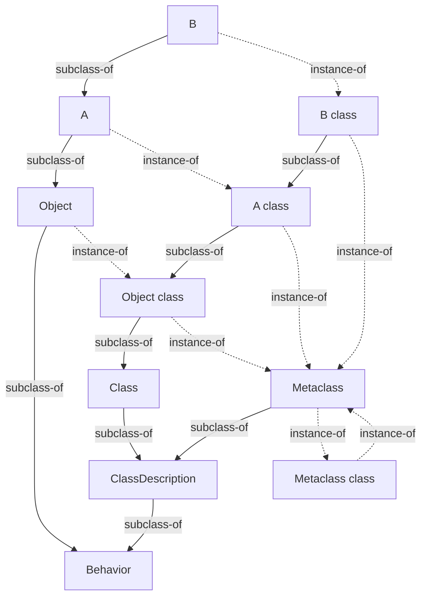

# The Metaclass Tower

In a system that means "everything is an object" literally, every object has a class, and a
class is an object. Those two clauses, held at once, produce a sentence that writes itself
before you've decided whether you want it: *a class has a class*. That class is, in turn, an
object, so it has a class too. Ask "what is the class of the class of the class of `Integer`?"
and nothing in the sentence tells you where to stop asking. This is the **metaclass regress** —
sometimes called, with the right amount of irritation, "turtles all the way down," after the
old (probably apocryphal, variously attributed) cosmological joke about a world resting on a
turtle resting on a turtle. The name is worth keeping, because it names the right thing: not a
bug, not an oversight, but a *question that regenerates itself* the moment you accept the two
premises above.

Two questions live inside that one uneasy feeling, and almost every confused first encounter
with metaclasses is a failure to keep them apart:

1. **Why does a metaclass need to exist at all?** — what problem is it solving, what would break
   without it.
2. **How does the regress terminate** — how a real implementation avoids either (a) an
   infinite chain of distinct objects in memory, or (b) quietly lying about premise one to make
   the question go away.

These have different answers, argued by different means (one is a dispatch argument, the other
is a graph-and-construction argument), and a design can get the first right while botching the
second, or vice versa. The rest of this document answers them in order, then spends real time on
the part that's usually skipped: not just that the regress terminates, but how you *build* the
terminating structure when every object in it needs every other object to already exist.

## Notation: two arrows, not one

Before going further, two relationships need names that don't collide, because the entire
subject is a story about keeping them distinct.

- **`Super(X)`** — the superclass of class `X`. Call this the **subclass-of** arrow. It runs
  between classes only, and it's what "inherits from" means colloquially: `X`'s instances get
  everything `Super(X)`'s instances get, plus whatever `X` adds or overrides.
- **`Class(o)`** — the class of object `o`. Call this the **instance-of** arrow. It runs from
  *any* object to *the* object that classifies it, and it applies uniformly — `Class(3)` is
  `Integer`, and if classes are themselves objects, `Class(Integer)` is something too.

When the argument to `Class(·)` happens to be a class, the result is traditionally given its own
name — the **metaclass** of that class — and this document will write `Meta(X)` as shorthand for
`Class(X)` in exactly that case, purely as a reading aid. It is not a different operation. That
sameness is the entire point of a "class is an object" system: there is one function that answers
"what is your class," and it doesn't need to know in advance whether its argument is a number, a
string, or a class.

Picture the two arrows as different line styles — solid for subclass-of, dashed for
instance-of — because that convention will carry the diagrams later in this document, and because
the single most common way to get confused about metaclasses is to let the two arrows blur into
one mental "is-a" line. They don't blur. `Integer`'s subclass-of arrow points at `Number`
(or whatever its ordinary superclass is); `Integer`'s instance-of arrow points at its metaclass.
Those are two different objects, reached by two different questions, and conflating them is
precisely the failure mode this notation exists to prevent. (Readers who like category theory may
notice the shape of a commuting square coming — hold that thought; it will pay off in the
mechanism section, but the analogy won't be pushed further than "the shape rhymes.")

## Why a metaclass has to exist

Start from a class `X` with a method dictionary — the table that says what `X`'s *instances*
respond to. Now suppose the language wants `X` itself, as a receiver, to respond to some
class-side message: a factory method, a class-level counter, a "how many of me exist" query,
whatever a language calls `static` or "class method." Where does *that* method dictionary live?

It cannot be `X`'s own instance method dictionary — that one is already spoken for; it describes
`X`'s instances, not `X`. It has to be some other table, reached by asking "what defines what `X`
itself responds to" — and the only uniform way to ask that question in an everything-is-an-object
system is the same one you'd ask of any other object: `Class(X)`.

That forces a decision. Either `Class(X)` is some generic, shared thing that every class points
at alike (in which case there is nowhere to hang a table that differs from one class to the
next), or `Class(X)` is a genuine, *per-class* object — one that itself has a method dictionary
and, if you want inheritance to work the way it does everywhere else in the language, its own
superclass link. The moment you choose the second option, you have manufactured a new
first-class object whose entire job is to hold `X`'s class-side behavior and its place in a
class-side hierarchy. That object is the **metaclass** of `X`.

And here is the regress, arriving not as a decision but as a *corollary*: the metaclass you just
built is, by the same "everything is an object" premise, an object — so it too has a class. You
did not choose to keep going; you chose "classes are objects" and "class-side methods dispatch
the same way instance methods do," and the infinite question is what those two choices entail
when applied to their own output, repeatedly. The regress is a property of the *question*, not
evidence of a flaw in the design. Whether it is a property of *memory* is a separate matter,
answered later.

**Predict, then check.** Before reading on: you have some class `Number` with an ordinary
instance method `+`. Now imagine `Number` also has a class-side method, `Number zero` say,
returning the additive identity — a method sent *to the class itself*, not to an instance. Where
does the code for `Number zero` live, and what kind of thing is *that* place? If your answer was
"some other object, itself a class, whose instances-in-spirit are exactly the class-side
protocols" — you have just independently derived the metaclass. If your answer was "a special
slot on `Number` itself, resolved by name rather than by sending a message to an object" — you
have just independently derived the branch that rejects metaclasses. Both answers are coherent
engineering positions. The next section makes the trade-off between them concrete.

## Walking the design space

Four positions occupy this space, and each was chosen by real, serious language designers for
real reasons. Before dismissing any of them, it's worth granting the reasons.

**No metaclass — class-side entries just live on the class object.** This is Java's `static` and
C++'s `static` member functions, and it is, honestly, the easiest thing to build and the easiest
thing to teach. A class in this model is a single, simple object (or, in C++, not even
fully an object at runtime): a name, a table of instance methods, a table of *class* methods
sitting right next to it with no further structure. No second tower to model, no question of
what the class of a class even is, no bootstrap problem — because nothing needs to close a loop
that was never opened. For decades this was more than enough for the overwhelming majority of
object-oriented code ever written. It costs almost nothing at runtime: a static call can often be
resolved and even inlined at compile time, because there is no dynamic receiver to consult.

**One shared metaclass for every class.** This is subtler and more tempting than it looks: keep
"classes are objects" (so `Class(X)` is a real, inspectable thing, unlike branch one), but let
every class share the *same* one — call it `Class`. `Number.class` and `String.class` are both
literally the identical object. This preserves uniform object-ness at almost no structural cost:
one extra kind of object in the whole system, not one per class. Something close to this is how
Smalltalk's own earliest incarnations reportedly modeled classes before the fully symmetric tower
was worked out **[flagged — medium confidence; the exact metaclass story of Smalltalk-72 and
Smalltalk-76 relative to Smalltalk-80 is something I recall imprecisely and would want to verify
against a primary source before asserting further]**, and it is close to how Ruby *feels* from
the outside — most Ruby code is written for years without anyone needing to know the word
"eigenclass."

**Parallel metaclass per class — the tower.** Every class `X` gets its own distinct `Meta(X)`,
and the metaclass hierarchy is kept in lockstep with the class hierarchy by a rule given precise
form in the next section. This is more machinery than either branch above: a second hierarchy
to maintain, a regress that needs an actual termination story, and — as the deep dive below will
insist on — a real construction-order problem to solve at bootstrap. What it buys back is
covered in the next two sections, and it is not a small thing: class-side methods that
genuinely *inherit*, override, and re-dispatch by the same rules as everything else in the
language, with zero special-casing anywhere in the dispatch algorithm.

**No classes at all.** Prototype-based systems (JavaScript's original object model, Self)
dissolve the question rather than answer it — objects delegate directly to other objects, there
is no separate "class" kind of thing to need a class of its own, so there is no regress to close.
Cut here to one sentence deliberately: it is a genuinely different object model, not a fourth
answer to this question, and pursuing it would mean writing a different document.

### The decisive question

The branch that separates "no metaclass" and "one shared metaclass" from "the tower" is a single,
sharp question: **when a subclass inherits a class-side method whose body sends a message to
itself, does that internal self-send re-dispatch to the subclass's own override, or does it stay
pinned to wherever the method was textually defined?**

Under the tower, the answer is yes, it re-dispatches — because the metaclass that receives the
self-send is a first-class object with its own place in a hierarchy, and ordinary polymorphic
dispatch doesn't know or care that the receiver happens to be a class. Under "no metaclass" and
under "one shared metaclass," the answer is no, or at best "sort of, with caveats," because there
is either no per-class object to carry an override (branch one) or exactly one shared object that
cannot hold two different answers to the same question for two different classes at once (branch
two, without resorting to hand-rolled, special-cased lookup logic that starts to reinvent the
tower badly and without its uniformity). The next section makes this concrete enough to run.

## The distinguishing program

Take a base class `Shape` with a class-side factory `make`, and a class-side hook `defaultColor`
that `make` consults. A subclass `Circle` overrides only `defaultColor`, never touching `make`.

**Predict, then check.** What does `Circle make` produce — a shape whose color came from
`Shape`'s `defaultColor`, or from `Circle`'s?

Pseudocode, written receiver-first the way message-passing systems read:

```
class-side Shape:
    method make:
        return new self with color: (self defaultColor)
    method defaultColor:
        return "black"

class-side Circle extends Shape:
    method defaultColor:
        return "red"
    # note: Circle does NOT redefine make
```

**In a tower system (Smalltalk-flavored):**

```smalltalk
Shape class >> make
    ^ self new setColor: self defaultColor

Shape class >> defaultColor
    ^ #black

Circle class >> defaultColor
    ^ #red

Shape make.   "a black Shape"
Circle make.  "a RED Circle"
```

Walk the mechanics: `Circle make` sends `make` to the class object `Circle`. Lookup starts at
`Circle`'s metaclass, doesn't find `make` there, follows the metaclass's superclass link (which,
per the parallel rule below, is `Shape`'s metaclass), finds `make` there, and runs its body — but
crucially, `self` inside that body is bound to the *original receiver*, `Circle`, not to `Shape`.
Method lookup decides which code runs; it never changes who `self` is. So `self defaultColor`
inside the inherited `make` sends `defaultColor` to `Circle`, lookup starts at `Circle`'s
metaclass *again*, and this time it finds `Circle`'s own override immediately, without ever
reaching `Shape`'s. One inherited method body, two different outcomes, purely because the
internal self-send is a real, receiver-driven dispatch — exactly the same rule that makes
ordinary instance-side polymorphism work, applied a level up.

**In the no-metaclass branch (Java):**

```java
class Shape {
    static String defaultColor() { return "black"; }
    static Shape make() { return new Shape(defaultColor()); }
}

class Circle extends Shape {
    static String defaultColor() { return "red"; }  // hides Shape's, does not override it
}

Shape.make();   // a black Shape — expected
Circle.make();  // ALSO a black Shape — not a red Circle
```

`Circle.make()` compiles and runs; static methods *are* inherited in the sense that a subclass
can be used to invoke a static method it never redeclared. But the unqualified `defaultColor()`
call inside `make()`'s body is resolved once, at compile time, against the class where `make` is
*textually written* — `Shape` — because a `static` call has no receiver object for the runtime to
consult. There is no `self` to be `Circle` instead of `Shape`; there is only ever the
lexically-enclosing class. This is precisely the well-known Java trap usually phrased as "static
methods are hidden, not overridden" — declaring `static void foo()` again in a subclass does not
place an entry in some polymorphic table that instance methods use; it merely makes a second,
unrelated method that happens to share a name, chosen by the *compile-time* type of whatever
expression you called it through. `((Shape) new Circle()).someStaticMethod()` and
`new Circle().someStaticMethod()` can print different things for exactly this reason, and it
regularly surprises programmers who have correctly internalized that *instance* methods don't
work that way.

That gap — "inherited by name" versus "inherited as real dispatch" — is the entire weight of the
decisive question, made concrete enough to run in an interpreter.

## The mechanism

### The parallel rule

The tower's defining equation, holding for every class `X` other than the root:

```
Super(Meta(X)) = Meta(Super(X))
```

In words: the superclass of `X`'s metaclass is the metaclass of `X`'s superclass. The metaclass
hierarchy is not an independent structure that happens to resemble the class hierarchy — it is
*forced* into lockstep with it, one level up, by this single rule.

This is exactly what makes the distinguishing program come out the way it does. Method lookup for
a class-side send walks `Super(Meta(·))` repeatedly. The parallel rule guarantees that this walk
visits `Meta(Shape)`, then `Meta(Object)`, in *exactly* the order that an ordinary instance-side
lookup on a `Circle` instance would visit `Circle`, `Shape`, `Object` — shifted up one level. If
`B` is a subclass of `A` on the instance side, `Meta(B)` is *guaranteed* to be a subclass of
`Meta(A)` on the metaclass side, automatically, with no separate bookkeeping. Break this
equation — give metaclasses some other, unrelated assignment of superclasses — and class-side
inheritance stops corresponding to the instance-side hierarchy shape a reader already understands;
you'd need a second, independently-maintained hierarchy that could drift out of sync with the
first. The parallel rule is what prevents that drift by construction.

### Termination

The regress needs a bottom, and "bottom" here does not mean "the chain stops being askable" — the
question `Meta(Meta(Meta(...)))` remains askable forever — it means the *answers* stop being new
objects. Two structural facts do this:

**The root closes the metaclass chain into the ordinary hierarchy.** The class hierarchy has a
root — call it `Object` — whose own superclass is undefined (often represented as "none," never
as a further class to climb past). The parallel rule can't be applied at this exact point (there
is no `Super(Object)` to take the metaclass of), so a real implementation defines the join
directly: `Super(Meta(Object))` is set, by fiat, to some already-existing class near the root of
the *ordinary* hierarchy — canonically, in the Smalltalk-80 kernel, the class named `Class`. Walk
upward from any class's metaclass for long enough and you fall back into the ordinary hierarchy
instead of climbing a second, ever-taller one.

**Some metaclass is an instance of itself, or of something that loops straight back.** Since every
metaclass is, in turn, an ordinary object and needs a class of its own, and since the whole point
was to avoid manufacturing infinitely many distinct objects, *some* object in the tower must
answer `Class(·)` with an object already in the set — ultimately, with itself. In canonical
Smalltalk-80, the kernel introduces a class called `Metaclass`, defined so that **every metaclass,
for every class in the system, is an instance of `Metaclass`** — `Class(Meta(X)) = Metaclass` for
all `X`. That includes `Metaclass` itself, which is a class like any other and therefore has its
own metaclass, conventionally written `Metaclass class`. That object, being itself a metaclass (it
*is* "the metaclass of a class"), is — by the same universal rule — an instance of `Metaclass`.
Closing: `Class(Metaclass class) = Metaclass`, which unwinds to the famous fixed point

```
Metaclass class class == Metaclass
```

a two-step loop: `Metaclass` classifies into `Metaclass class`, which classifies back into
`Metaclass`. This precise, two-hop shape is worth being exact about, because it's easy to
mis-remember as the shorter (and, in canonical Smalltalk-80, false) claim `Metaclass class ==
Metaclass` — that would require `Metaclass` to be its *own* metaclass directly, a one-hop fixed
point, rather than sharing that role with a distinct companion object one step away.
**[flagged — medium-high confidence on the two-hop shape from repeated exposure to this exact
fact in secondary sources describing Smalltalk-80; I cannot currently cross-check it against the
Blue Book directly, and it is exactly the kind of fact worth verifying before quoting elsewhere.]**
It's also worth registering as a genuine design choice rather than a law of nature: nothing about
"the regress must terminate" forces a two-hop closure specifically. A one-hop fixed point (some
object that is directly its own metaclass, with no intermediate companion) closes the regress
just as validly; it's a different, smaller shape for the same job. Real systems make different
choices here, covered in the comparative section below — the point for now is only that *a*
closing fixed point is what termination requires, not which particular shape it takes.

Either way, the load-bearing realization is the same one flagged at the very top: the regress
that feels infinite is a property of the *question* — "what classifies the classifier of the
classifier..." — asked against a structure that, as a set of distinct objects sitting in memory,
is small and finite. Nothing in a working implementation is "still being computed" when you ask
the question for the hundredth time; the answer has already looped back into a set you've seen
before.

### The finite cyclic graph

A minimal worked tower — root class `Object`, with a small subclass chain `B < A < Object`, plus
the closing kernel classes — drawn with the two arrow kinds kept visually distinct:



Solid arrows are subclass-of; dashed arrows are instance-of. Two things to look for: the solid
path leaving `Object class` doesn't run off the top of the page — it bends back down into
`Class`, `ClassDescription`, and `Behavior`, which itself subclasses `Object`, so the metaclass
hierarchy's own superclass chain terminates back in the ordinary hierarchy's root, a handful of
steps later. And the dashed arrows out of `Metaclass` form a two-node loop with `Metaclass class`
— the picture *is* the termination argument; there's no way to keep following either arrow kind
and land outside this drawing. **Simplification flagged:** every kernel class shown here
(`Class`, `ClassDescription`, `Behavior`) also has its own metaclass, following the identical
pattern as `A` and `B`; those are omitted to keep the diagram legible, since they add no new
structure — they all still resolve into `Metaclass` the same way `A class` and `B class` do.

## Two branches dispatched with one sentence each

**Prototype-based systems** (JavaScript's original model, Self) don't have this problem because
they don't have this premise: without a separate "class" kind of object, delegation runs
object-to-object directly, and there is nothing distinguished enough to need a class of its own —
cut, because engaging it seriously means describing a different object model, not a fourth
answer inside this one.

**Typeclass and trait-based dispatch** (Haskell's typeclasses, Rust's traits) resolve "which
implementation runs" by *type*, generally at compile time via instance/impl resolution, with no
runtime object standing in for "the class" at all — cut, because the entire question this
document is about (what object is a class, and what is the class of that object) is
category-mismatched against a system that was never built on "classes are objects" in the first
place.

## The bootstrap problem

This is the half of the knot that gets skipped in most treatments that stop at "and then it loops
back to `Metaclass`." Looping back is a fact about the *finished* structure. Getting there from
nothing is a separate problem, and it is real: to build the objects described above, you would
seem to need to build `Metaclass` before you can build any ordinary metaclass (since every
metaclass's class is `Metaclass`) — but `Metaclass` is itself a class, and needs its own metaclass
already built to point at, and that metaclass needs `Metaclass` itself... The dependency graph
among "which object needs which other object to already exist before it can be filled in" is
*exactly* the cyclic graph from the previous section. And a cyclic dependency graph has, by
straightforward graph theory, no topological order. There is no sequence "build this one
completely, then that one completely, then that one completely" that respects every dependency,
because *every* candidate first object has a dependency on something not yet built.

**Predict, then check.** Two records, `A` and `B`, must each hold, as one of their first-class
fields (not optional, not nullable), a valid reference to the other. Write pseudocode — any
language, any paradigm — that constructs both without ever writing a null, a placeholder, or an
"I'll fix this later" sentinel into either field. Take a minute with it before reading on.

There isn't one, if "construct" means "allocate and fully initialize in one atomic step, and only
then move to the next object." Any such attempt is stuck on move one: to fully initialize `A`,
its reference-to-`B` field needs `B`'s identity, but `B` doesn't exist yet. This isn't a skill
issue or a missing clever trick; it's the same fact as "a cyclic graph has no topological sort,"
restated at the granularity of individual field writes.

The way out is to stop insisting that "exists" and "is fully initialized" happen at the same
moment. Every real implementation of a cyclic object graph — whatever the domain — uses some
version of the same two-phase recipe:

1. **Allocate every object blank.** Reserve a slot, an address, a handle, an index — whatever
   gives an object a stable *identity* — for every object in the eventual cyclic set, before
   filling in a single field. At this point every object *exists enough to be pointed at*, even
   though none of them are valid to *use* yet.
2. **Fill in the ordinary, non-cyclic fields** for each object, in any order that's convenient —
   names, non-circular data, anything that doesn't need another blank object's identity.
3. **Patch the cyclic fields last**, now that every identity in the set is known. This is the
   step that actually writes `A`'s reference-to-`B` and `B`'s reference-to-`A`, and by this point
   both identities are stable and available, even if some of the *other* fields on those objects
   are still being filled in concurrently.
4. **Verify the closure**, before letting anything else touch the structure: walk the invariants
   the design promised (the parallel rule holds everywhere it should; the closing fixed point
   actually closes) and refuse to proceed if it doesn't. A cyclic structure built by hand, in two
   passes, is exactly the kind of thing that's easy to get subtly wrong once and never notice
   until something downstream behaves strangely.

**Allocate-then-patch** is the name worth keeping for this — it is the general answer to
"how do you construct a cycle," independent of language, memory model, or which specific objects
are involved. Call it two-phase initialization if you prefer the more generic name; the two
names point at the same recipe.

Three real systems, three ways of paying this cost:

**The Smalltalk image.** Smalltalk-80's fully-tied kernel tower is not rebuilt from scratch each
time a Smalltalk system starts up. The system state — including the entire, already-closed
metaclass structure — is captured once into a persistent, loadable **image**: essentially a
snapshot of the live object memory, saved to disk and restored by mapping it back in, cross-links
intact. This sidesteps the bootstrap cost for every *ordinary* session: the two-phase
allocate-then-patch dance happened once, historically, when the very first image was assembled,
and every subsequent Smalltalk system just deserializes an already-tied structure rather than
re-deriving it. **[flagged — high confidence that image-based persistence, capturing the live
tied object graph rather than rebuilding it, is a real and well-documented Smalltalk-80 practice;
lower confidence on the precise mechanics of how the very *first* image's kernel classes were
originally assembled — some sources describe a more bespoke, lower-level bootstrapping compiler or
hand-built primitive process for that one historical event, which I can't currently pin down with
enough precision to state as fact.]**

**Ruby's C-level core class boot.** Ruby's core hierarchy — `BasicObject` at the root, `Object`
below it, `Module` below that, and `Class` below `Module` — has the identical shape of problem:
every one of those four is a class, hence an instance of `Class`, including `Class` itself
(`Class`'s own class is `Class` — a one-hop fixed point, notably a *different* closing shape than
canonical Smalltalk-80's two-hop `Metaclass` closure described above). The C-level interpreter
initialization allocates these four core class structures specially — not through the ordinary
"define a new class" machinery that end-user Ruby code goes through, since that machinery itself
presupposes `Class` and `Module` already existing — filling in their mutual class/superclass
pointers by hand once all four have a stable address, then switching over to the normal class
machinery for everything else the standard library defines. **[flagged — medium confidence on the
general shape (specialized bootstrap allocation for the four root classes, sidestepping the
ordinary class-creation path which would be circular); lower confidence on exact function or
symbol names in current CRuby/MRI source, which I'm not citing since I can't currently verify
them.]**

**CPython's `type`/`object` mutual dependency.** This is the cleanest small statement of the tie
in any mainstream implementation, because Python surfaces it directly at the language level:
`type(type) is type` is literally true, checkable at a `python3` prompt. `object` has no base
class; `type` is a subclass of `object` (`issubclass(type, object)` is true) — that's the
subclass-of arrow. But simultaneously, `type` is the *class* of `object` (`type(object) is type`)
and the class of *itself* (`type(type) is type`) — the instance-of arrow. So `type` depends on
`object` existing (to be its superclass) while `object` depends on `type` existing (to be its
class), and `type` depends on `type` existing (to be its own class). CPython resolves this by not
constructing these two objects through the normal object-construction path at all: the core `type`
and `object` structures are written directly into the interpreter's compiled data as
fully-specified static structures, with their mutual class/base pointers filled in as part of
that static definition rather than computed at runtime — the "allocation" step is done by the
compiler, not by a runtime allocator, which sidesteps the ordering problem entirely for these two
specific objects. A subsequent readiness/fixup pass at interpreter startup then derives the fields
that *do* need computing (method resolution order, aggregated method tables, and similar) once
every core type is in its final, addressable place. **[flagged — medium confidence on this
general shape from recollection of CPython's approach to statically-defined built-in types; I'm
not confident enough in specific struct or function names from memory to cite them without risk
of misquoting current source, so none are given here.]**

The common thread across all three: nobody found a clever *order* that avoids two-phase
construction, because no such order exists for genuinely cyclic data. What differs is *where* the
one-time cost of phase one gets paid — once, into a saved image; once, in hand-written
interpreter startup code; once, at compile time into the binary's static data — and how visible
that payment is to someone using the finished language, which for ordinary users of any of these
three systems is: not at all.

## Four comparisons that earn their place

**Smalltalk-80** is the ancestor and gets the fullest treatment already given above: it names the
metaclass, states the parallel rule, and closes the tower with the two-hop `Metaclass class class
== Metaclass` fixed point plus the `Object class` → `Class` join. Who: the Xerox PARC Learning
Research Group, formalized in Goldberg and Robson's 1983 *Smalltalk-80: The Language and its
Implementation* (the "Blue Book"). What: the fully symmetric parallel tower, with no
special-casing between ordinary classes and the kernel classes that hold the tower together —
`Class` and `Metaclass` are themselves ordinary classes participating in the same rule as
everything else. Bill: a second hierarchy to maintain in lockstep, plus the bootstrap cost above,
paid once via the image. Scar: none especially notable beyond the bootstrap cost itself, precisely
*because* the image mechanism absorbs it — most Smalltalk programmers go an entire career without
personally re-deriving the tower's construction order.

**Ruby** names something Smalltalk leaves implicit and Java doesn't have at all: the
**eigenclass**, more often called the **singleton class** in Ruby's own documentation and error
messages. Every object in Ruby — not just classes — can have one: a private, per-object class
sitting between the object and its "declared" class, used to hold methods defined on that one
object alone (`def obj.greet; end`). When the object in question happens to be a class, its
singleton class is doing exactly the job this document calls a metaclass, and the singleton-class
chain does obey a parallel rule against the ordinary superclass chain, mirroring Smalltalk closely
under the hood. The scar is real and mostly social: this machinery is deliberately hidden from
ordinary `.class` — asking a class object for `.class` in Ruby returns the shared `Class` (which
is why Ruby's *felt* model reads like the "one shared metaclass" branch even though its actual
architecture is the full tower) — and reaching the singleton class explicitly requires a separate
call, `singleton_class`, or the older idiom `class << obj; self; end`, both of which regularly
puzzle newcomers who've never needed the concept before meeting it in someone else's metaprogramming
code. A classic, frequently-rediscovered gotcha follows directly from singleton methods being
attached per-object rather than per-class: `obj.dup` does **not** carry an object's singleton
methods over to the copy, while `obj.clone` does — a distinction almost nobody remembers correctly
until they've been bitten by it once. **[flagged — medium-high confidence on the dup/clone
distinction, moderate confidence on exact historical Ruby version numbers for when `singleton_class`
was added as a public method, which I'm not asserting a specific version for.]**

**Python** offers, as already covered above, the single cleanest one-line statement of the
self-instantiation tie available in any mainstream language: `type(type) is type`, checkable
directly at a prompt, no image or hidden C struct required to observe it. What it names less
directly than Ruby or Smalltalk is anything like an "eigenclass" concept for *ordinary* objects —
Python's metaclass story is deliberately narrower and more restrained, confined to classes
(`type` and its user-defined subclasses), not extended to arbitrary instances the way Ruby's
singleton classes are. Bill: essentially none for ordinary users — custom metaclasses (writing
`class Meta(type): ...` and using `metaclass=Meta`) are an opt-in feature most Python code never
touches. Scar: a genuinely famous gotcha lives here, though it belongs to metaclass *conflicts*
rather than to the tie itself — defining two base classes whose metaclasses differ and don't
share a resolution order raises `TypeError: metaclass conflict`, a message that has confused a
great many programmers who didn't know they were using a metaclass at all until Python told them
their inheritance was contradictory at that level.

**Java** is the deliberately short foil: no metaclass, `static` methods live directly on the class
declaration, resolved by the compile-time type of the reference rather than the runtime type of
the object — the exact mechanics and the exact bug (`Circle.make()` staying pinned to `Shape`'s
`defaultColor`) were walked in full above and won't be repeated. One thing worth naming here that
wasn't above: Java *does* have a runtime `java.lang.Class` object, obtainable via
`obj.getClass()`, and a reader who's used reflection might reasonably ask whether that's Java's
metaclass in disguise. It isn't: `Class` objects exist for introspection — asking what something
is, checking `instanceof`-style relationships reflectively, reflectively invoking constructors —
and play no role in resolving a `static` call. There is no `Class`-of-`Class` hierarchy that
static dispatch consults; `getClass()` is a dead end for this question, not a hidden answer to
it.

**Named and cut:** C# is close enough to Java's story on `static` (a `new` keyword exists
precisely to let a subclass member *explicitly* declare that it's hiding rather than overriding a
base member, an acknowledgment, in the language itself, that hiding and overriding are different
things worth being explicit about — but the underlying mechanics are the same foil as Java's, and
walking it separately would repeat rather than add). Typeclass and trait dispatch (Haskell, Rust)
and prototype-based systems (JavaScript, Self) were already dispatched to one sentence each above,
for the reason given there: different axis, different premises, not additional points on this
scale.

## Where the theory bottoms out

Two tensions are worth naming precisely, because they're where "theory" stops being able to
adjudicate and "an implementation's actual choices" have to take over — which is exactly the
handoff point for a document that promised not to make that choice on any implementation's
behalf.

**Holding the cycle is not the same problem as building it, and they have very different
difficulty.** Once a cyclic class graph exists, *traversing* it is unremarkable — following
`Super` or `Class` links around a loop is no harder than following any other pointer, and nothing
about "this eventually comes back to where it started" trips up an ordinary graph walk (as long
as whatever's walking it — a lookup algorithm, a garbage collector, a printer — is written with
the awareness that it might). All of the real difficulty sits in the *other* half: there is no
construction order for genuinely cyclic data, full stop, which is a fact about graphs, not about
any particular language, and it forces two-phase (allocate-then-patch) construction on *any*
implementation that wants this structure, regardless of what the structure is represented with
once built. That asymmetry — trivial to hold, hard to build, and the difficulty concentrating
entirely into a single one-time construction phase — is the spine of the whole subject.

**Strict ownership disciplines resist exactly this shape of data, independent of any specific
language's memory model.** A system where every value has a single, unique owner, and where
references must know in advance how long the thing they point at will live, has a structural
problem with two objects that need to point at each other: to give the first a valid reference to
the second, the second must already exist at a stable location; to give the second a reference
back, the same is true in reverse — the construction-order problem from above, recurring one
level down, now enforced by a type system rather than merely being inconvenient. This is not a
claim about any one implementation's chosen resolution — real systems facing this constraint
generally reach for one of two well-known escapes (shared, reference-counted ownership paired with
interior mutability so a field can be patched in after the fact, or replacing direct references
with small, ownership-free indices into a shared table, so that a "cycle" is just ordinary data
with no aliasing rule to violate) — but which escape any particular system takes, and why, is a
fact about that system's representation, not a fact this document is positioned to assert.
