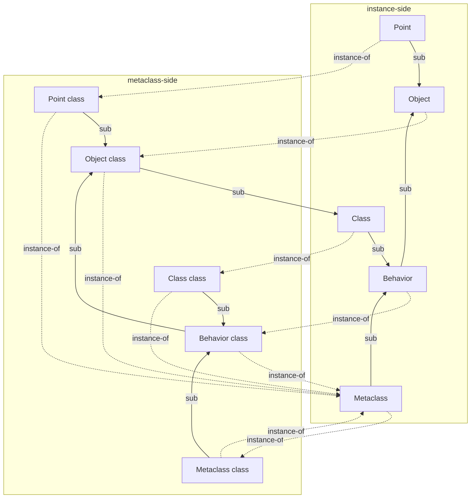

# The metaclass tower

Phalcom means *everything is an object* literally. Two clauses follow, and held together they
write a sentence you didn't ask for:

- every object has a class, and
- a class is an object.

So a class has a class. That class is an object, so *it* has a class. Ask "what is the class of the
class of the class of `Number`?" and nothing in the sentence tells you where to stop. This is the
**metaclass regress** — "turtles all the way down." It is not a bug and not an oversight. It is a
*question that regenerates itself* the instant you accept both clauses.

The grip for this whole document is one reframe:

> **The regress is infinite in the *question*, not in *memory*.** Phalcom stores the entire tower
> as a handful of rows whose top links point back into the set. The structure is small, finite, and
> cyclic — and because those links are *handles*, not pointers, the only real work is not *holding*
> the cycle but *building* it from nothing.

Two questions hide inside the one uneasy feeling, and nearly every confused first encounter with
metaclasses is a failure to keep them apart. **Why does a metaclass exist at all** (a dispatch
argument), and **how does the regress terminate** without an infinite chain in memory (a graph
argument). They have different answers. A design can get one right and botch the other. This
document takes them in order, then spends its real weight on the part usually skipped: not that the
cycle closes, but how you *construct* a structure in which every object needs every other object to
already exist.

---

## Notation: two arrows, never one

The single most common way to lose the thread here is to let two different relationships blur into
one mental "is-a" line. They are not one line. Give them names that cannot collide:

- **`Super(X)`** — the **superclass** of class `X`. The *subclass-of* arrow. It runs between
  classes only. It is what "inherits from" means: `X`'s instances get everything `Super(X)`'s
  instances get, plus what `X` adds.
- **`Class(o)`** — the **class of object `o`**. The *instance-of* arrow. It runs from *any* object
  to the object that classifies it, uniformly. `Class(3)` is `Number`; and since a class is an
  object, `Class(Number)` is something too.

When `Class(·)` is applied to a class, its result gets a name — the **metaclass** — and this
document writes `Meta(X)` for `Class(X)` in exactly that case, as a reading aid. **It is not a
different operation.** One function answers "what is your class," and it does not care whether its
argument is a number or a class. That sameness *is* the point of an everything-is-an-object system.

Throughout, **solid arrows are subclass-of; dashed arrows are instance-of.** Keep them visually
apart, because the entire subject is the discipline of not confusing them.

---

## Why a metaclass has to exist

Start from a class `Number` with a method dictionary — the table of what `Number`'s *instances*
answer, like `+`. Now suppose `Number` itself, as a receiver, should answer a *class-side* message:
a factory, a counter, a `zero` returning the additive identity. Where does *that* method live?

It cannot be `Number`'s instance-method table — that one already describes `Number`'s instances, not
`Number`. It must be some other table, reached by asking "what defines what `Number` itself
responds to." In an everything-is-an-object system the only uniform way to ask that is the same way
you ask it of anything: `Class(Number)`.

That forces a fork. Either `Class(Number)` is a generic shared thing every class points at alike —
in which case there is nowhere to hang a table that differs per class — or `Class(Number)` is a
genuine *per-class* object with its own method dictionary and its own superclass link. Choose the
second and you have manufactured a new first-class object whose whole job is to hold `Number`'s
class-side behavior and its place in a class-side hierarchy. That object is the **metaclass** of
`Number`.

And the regress arrives not as a decision but as a *corollary*: the metaclass you just built is,
by the same premise, an object — so it has a class too. You didn't choose to keep going. You chose
"classes are objects" and "class-side methods dispatch like everything else," and the infinite
question is what those two choices *entail*.

> **Predict, then check.** `Number` has an ordinary instance method `+`. Now it also gets a
> class-side `zero`, sent to the class itself. Where does the code for `zero` live, and what *kind
> of thing* is that place? If you answered "another object, itself a class, whose job is to hold
> class-side protocols" — you just derived the metaclass. If you answered "a special slot on
> `Number`, resolved by name, not by sending a message to an object" — you just derived the branch
> that *rejects* metaclasses. Both are coherent. The next section makes the trade-off runnable.

### The decisive question

One sharp question separates "the tower" from every branch that avoids it:

> When a subclass inherits a class-side method whose body sends a message to *itself*, does that
> self-send re-dispatch to the subclass's own override — or stay pinned to where the method was
> textually written?

Take a base `Shape` with a class-side factory `make` that consults a class-side hook
`defaultColor`. A subclass `Circle` overrides only `defaultColor`, never touching `make`. Does
`Circle make` use `Shape`'s color or `Circle`'s?

**Java — no metaclass.** `static` methods live directly on the class; a `static` call has no
receiver object for the runtime to consult, so the inner `defaultColor()` is bound once, at compile
time, to the class where `make` is written:

```java
class Shape {
    static String defaultColor() { return "black"; }
    static Shape  make()         { return new Shape(defaultColor()); }
}
class Circle is Shape {
    static String defaultColor() { return "red"; } // hides, does not override
}
Circle.make(); // a BLACK Shape — not a red Circle
```

This is the well-known Java trap: *static methods are hidden, not overridden.* Redeclaring
`defaultColor` in `Circle` makes a second, unrelated method that shares a name; which one runs is
chosen by the *compile-time* type. There is no `self` to be `Circle` instead of `Shape`.

**Phalcom — the tower.** A class-side method is found in the receiver's metaclass, and `self` inside
it is the *original* receiver. `Circle make` finds `make` up in `Shape`'s metaclass, but its
`self defaultColor` sends to `Circle`, whose metaclass answers with the override. One inherited
method body, two outcomes — the same receiver-driven dispatch that makes ordinary polymorphism work,
applied one level up. This inheritance is not a story; it is asserted for every core class at boot
(`universe/invariants.rs::verify_invariants`) and pinned by fixtures — `Number.class.superclass ==
Object.class` returns `true` ([`metaclass_parallel_rule_builtin.ph`](../../../phalcom-core/tests/lang/metaclass/metaclass_parallel_rule_builtin.ph)).

That gap — *inherited by name* versus *inherited as real dispatch* — is the entire weight of the
tower's extra machinery.

---

## The design space (a reconstruction — read the caveat)

Four positions occupy this space. Two honesty notes before walking it, because this document's one
promise is that you can re-derive Phalcom's choice, and a rigged survey teaches the answer without
the question:

1. **This four-way menu is pedagogical scaffolding, not the decision as it happened.** Phalcom did
   not pick "the tower" off a menu. The record (below) is narrower: a *flat-chain bug* was fixed
   into the parallel rule ([ADR-0002](../../../docs/adr/accepted/0002-metaclass-tower-parallel-rule.md)),
   a shared kernel class `Behavior` was factored out
   ([ADR-0003](../../../docs/adr/accepted/0003-introduce-behavior-kernel-class.md)), and the
   representation was later changed from reference-counted cycles to handles
   ([ADR-0009](../../../docs/adr/accepted/0009-handle-arena-heap.md)). The menu is here to make the
   tower *tempting*, not to imply it was chosen against equals.
2. Each branch was chosen by serious designers for real reasons. Grant them.

- **No metaclass** (Java, C++ `static`). Simplest to build and teach: a class is one flat object —
  a name, an instance-method table, a class-method table beside it. No second hierarchy, no
  regress, no bootstrap, because no loop was ever opened. The bill is the decisive question above:
  class-side methods do not truly inherit.
- **One shared metaclass** (how Ruby *feels* from outside). Keep "classes are objects," but let
  every class share the *same* `Class` object. Uniform and cheap — one extra kind of object, not
  one per class. The bill: there is exactly one class-side table, so it cannot hold two different
  answers for two different classes; per-class class-side inheritance is gone.
- **Parallel metaclass per class — the tower** (Smalltalk-80, **Phalcom**). Every class gets its
  own `Meta(X)`, kept in lockstep with the class hierarchy by a single rule. More machinery: a
  second hierarchy, a regress that needs a termination story, and a real construction problem at
  boot. What it buys is the decisive question answered *yes*, with zero special-casing in dispatch.
- **No classes at all** (prototypes: JavaScript's original model, Self). Dissolve the question —
  objects delegate to objects, nothing is distinguished enough to need a class of its own. Cut to
  one sentence: it is a different object model, not a fourth answer here.

---

## The mechanism, in Phalcom

### One row type for classes *and* metaclasses

There is no separate metaclass struct. A class and a metaclass are the same Rust type — a
`ClassObject` row on the heap ([`heap/class.rs::ClassObject`](../../../phalcom-core/src/heap/class.rs)):

```rust
pub struct ClassObject {
    pub name: String,               // "Number", or "Number.class" for its metaclass
    pub class: ClassId,             // this row's metaclass — a handle
    pub superclass: Option<ClassId>,// None only at the apex (Object)
    pub methods: MethodsMap,        // selector → method handle
    // … field slots, static slots, base-name index, attributes
}
```

`Meta(X)` and `Super(X)` are literally the `class` and `superclass` fields. A metaclass is just a
`ClassObject` whose name ends in `.class`. Hold onto the type of those two fields — `ClassId`, not
`&ClassObject` — because the representation section turns on it.

### The parallel rule

The tower's defining equation, for every class `X` below the root:

```
Super(Meta(X)) == Meta(Super(X))
```

*The superclass of `X`'s metaclass is the metaclass of `X`'s superclass.* The metaclass hierarchy
is not an independent structure that happens to resemble the class hierarchy — it is *forced* into
lockstep, one level up, by this one rule. That is exactly why the decisive program comes out right:
a class-side lookup walks `Super(Meta(·))`, and the parallel rule guarantees it visits metaclasses
in the same order an instance-side lookup visits classes. Break the equation and class-side
inheritance drifts out of sync with the shape the reader already understands.

In Phalcom the rule is not maintained by hand per class; it is a single line inside the helper that
mints every ordinary class
([`universe/core_classes.rs::make_core_class`](../../../phalcom-core/src/universe/core_classes.rs)):

```rust
fn make_core_class(heap, name, superclass, metaclass_class) -> ClassId {
    let metaclass_superclass = heap.class(superclass).class; // == Meta(Super(X))
    let metaclass = heap.alloc_class(ClassObject::bare(&format!("{name} class")));
    { let meta = heap.class_mut(metaclass);
      meta.class = metaclass_class;
      meta.superclass = Some(metaclass_superclass); } // Super(Meta(X)) := Meta(Super(X))
    let class = heap.alloc_class(ClassObject::bare(name));
    { let c = heap.class_mut(class);
      c.class = metaclass;
      c.superclass = Some(superclass); }
    class
}
```

`meta.superclass = superclass.class` **is** the parallel rule, applied automatically to every class
the moment it is created.

### Termination, and a lie in the source

The regress needs a bottom. "Bottom" does not mean the question stops being askable —
`Meta(Meta(Meta(…)))` is askable forever — it means the *answers* stop being new objects. Two facts
do it in Phalcom:

**The root joins the metaclass chain back into the ordinary one.** `Object` is the sole root; its
superclass is `None`. The parallel rule cannot apply at `Object` (there is no `Super(Object)`), so
the join is set by fiat: `Super(Object class) := Class`. Walk up from any metaclass and you
eventually fall back into the ordinary hierarchy at `Class → Behavior → Object`, not up a second
ever-taller tower. Live: `Object.class.superclass == Class` → `true`.

**Some rows close into a loop.** Every metaclass is an instance of `Metaclass`. `Metaclass` is a
class like any other, so it has a metaclass — `Metaclass class` — and that row, being a metaclass,
is itself an instance of `Metaclass`. The loop closes across *two* rows.

Now the predict-then-check — and it is a real trap, because the source itself gets it wrong. The
module doc-comment at the top of [`heap/class.rs`](../../../phalcom-core/src/heap/class.rs) says the
apex is *"a handle that points at itself, e.g. `Metaclass.class == Metaclass`."*

> **Predict, then check.** The doc-comment says `Metaclass.class == Metaclass`. Predict what the
> running VM prints for `(Metaclass.class == Metaclass)`.

The doc-comment predicts `true`. Run it:

```
Metaclass.class == Metaclass        -> false
Metaclass.class.class == Metaclass  -> true
Metaclass.class.name                -> "Metaclass class"
```

The doc-comment is a **one-hop self-loop** (a row that is its own metaclass). What the bootstrap
actually builds is a **two-hop loop**: `Metaclass →class→ Metaclass class →class→ Metaclass`. No
row's `class` field ever equals its own id at HEAD. The authority is not the comment; it is
`verify_invariants`, which asserts exactly the two-hop closure and would abort startup otherwise
([`universe/invariants.rs`](../../../phalcom-core/src/universe/invariants.rs) — *"Metaclass.class
should be Metaclass class"*, and separately *"Object.class must not equal Object itself"*). The
`v0.2` spec states it correctly too (`core-classes.md` §3: `(X class).class == Metaclass`). Two
in-source doc-comments describe a shape the code does not build — a working reminder that in a
cyclic kernel the *invariant check* is the ground truth, not the prose next to the struct.

*(This is a genuine documentation defect, flagged separately at the end.)*

Why does the one-hop shape *not* happen, when the `ClassId` type plainly permits `class == self`?
Because nothing in the bootstrap ever assigns a row its own freshly-minted id — and a one-hop
self-loop is a *different* valid choice that other languages do make. Python takes it:
`type(type) is type`. Phalcom takes Smalltalk-80's two-hop shape. The termination is not forced;
*a* closing fixed point is, and the number of hops is a design choice.

### The finite cyclic graph

The whole tower — the four kernel rows, their four metaclasses, and one ordinary class `Point` to
show the pattern:



Solid = subclass-of, dashed = instance-of. Two things to see. The solid path leaving `Object class`
does not run off the top — it bends back down through `Class → Behavior → Object`, so the metaclass
hierarchy's own superclass chain terminates in the ordinary root a few steps later. And the dashed
arrows between `Metaclass` and `Metaclass class` form a closed two-node loop. **The picture *is* the
termination argument:** you cannot follow either arrow kind and land outside this drawing. (Note
Phalcom's kernel is exactly `Object / Behavior / Class / Metaclass` — it has no `ClassDescription`
row that Smalltalk-80 inserts; `Behavior` absorbs that role, per ADR-0003.)

---

## The representation: a handle, not a pointer

Return to those two fields, `class: ClassId` and `superclass: Option<ClassId>`. What is a `ClassId`?

```rust
// phalcom-core/src/heap/mod.rs
pub type ClassId = ObjRef; // a slotmap generational key: index + generation, Copy
```

It is an **index into a heap**, not a memory address. `ObjRef` is a `slotmap` key; every access
resolves it through `&Heap` ([`heap/accessors.rs::Heap::class`](../../../phalcom-core/src/heap/accessors.rs)
turns a `ClassId` into a `&ClassObject`, or panics on a stale handle). This is the same house rule
that governs [upvalues](../vm/upvalues.md) and every other cross-object link in Phalcom: **hold a
name resolved through the heap, never a raw address.**

Here the payoff is structural, and it is worth deriving.

> **Predict, then check.** Two records, `A` and `B`, must each hold — as a non-optional field — a
> valid reference to the other. In safe Rust with `&` references, write the two constructors that
> build both. Take a moment.

You cannot. To construct `A` you need `B`'s reference; to construct `B` you need `A`'s. A
self-referential class — a row whose `class` field points at a row that points back — is exactly
the shape a borrow checker forbids for references. Systems that insist on references reach for one
of two escapes: reference-counted ownership with interior mutability (`Rc<RefCell<T>>` plus `Weak`
to break the cycle), or **replace the reference with an ownership-free index into a shared table**,
so a "cycle" is just ordinary integer data that no aliasing rule can object to.

Phalcom's history contains *both* escapes, in order. The tower was first built on
`Rc<RefCell<T>>` + a deliberate `Weak`-guarded kernel cycle. ADR-0009 then replaced that with the
slotmap heap and `Copy` `ClassId` handles — "the kernel cycle is expressed as handles that refer to
each other with no ownership paradox." Same tower, second representation, and the second deletes an
entire category of construction pain: patching a `ClassId` field is a plain integer write, where
patching an `Rc` cycle needed `new_cyclic`/`Weak` gymnastics. That is the scar this document points
at — the design didn't get easier, its *representation* did.

The collector rides on the same choice. Phalcom's GC is **non-moving mark-sweep**
([ADR-0050](../../../docs/adr/accepted/0050-non-moving-mark-sweep-collector.md)): it *marks through*
both links and never relocates or patches them ([`heap/trace.rs::trace_object`](../../../phalcom-core/src/heap/trace.rs),
the `Object::Class` arm pushes `class` and `superclass` onto the mark worklist), and the kernel's
own cycle terminates the mark simply because an already-marked row is never re-pushed. A moving
collector would have to find and fix up every handle on every collection; a name resolved through
the heap costs the collector nothing.

---

## The bootstrap: building the cycle from nothing

Looping back is a fact about the *finished* structure. Getting there from nothing is the other half
of the knot, and it is where the grip is finally earned. To build the tower you seem to need
`Metaclass` before any ordinary metaclass (every metaclass is an instance of `Metaclass`) — but
`Metaclass` is a class, so it needs *its* metaclass already built, which needs `Metaclass`… The
dependency graph among "which row must exist before which" is *exactly* the cyclic instance-of graph
above. A cyclic graph has no topological order. There is no sequence "fully build this one, then
that one" that respects every dependency, because every candidate first row depends on something not
yet built.

The way out is to stop insisting that *exists* and *is initialized* happen at the same instant. Every
implementation of a cyclic object graph uses the same two-phase recipe — **allocate every row blank
(so it has a stable identity to be pointed at), then patch the cyclic fields once all identities
exist, then verify the closure.** Phalcom's kernel constructor is that recipe, unabbreviated
([`universe/core_classes.rs::create_core_classes`](../../../phalcom-core/src/universe/core_classes.rs)):

```rust
// 1. Allocate the 8 apex rows BARE — name only. bare() sets class = ClassId::default()
//    (the null key) and superclass = None. Each alloc mints a fresh, stable ClassId.
let object_class     = heap.alloc_class(ClassObject::bare("Object"));
let behavior_class   = heap.alloc_class(ClassObject::bare("Behavior"));
let class_class      = heap.alloc_class(ClassObject::bare("Class"));
let metaclass_class  = heap.alloc_class(ClassObject::bare("Metaclass"));
let object_metaclass    = heap.alloc_class(ClassObject::bare("Object class"));
let behavior_metaclass  = heap.alloc_class(ClassObject::bare("Behavior class"));
let class_metaclass     = heap.alloc_class(ClassObject::bare("Class class"));
let metaclass_metaclass = heap.alloc_class(ClassObject::bare("Metaclass class"));

// 2. Patch instance-of (`class`) — now every id exists, so cycles are just writes.
heap.class_mut(object_metaclass).class    = metaclass_class;
heap.class_mut(metaclass_metaclass).class = metaclass_class;
heap.class_mut(metaclass_class).class     = metaclass_metaclass; // the 2-node loop closes here
heap.class_mut(object_class).class        = object_metaclass;
// … behavior_class, class_class likewise

// 3. Patch instance-side superclasses.
heap.class_mut(object_class).superclass   = None;
heap.class_mut(behavior_class).superclass = Some(object_class);
heap.class_mut(class_class).superclass    = Some(behavior_class);
heap.class_mut(metaclass_class).superclass= Some(behavior_class);

// 4. Patch metaclass-side superclasses BY THE PARALLEL RULE.
heap.class_mut(object_metaclass).superclass    = Some(class_class); // the root join
heap.class_mut(behavior_metaclass).superclass  = Some(object_metaclass);
// … then make_core_class for Number, String, Nil, … (~24 more)
```

Watch the seam at step 2. `heap.class_mut(metaclass_class).class = metaclass_metaclass` writes a
link that would be impossible to write in step 1: at step 1 `metaclass_metaclass` did not yet exist
to be named. The `bare()` row with its null-key `class` field is the "I'll fill this later"
placeholder that the reference version could not have — a null `ClassId` is a legal value; a null
`&ClassObject` is not. **This is the grip cashed out:** holding the cycle is trivial because the
links are handles; the entire difficulty was construction order, and it is dissolved by allocating
identities before wiring them.

Then phase four. After primitives are installed and `core.ph` has run, `VM::new` calls
[`verify_invariants`](../../../phalcom-core/src/universe/invariants.rs) and `.expect()`s it — a
violated invariant aborts VM construction outright rather than surfacing as a strange runtime bug
later. It re-derives, from the live heap, that the parallel rule holds for every ordinary row, that
the two-node apex loop closed, that `Object.superclass` is `None`, and that no metaclass chain runs
longer than 64 steps (a cycle that failed to close would hang a walk; the bound turns that into an
honest error). The cyclic structure was built by hand in two passes — exactly the thing that is easy
to get subtly wrong once and never notice — so the design refuses to run until a machine has checked
the tie.

---

## Comparisons that earn their place

**Smalltalk-80** — the ancestor. It names the metaclass, states the parallel rule, and closes the
tower with a distinct `Metaclass` companion row (the two-hop shape Phalcom shares) plus the
`Object class → Class` join. Phalcom is a faithful narrowing of it: same rule, same closure, minus
Smalltalk's extra `ClassDescription` kernel row, which `Behavior` here subsumes. Where Smalltalk
pays the one-time bootstrap cost by *snapshotting a pre-tied image* to disk and mapping it back in,
Phalcom pays it *every startup* in `create_core_classes` — cheap enough at ~32 rows that it is not
worth persisting. *(Historical detail on Smalltalk's original image assembly is beyond what this
document verified; the lineage and the parallel-tower shape are the load-bearing claims.)*

**Python** — the clean contrast on *termination shape*. `type(type) is type` is true at a prompt: a
**one-hop** self-loop where `type` is directly its own metaclass. This is the shape Phalcom's
source doc-comment mistakenly claims and the code declines — the same job (close the regress) done
with one node instead of two. Python also shows the tie is not exotic: it is observable in one line,
no image or hidden struct required. (Python confines metaclasses to classes; it has no per-object
analogue.)

**Ruby** — names something Phalcom leaves anonymous: the **eigenclass** / **singleton class**, a
private per-object class holding methods defined on one object alone. When that object is a class,
its singleton class does exactly the metaclass job, obeying a parallel rule against the ordinary
chain — the architecture *is* the full tower. Yet asking a Ruby class for `.class` returns the
shared `Class`, so Ruby *feels* like the "one shared metaclass" branch while *being* the tower. That
gap between felt model and real architecture is the reason the branch was worth walking as tempting
rather than as a strawman.

**Java** — the deliberately short foil, walked in full under the decisive question: no metaclass,
`static` hidden-not-overridden, dispatch pinned to compile-time type. Its runtime `java.lang.Class`
is for *reflection*, not class-side dispatch — a dead end for this question, not a hidden answer.

**Named and cut:** C# (same `static` foil as Java, with an explicit `new`-hides keyword — repeats
rather than adds); JavaScript/Self prototypes and Haskell/Rust typeclasses (different axis: no
"classes are objects" premise, so the regress never arises). None are additional points on this
scale.

---

## What it costs, and where theory hands off

The spine of the whole subject is an asymmetry: **a cyclic class graph is trivial to *hold* and
impossible to *build* in one pass.** Traversal around the loop is an ordinary graph walk (lookup,
GC, and printing just need to know it might loop) — `lookup_method_in_hierarchy` walks
`superclass` handle-by-handle through the heap, re-resolving each hop, holding no reference across
steps, which is exactly what lets it walk the cyclic kernel without a borrow conflict. All the
difficulty concentrates into one construction phase, paid once at startup.

Theory can take you to "there are two escapes for cyclic data — reference-counting with interior
mutability, or ownership-free indices." It cannot tell you which a given system picks; that is a
fact about representation. Phalcom's answer is on the record and dated: it took the second, via
ADR-0009, after starting with the first. And it draws one more line theory leaves open — an object's
class is *fixed*: the `class=` selector exists but is a hard error by design
([`primitive/object.rs::object_set_class`](../../../phalcom-core/src/primitive/object.rs) —
`InvalidSetClass`, *"an object's class is fixed"*), so the tower is wired once at boot and never
re-pointed at runtime.

---

## Source map

| What | Where |
|---|---|
| The row type (class *and* metaclass) | `heap/class.rs::ClassObject` — `class` / `superclass` are `ClassId` |
| The handle type | `heap/mod.rs` — `pub type ClassId = ObjRef` (slotmap generational key) |
| Blank-row constructor (phase 1) | `heap/class.rs::ClassObject::bare` — `class = ClassId::default()` (null key) |
| Superclass walk | `heap/class.rs::lookup_method_in_hierarchy` — handle-by-handle, no held ref |
| Row→row class-of | `heap/accessors.rs::Heap::class(ClassId)` — resolve or panic |
| Value→class-of (incl. immediates) | `value/mod.rs::Value::class(&VM)` — tag dispatch; `Object::Class(c) => c.class` |
| Parallel-rule helper | `universe/core_classes.rs::make_core_class` — `meta.superclass = superclass.class` |
| The bootstrap tie | `universe/core_classes.rs::create_core_classes` — allocate-bare then patch |
| Closure check (phase 4) | `universe/invariants.rs::verify_invariants` — `.expect()`ed in `vm/bootstrap.rs::VM::new` |
| GC marks through, non-moving | `heap/trace.rs::trace_object` (`Object::Class` arm); ADR-0050 |
| Fixed class | `primitive/object.rs::object_set_class` — `InvalidSetClass` |
| ADRs | 0002 (parallel rule), 0003 (`Behavior` kernel), 0009 (handle heap, supersedes `Rc` cycle) |
| Spec | `docs/spec/current/core/core-classes.md` §3 "Kernel tower classes" |

**Simplifications marked as lies, with forward pointers.** Earlier object-model docs may say "an
object has a class" as if that class were flat and final — *this* document is where that is
destroyed: the class is itself an object, with its own class, and the chain closes into the tower
above. And within this document: "ignore `Behavior`, pretend `Class` is the class of classes" is a
convenience the kernel section corrects — `Class` and `Metaclass` are *siblings* under `Behavior`,
which is where the shared protocol actually lives.
