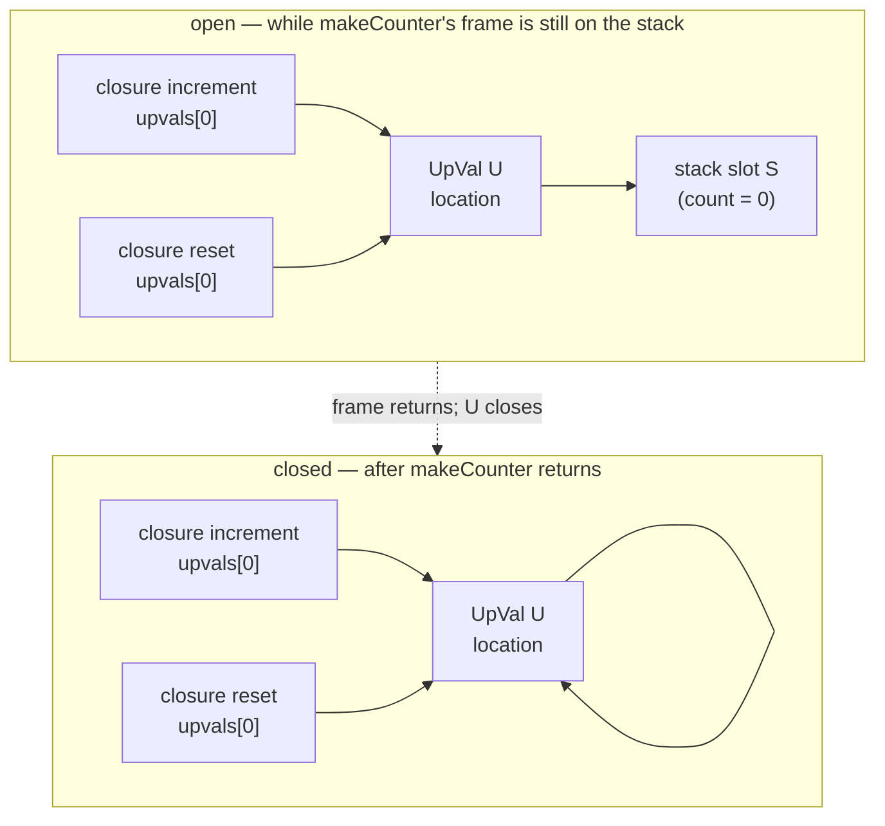
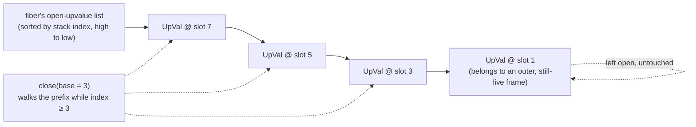

# Upvalues and the Upward Funarg Problem

*Pure theory. No repository source was consulted to write this — not Phalcom's, not any
other project's. Every mechanism below is either general reasoning from first principles or a
named, publicly documented behavior of a real language (Lua, JavaScript, Java, C#, Swift,
Python, Smalltalk, C++). Where a historical date, attribution, or implementation detail is
recalled rather than certain, it is marked **[flagged]** with a confidence note. Treat those as
claims to verify, not as established fact — an unmarked wrong claim is worse than a marked gap.*

## A stack frame is a loan, not a gift

When a function is called, the values that come into existence for that call — its parameters,
its locals — need somewhere to live for the duration of the call. The stack is the obvious
place: pushing a new frame is cheap (bump a pointer), the frame's lifetime is exactly the
call's lifetime, and popping it back off at return is just as cheap. This works because of a
tacit contract: nothing outside the call is allowed to keep a reference to what's inside it
past the point the call ends. The frame is a loan. It gets called back the moment the function
returns, and everything built on top of it — every local variable's storage — is repossessed
with it.

A closure is a promise to break that contract. It captures a *variable* from an enclosing
scope — not its value at one instant, but the variable itself, so that later reads and writes
of the free variable inside the closure and later reads and writes of the same name in the
enclosing code observe each other. If the closure is invoked while the enclosing call is still
on the stack, the promise costs nothing: the variable's storage is still there. But a closure
can also be *returned* from the function that created it, stored in a data structure, handed to
a scheduler, dispatched to another thread — used, in short, after the frame that owns its
free variables has already returned and been reclaimed. At that point the promise and the loan
are in direct conflict. The variable must go on living; the frame that gave it a home is gone.

This is the entire problem. Everything in this document is an answer to: *what do you do with
a variable whose lexical home dies before its last reader does?*

## Naming the problem: upward vs. downward funarg

The historical name for this is the **upward funarg problem**, and the qualifier "upward" is
doing real work, because there are two shapes and only one of them is hard.

A **downward funarg** is a function value that flows *down* the call stack — passed as an
argument, used, and discarded within the callee's own activation, e.g. `map(list, f)`, where
`f` is invoked while both `f`'s defining frame and `map`'s frame are still live on the stack.
Nothing here requires anything beyond following a pointer to a frame that is provably still
there. Algol-family languages solved this case adequately in the 1960s.

An **upward funarg** is a function value that flows *up and out* — returned from its own
defining call, or stored somewhere that outlives it — so that by the time it is invoked, the
frame it needs is gone, if the frame was ever stack-allocated in the first place. This is the
hard direction, and it is the only direction that forces a real design decision.

The name "funarg problem" is usually traced to Joseph Weizenbaum's work on early Lisp
implementation, around **1968** **[flagged — I recall this attribution and approximate date
with only moderate confidence; the precise venue and year should be checked against a primary
source before being asserted as fact]**. The canonical, citable treatment is Joel Moses's 1970
MIT AI Lab memo, commonly cited as **"The Function of `FUNCTION` in LISP, or Why the FUNARG
Problem Should Be Called the Environment Problem"** **[flagged — title and general content
recalled with fairly high confidence; the exact memo number is less certain]**. Moses's
argument is worth keeping, because it reframes everything that follows: the difficulty isn't
that a function was passed as an argument (that's just data movement) — it's that a function
value carries an *environment* (a set of bindings for its free variables), and the question of
which environment is correct, and how long that environment must survive, is a question about
lexical scoping and storage lifetime, not about argument-passing mechanics. Every design in
this document is, underneath, an answer to "how long does this environment live, and who owns
it."

> **An upvalue is a pointer that knows how to become an owner.**
>
> One real answer to the upward funarg problem — the one this document spends the most time
> on — gives every captured variable exactly two states and exactly one transition between
> them, at exactly one moment you can name. **Open**: the variable is still on the stack, and
> the upvalue merely *points at* the stack slot — it borrows. **Closed**: the stack slot is
> gone, and the upvalue *owns* a copy of the value inline, in its own storage — it now behaves
> as if it always had. The transition happens once, at frame death, never again, in one
> direction only.
>
> The payoff of framing it this way is that **the code that reads a captured variable never
> has to ask which state it's in.** A single indirection — deref one pointer — is correct
> whether the variable is open or closed, because closing doesn't change *how* you read, it
> changes *where the pointer points*, and it always points somewhere valid. That collapse — no
> branch, no state check, ever, on the hot path — is the entire reason this design is worth the
> bookkeeping it costs elsewhere.

That is the thesis. It is not the only answer in the design space, and it is not free — it
buys its branchless read path by paying somewhere else (a list to search, a moment to close,
a pointer the garbage collector has to know about). The rest of this document earns that
sentence by walking every other answer first, honestly, and then coming back to show exactly
what this one costs and where the cost is hidden.

## The design space

Six real answers exist to "what happens to a captured variable when its frame dies." Each one
was a reasonable, even attractive, choice for the language that made it. None of them is free.

### Refuse it: make the compiler the enforcer

The cheapest possible answer is to make the upward-funarg case *not type-check*. If a closure
can only capture variables that are provably never reassigned after their initial binding, then
there is no observable difference between "the closure reads the variable" and "the closure
read a copy of the variable's value at capture time" — because nothing after capture ever
changes it. Capture-by-value becomes indistinguishable from capture-by-reference for exactly
the variables the language allows you to capture. No runtime state machine, no heap allocation
for the common case, no question of which frame owns what, because the compiler has removed
the question at the source.

This is genuinely attractive, not a strawman: it costs nothing at runtime, it needs no garbage
collector cooperation, and it is a fully honest design position, not laziness — Java's rule for
lambdas and anonymous inner classes, that a captured local must be `final` or
**effectively final** (behaves as if declared `final`: assigned once, never reassigned,
even without the keyword — this relaxation from mandatory `final` shipped with lambdas in
Java 8), is exactly this stance made explicit. The occupants: Java from Java 8 onward, and
early C++ (pre-C++11 had no closures at all in the language proper; function pointers plus
manually threaded context structs were the idiom).

The bill comes due the moment a program actually wants shared mutable state between a closure
and its enclosing scope — a counter that a lambda increments and the surrounding code reads,
an accumulator built up across several callback invocations. The language that refuses capture
does not make this need disappear; it just declines to build the machinery for it, and the
programmer builds a hand-rolled version of exactly the mechanism the language wouldn't give
them:

```java
// "effectively final" forbids this outright: `count` is reassigned, so it cannot be captured.
int count = 0;
Runnable r = () -> count++; // compile error

// The workaround: manually allocate the box the language wouldn't allocate for you.
final int[] count = {0};
Runnable r = () -> count[0]++; // legal — the *reference* to the array is effectively final,
                                // even though what it points at is mutable.
```

The one-element array is not a workaround to a missing feature so much as proof of the
feature's necessity: it is a hand-built heap cell, allocated explicitly because the language
won't allocate one implicitly. `AtomicInteger`/`AtomicReference` get reached for in the same
idiom for the same reason. The refusal branch doesn't eliminate the need for a mutable box that
outlives a frame — it just makes the programmer build the box instead of the compiler.

### Chain the frames: static link and display

If frames are going to live on the stack anyway, the obvious move is to give each frame a
pointer back to the frame that lexically encloses it, and let a captured variable be resolved
by walking that chain at access time. This is the **static link**: one pointer per frame,
pointing to the (dynamically) most-recently-activated frame of the (statically) enclosing
function. Reaching a variable declared `N` lexical levels up costs `N` pointer hops. A
refinement used in some Algol-family implementations is the **display**: instead of one link
per frame, keep a small array — one slot per lexical nesting *level*, each holding a pointer to
whichever frame is currently the live activation of that level — so that reaching any enclosing
level is a single array index, no chain-walking, at the cost of updating the whole array on
every call. Both are instances of the same idea: reach the enclosing environment by following
pointers through *other stack frames*, never by copying data out of them.

This is genuinely elegant for its target case. Algol 60 and Pascal both support nested
procedure declarations, and in both languages the intended use is a downward funarg: a nested
helper procedure passed to, or called by, code that's still within the lexical scope where the
helper is valid. The static link costs one extra word per frame and one store per call. There
is no allocation, no boxing, no distinction between "captured" and "not captured" variables at
all — every local is uniformly reachable from any nested scope via the chain, whether or not
anything actually captures it.

The bill: a static link or display entry is only valid for as long as the frame it points at is
valid. It is correct *only* for downward funargs. The instant a nested procedure is allowed to
escape upward — returned as a value, stored in a variable, called after its enclosing
procedure has returned — the static link points at a stack frame that has been popped and
whose storage now belongs to someone else. This is why classical Pascal and Algol 60 simply
did not allow procedures to be returned as first-class values: the static link made it
impossible to make that case safe, so the languages declined to expose the case at all. This is
the historical dead end this design walks into — not because static links are a bad idea, but
because they only work for the direction of the funarg problem that was never actually hard.
(GCC's nested-function extension, which allows returning a pointer to a nested C function,
reintroduces exactly this hazard and is a well-known source of dangling-trampoline bugs when
the returned pointer outlives its enclosing frame — the same failure, decades later, in a
language whose ordinary functions have nothing like this problem at all.)

### Box everything you might need: assignment conversion

A different move: decide, at compile time, which variables are dangerous — captured by an
inner function *and* reassigned somewhere — and give exactly those variables their own heap
cell from the moment they're declared, instead of a stack slot. Every read and write of such a
variable, inside the declaring function or inside any closure over it, goes through the cell.
Nothing on the stack ever needs to be found later, because the mutable, shared part was never
on the stack.

This is **assignment conversion**, the term used in the Scheme compiler literature for the
static analysis that performs this rewrite — described in Guy Steele's 1978 Rabbit compiler
thesis and treated formally in later expositions such as Appel's *Compiling with Continuations*
**[flagged — attribution and dates recalled with moderate confidence; check before citing]**.
The analysis is more careful than "box everything you close over": only variables that are
*both* captured by a nested closure *and* assigned to (not merely read) after their initial
binding need the cell — a variable that's captured but never reassigned is safe to copy,
because nothing ever makes the copy stale. This selectivity is exactly what distinguishes real
assignment conversion from a cruder version of the same idea: some interpreters and early or
unoptimized JavaScript engines effectively boxed *every* captured variable regardless of
whether it was ever mutated, because determining mutability requires a static analysis pass
that a naive implementation skips. Both approaches land in the same place at runtime — a heap
cell, one indirection to reach it — but the naive version pays the allocation for variables
that never needed the protection, while true assignment conversion pays it only where a write
could actually be observed through the closure.

Even at its best, the bill is real: the decision to box is made at declaration time, based on
static analysis of the whole function body, not on whether a closure capturing the variable
ever actually escapes. A variable captured only by a closure that's invoked and discarded
entirely within its own creating call — never stored, never returned — still gets boxed if the
analysis can't prove it never will escape, which in a language with first-class, dynamically
passed-around function values is often not provable at all. You pay for the possibility of
escape, not the fact of it.

### Make every activation a citizen: Smalltalk's contexts

The most radical answer removes the asymmetry between "stack" and "heap" entirely: don't put
activation records on a stack in the first place. Make every method or block activation an
ordinary heap object, with the same lifetime rules as any other object — it exists as long as
something references it, and is reclaimed by the same garbage collector that reclaims
everything else. This is Smalltalk's design: a method activation is a `MethodContext`, a block
activation is a `BlockContext`, and both are first-class objects a program can hold a reference
to, inspect, and (in Smalltalk's debugger) resume. A block that captures a variable from its
enclosing method doesn't need an upvalue, an open/closed state, or a list of anything — it
simply holds a reference to the enclosing context object, and the variable is a field (a
"temp slot") on that object, reachable for exactly as long as the object is reachable. The
upward funarg problem cannot arise, structurally, because there was never a stack frame whose
lifetime was shorter than the object's — there is no stack frame at all in the sense the other
branches mean it.

This is the pole directly opposite the branch this document spends the most time on, and it is
worth taking seriously rather than dismissing, because it is the branch a Smalltalk-lineage
object model would most naturally reach for if it changed nothing else: everything else in the
object model is already a heap object with reference-counted or garbage-collected lifetime, so
why should an activation record be any different? Uniformity is a real virtue — a debugger,
a continuation mechanism, or a process scheduler that treats stack frames as ordinary
inspectable objects gets those features almost for free, rather than needing bespoke plumbing
to reify a stack frame on demand.

The bill is a heap allocation on every single call, method or block, whether or not anything
ever captures it — and, in a naive implementation, whatever GC pressure and pointer-chasing
that entails on the overwhelmingly common case where nothing escapes at all. Real production
Smalltalk implementations did not simply eat this cost: Deutsch and Schiffman's classic
description of an efficient Smalltalk-80 implementation is usually cited (alongside inline
caching, its more famous contribution) for a technique that represents contexts in a
contiguous, stack-shaped region of memory for the common case, and only actually promotes a
context to a fully independent heap object — copying it out — at the point something outlives
the assumption that it wouldn't need to **[flagged — I recall the shape of this optimization
with reasonable confidence but not its exact terminology or every detail; verify against the
original paper before citing specifics]**. That is worth pausing on, because it is
*structurally the same move* as the open/closed distinction this document is about to go deep
on — a thing that behaves like a stack allocation until proven otherwise, and only pays a
promotion cost when something actually needs it to outlive the stack. Smalltalk needed this
idea at the granularity of an entire activation, decades before Lua needed the analogous idea
at the granularity of a single variable, for a related but distinct reason (making a
fully-reified object model fast, rather than making a single closed-over variable cheap).

It is worth naming explicitly that "Smalltalk-style object model" and "heap-allocate every
activation" are two different design axes, not one. A language can adopt Smalltalk's
message-send, class-and-metaclass object model — everything is an object, method dispatch is a
message send — while making an entirely separate decision about how activation records and
captured variables are represented at runtime. Nothing about believing "everything is an
object" forces frames themselves to be heap objects from birth; it is a legitimate, orthogonal
choice to keep frames stack-allocated by default and only reify (or partially reify, per
variable) the parts that provably need to survive past the frame. A Smalltalk-lineage language
that instead adopts a Lua-style open/closed upvalue mechanism is not contradicting its
ancestry — it is separating two decisions that Smalltalk-80 happened to bundle together.

### Copy free variables at the moment of creation: flat closures

A sixth answer sidesteps the stack-vs-heap question for the closure's storage by making the
closure a self-contained record from the instant it is created. When a `MakeClosure`-style
instruction runs, it allocates one small object — a **flat closure** — with one field per free
variable the function body actually uses, and copies each one in, right then. There is no
chain to walk at read time and no list of anything to search at creation time: the closure
already has everything it will ever need, in a fixed-size vector indexed directly by the
compiler.

This is the ML-family and Chez Scheme approach to closure representation, and it is attractive
for reasons that are almost the mirror image of the linked designs: no per-access indirection
through an enclosing frame or an enclosing closure, excellent cache locality (a closure's free
variables sit contiguously, in the closure object itself), and — this matters a great deal for
garbage collection — the closure never holds a raw pointer *into* a stack. A copying or
moving collector that relocates stack-resident data has nothing special to do for a flat
closure's captured variables, because by the time the collector runs, they are already
somewhere else, in ordinary heap storage the collector already knows how to move.

The bill has two parts. First, "copy in the free variables" only preserves the right semantics
for variables that are never mutated after capture; anything that must behave as a *shared,
writable* variable between the closure and its enclosing scope cannot simply be copied by
value, because a copy severs the connection the moment it's made — the closure would see the
value as of its own creation and never again. So a flat-closure design still needs to identify,
by static analysis, which variables are mutably shared and represent *those* — and only those —
as an explicit heap cell from the start, copying the *reference to the cell* into the closure
rather than the cell's contents. This is the same problem assignment conversion solves,
required again here, because flat closures don't dodge the by-value/by-reference question —
they just relocate the decision to compile time instead of leaving it implicit in "point at
the stack." Second, nested capture must copy *through every intermediate level*: if an
inner-inner function needs a grandparent's variable, and the function in between never
touches it, the intermediate function's own closure must still carry a copy of the reference
(so it has something to hand down when it, in turn, builds the inner-inner closure) — the
free variable propagates by being re-copied at every closure-creation boundary along the
chain, rather than by every level sharing one runtime object, which is what happens under the
linked (Lua-style) design covered next.

This pair of vocabulary terms is worth fixing precisely, because they recur throughout the
rest of this document: a **linked closure** reaches a free variable by following a pointer —
to an enclosing frame, or to an entry in an enclosing closure's own upvalue array — so
resolution happens, at least in part, at access time or at each closure's creation time by
consulting something outside itself. A **flat closure** carries everything it needs in its own
storage from the moment it is built, with no pointer outside itself required to read a free
variable.

### The branch this document goes deep on

The sixth real branch keeps a captured variable on the stack for exactly as long as the stack
is where it belongs, and moves it — once, atomically, at a moment you can name — the instant
that stops being true. This is the **stack slot plus an upvalue that closes** design, most
closely associated with Lua and adopted by Wren, and it is the subject of the rest of this
document. The name for the object at the center of it, an **upvalue**, is Lua's own term, and
it has become the name of art for this specific mechanism across implementations that copy the
idea, whether or not they copy Lua's exact code.

## What a copy cannot give you

Before going into the mechanism, it is worth making the stakes concrete, because "capture by
value" is sometimes described as though it were merely a smaller, simpler version of "capture
by reference" — a subset of the same feature, missing a nice-to-have. It is not a subset. It is
a different answer to a question the programmer is implicitly asking every time they write a
closure over a mutable local, and getting the wrong answer doesn't degrade gracefully — it
silently produces two independent variables where the program's structure implies one.

Here is the exact program that tells the two apart. In C++, the two capture modes are spelled
out explicitly, which makes the distinction impossible to paper over:

```cpp
#include <functional>
#include <iostream>

std::function<int()> get;
std::function<void()> inc;

void wire_up_by_reference() {
    int x = 0;
    get = [&]() { return x; };   // captures a reference to x
    inc = [&]() { ++x; };        // captures a reference to x — same x
}

void wire_up_by_value() {
    int x = 0;
    get = [=]() { return x; };   // captures a *copy* of x, frozen at this instant
    inc = [x]() mutable { ++x; }; // captures its *own separate copy*, mutates only that copy
}
```

Under `wire_up_by_value`, `inc()` mutates a copy that belongs to `inc`'s own closure object;
`get()` reads a completely different copy, frozen at the moment `get` was created. Calling
`inc(); inc(); std::cout << get();` prints `0`, not `2` — the two closures never shared
anything, despite both being built from the same variable `x` in the same scope in the same
function, one line apart. (`wire_up_by_reference` has its own, worse problem, covered later:
`x` is a local of `wire_up_by_reference`, which returns immediately after wiring these up, so
both `[&]` captures are dangling before either is ever called.)

This is the shared-mutable-state semantic every language with capture-by-reference (Lua,
JavaScript, Python, Smalltalk, Scheme with assignment conversion) gives you by default, and
that Java's effectively-final rule and C++'s `[=]` explicitly refuse: two closures built over
the same enclosing variable are supposed to behave as two views onto *one* variable, not two
independently evolving copies that happened to start equal. A language, or an implementation
strategy, that can't tell these apart hasn't merely dropped a feature — it has silently changed
what "the same variable" means every time a program captures something mutable in more than one
place. This is precisely the case the rest of this document calls the **identity invariant**,
and it's why getting it right or wrong is a correctness question, not a performance one.

## Lua: the stack slot that can outlive the stack

### Open and closed

An upvalue, in this design, is a small object with (conceptually) three fields:

```c
struct UpVal {
    Value *location;       // where to read/write — the whole interface
    Value  closed_storage;  // used only once location points here
    UpVal *next_open;       // link in the open-upvalue list — open state only
};
```

**[flagged]** — this is a representative shape, not a claim about any specific codebase's exact
field names or layout; different implementations (Lua's C sources, Bob Nystrom's `clox` in
*Crafting Interpreters*, Wren) vary in detail while sharing this structure.

**Open**: `location` points into a live stack slot — somewhere in the array of values that make
up the currently-executing call's (or an enclosing, still-live call's) locals. The upvalue owns
nothing; it borrows. Reading or writing through the upvalue reads or writes the stack directly,
in place.

**Closed**: `location` points at `closed_storage` — a field *inside the same `UpVal` struct*.
The upvalue now owns a private copy of the value, and nothing about the stack matters to it
anymore.

### The identity invariant

Two closures that capture the *same enclosing variable* must end up holding a pointer to the
*same `UpVal` object* — not two different `UpVal`s that happen to start out pointing at the
same stack slot. This is the **identity invariant**, and it is the single fact that makes
sharing possible at all. If it's violated — if a naive implementation just allocates a fresh
`UpVal` every time a closure captures something, without checking whether one already exists
for that slot — every closure gets a private view. A write through one is invisible to the
other, from the very first instruction, open or closed, because they were never the same
object to begin with; this is exactly the by-value failure mode from the previous section,
reintroduced by accident in a design that was supposed to avoid it.



Both diagrams show the *same* `UpVal U` — that's the point being drawn. `increment` and
`reset` never stop pointing at one shared object; only what that object's `location` points at
changes, once, at the transition.

### The open-upvalue list

The identity invariant needs a way to be enforced: before creating a new `UpVal` for a stack
slot, something has to check whether one already exists for that slot. That check is the
entire reason the **open-upvalue list** exists. Concretely, each thread (or fiber — see the
tensions section below) keeps a list of every currently-open `UpVal` it owns, and closure
creation consults it: "has this exact stack slot already been wrapped? If yes, reuse that
object. If no, make one and add it to the list." Skip this check — always allocate fresh — and
you have silently broken the identity invariant, with no compiler error and no crash, just two
closures that quietly stop agreeing with each other.

The list is kept **sorted by stack index** for a reason that only becomes visible at the other
end of an upvalue's life: when a frame returns, every upvalue that was open *at or above that
frame's base stack position* must close, and nothing else in the list should be touched — an
upvalue belonging to a still-live, enclosing frame must be left open. If the list weren't
sorted, closing a frame would require scanning every open upvalue on the entire thread and
testing each one's index individually. Sorted by index, "everything at or above this frame's
base" is a contiguous run at one end of the list — a **prefix walk** that stops the instant it
reaches an index below the frame's base, rather than a full scan with a filter.



Note this list is per-thread (per call stack, per fiber), not per-frame: it holds every open
upvalue anywhere on that stack at once, from every still-live frame simultaneously, which is
exactly why the sort matters — without it, a single frame's return would have no cheap way to
find "just the ones that belong to me or anyone above me" among everyone else's still-valid
entries.

### Closing: the self-pointing struct

The operation itself, for one upvalue `uv`, is two assignments, in this order:

```c
uv->closed_storage = *uv->location;   // copy the live value out, before it's gone
uv->location        = &uv->closed_storage;  // repoint into itself
```

The second line is the whole trick: `uv` now points *at a field of itself*. There is no longer
anything on the stack that `uv` depends on — it has become, structurally, a tiny
self-contained one-field object, indistinguishable from the flat-closure design's private
storage for a single variable, except that it arrived there by a transition instead of being
built that way from birth. The upvalue is then removed from the open-upvalue list — it no
longer needs to be found by future captures of that stack slot, because that stack slot no
longer belongs to this variable at all; it's about to be reused by whatever the caller pushes
next.

### The read path never branches

Here is the payoff, stated explicitly rather than implied. Both the open and the closed states
answer to the exact same access code:

```c
Value get_upvalue(UpVal *uv) { return *uv->location; }
void  set_upvalue(UpVal *uv, Value v) { *uv->location = v; }
```

There is no `if (uv->is_open) { ... } else { ... }` anywhere in either function. It is not that
the branch is cheap or well-predicted — it is *absent*. `GETUPVAL`/`SETUPVAL`-style bytecode
handlers dereference one pointer, unconditionally, and get the right answer whether the
variable is still on someone's stack or has been closed for a thousand calls. This is exactly
the grip stated at the top of this document: closing does not change how a value is read, only
where the one pointer that mediates every read points to. Every consumer of an upvalue — every
place `GETUPVAL` or `SETUPVAL` executes — is written once and is correct in both states, forever,
without ever needing to know which state it's in. All of the complexity this design has — the
list, the sort, the close operation itself — exists *only* to make that one guarantee hold; none
of it leaks into the part of the system that runs on every single variable access.

### When closing happens

The obvious trigger is a frame returning: at that point, every local the frame owned is about
to become invalid, so every open upvalue pointing at or above that frame's base must close,
via the prefix walk described above.

The less obvious trigger is **scope exit that isn't a frame exit** — a block ending, most
importantly a loop iteration ending, while the enclosing function keeps running. If a language
allows a `local` (or `let`, or equivalent) declared inside a loop body to be captured by a
closure created in that same iteration, and the loop reuses one physical stack slot for that
local across iterations (rather than pushing a genuinely fresh slot each time), then failing to
close the upvalue at the end of each iteration means every iteration's closure ends up sharing
one open upvalue pointing at one slot — and after the loop ends, that slot holds whatever the
final iteration left there. Every closure created across every iteration observes the *same*,
final value, because they were never given separate variables to begin with. This is precisely
the shape of the most famous closure bug in mainstream languages, covered in full below; a
language that closes upvalues at the end of each loop iteration — treating the loop body as its
own scope that ends and restarts, rather than one long-lived scope that merely loops — avoids
it structurally, by ensuring each iteration's capture targets a slot that gets closed (frozen at
that iteration's value) before the next iteration's declaration reuses the physical stack
position. *What any one given language or runtime actually does for its own loop construct is
an empirical question about that implementation's compiler, not a fact this pure-theory
document can answer in general — it can only lay out the two available policies (freeze per
iteration, or share one binding for the whole loop) and their consequences, which is done in
full in the JavaScript section below.*

### Resolving upvalues at compile time

The runtime mechanism only has to run at all because the compiler has already decided, ahead of
time, exactly which variables are free in which function and where each one comes from. The
resolution is naturally recursive, because "free in this function" bottoms out in one of two
cases — "local to the immediately enclosing function" or "free in the immediately enclosing
function too" — and the second case just means: go ask the same question one level further out.

```
resolve(name, f):
    if name is declared as a local in f:
        return Local(slot index in f)

    if f has no enclosing function:
        return Global(name)     # or: unresolved — compiler error

    outer = resolve(name, f.enclosing)

    match outer:
        Local(idx):
            f.enclosing.mark_captured(idx)      # tells the enclosing frame this slot
                                                  # must be discoverable via find-or-create
            return f.add_upvalue(is_local = true,  index = idx)

        Upvalue(idx):
            return f.add_upvalue(is_local = false, index = idx)   # alias into the
                                                                     # enclosing function's
                                                                     # OWN upvalue array

        Global(name):
            return Global(name)
```

`f.add_upvalue` is itself expected to deduplicate within `f`'s own compile pass — if the same
`(is_local, index)` pair is requested twice while compiling one function (the function reads
the same free variable in two different statements), it should return the same upvalue slot
number both times rather than growing the array again. It's worth being precise about what
this compile-time dedup does and doesn't guarantee: it prevents *one function's own bytecode*
from wastefully declaring the same free variable twice. It says nothing about two *different*
closures — two separate `CLOSURE` instructions, or the same `CLOSURE` instruction executed on
two different iterations of a loop — wanting the same live variable at runtime. That is a
distinct problem, solved at a different time (runtime, not compile time) by a different
mechanism (the open-upvalue list's find-or-create, not the compiler's array dedup). The two
together form the full identity invariant: statically, one function never lists a captured
variable twice; dynamically, no two closures ever get two different `UpVal` objects for what
is, at runtime, the same stack slot.

**Nested capture** — a grandparent's variable, reached through an intermediate function that
never itself uses it — is where the two branches of `add_upvalue`'s result (`is_local` vs. not)
earn their keep:

```lua
function outer()
  local x = 10
  local function middle()
    local function inner()
      return x + 1        -- inner uses x; middle's own bytecode never touches x
    end
    return inner
  end
  return middle()
end
```

Resolving `x` inside `inner`: not local to `inner`. Recurse into `middle`: not local to
`middle` either — `middle` never declares or reads `x`. Recurse into `outer`: `x` *is* local
there, at some slot index. So `middle` gets an upvalue entry `(is_local = true, index = <x's
slot>)`, even though nothing in `middle`'s own compiled body ever emits a `GETUPVAL` against
it — the entry exists purely so `inner`, compiled inside `middle`, has something to alias.
`inner` then gets its own upvalue entry `(is_local = false, index = <middle's new upvalue
slot>)` — reached through `middle`, not directly through `outer`'s frame.

At runtime this produces two structurally different actions when the enclosing `CLOSURE`
instructions execute. When `outer` runs `local function middle() ... end`, `middle`'s upvalue
slot 0 is `is_local`, so building `middle`'s closure means: search `outer`'s currently-open
list for a `UpVal` at `x`'s stack index; create one if none exists; store it as
`middle.upvals[0]`. This is the only kind of upvalue creation that ever touches the open list.
When `middle` runs `local function inner() ... end`, `inner`'s upvalue slot 0 is *not*
`is_local` — building `inner`'s closure means: `inner.upvals[0] = middle.upvals[0]`, a direct
copy of an already-resolved pointer from one closure's array into another's. No stack search,
no list lookup — the intermediate closure object *is* the shared handle, and copying its
already-established upvalue reference is all that's needed to route the grandparent's variable
one more level down. Multi-level capture is never a direct reach across several stack frames;
it's a chain of one-hop aliases, each hop either "find or create against the stack" (exactly
once, at the innermost function that's actually adjacent to the variable's home frame) or
"copy a pointer I already have" (every level beyond that).

*(A related, marked-as-a-lie-for-simplicity aside: some implementations of this family push the
idea further and represent even *global* variable access as upvalue access — Lua 5.2 is
documented, as I recall **[flagged — moderate confidence on version and exact mechanics]**, to
give every top-level chunk an implicit upvalue conventionally named `_ENV`, with a bare global
reference `x` compiled as indexing `_ENV.x`. The mechanism this document describes is presented
throughout as being specifically for locals captured across a function boundary; treat that as
the common case being explained cleanly, not as a claim that "upvalue" and "captured local" are
perfectly coextensive in every real implementation.)*

## Tracing a close: a counter factory

The close operation is stateful in a way nothing else in this document is, so it is the one
place a step-by-step trace earns its keep. Take the two-closures-over-one-variable case from
the identity-invariant discussion, spelled out fully:

```lua
function makeCounter()
  local count = 0
  local function increment()
    count = count + 1
    return count
  end
  local function reset()
    count = 0
  end
  return increment, reset
end

local inc, rst = makeCounter()
```

Assume `count` lives at stack slot `S` within `makeCounter`'s frame, and follow what happens to
the stack, the open list, and the one `UpVal` involved, step by step:

| # | Action | Slot `S` (physical stack) | Open list | `U.location` | `U` state |
|---|---|---|---|---|---|
| 1 | `makeCounter` called; frame pushed | `count = 0` | `[]` | — | `U` doesn't exist yet |
| 2 | `local function increment() ... end` executes (`CLOSURE`) | `count = 0` | search slot `S`: not found → create `U` → insert | `&stack[S]` | **open** |
| 3 | `local function reset() ... end` executes (`CLOSURE`) | `count = 0` | search slot `S`: **found `U`** → reuse, no new object | `&stack[S]` | **open** (unchanged) |
| 4 | `return increment, reset` | `count = 0` | `[U]` | `&stack[S]` | **open** — both closures' `upvals[0]` are the identical `U` |
| 5 | `makeCounter` returns; frame about to pop; `close(base)` runs, walks the prefix ≥ `S`, reaches `U` | `count = 0` (about to be reclaimed) | `[U] → []` | `U.closed_storage = 0; U.location = &U.closed_storage` | **closed** |
| 6 | frame popped; slot `S`'s memory now belongs to whatever the caller pushes next | *(reused by caller — irrelevant to `U` now)* | `[]` | `&U.closed_storage` | **closed** |
| 7 | `inc()` called: `GETUPVAL 0` reads `*U.location` (→ 0), adds 1, `SETUPVAL 0` writes `*U.location = 1` | n/a | `[]` | `&U.closed_storage` | **closed**, `closed_storage = 1` |
| 8 | `rst()` called: `SETUPVAL 0` writes `*U.location = 0` | n/a | `[]` | `&U.closed_storage` | **closed**, `closed_storage = 0` |
| 9 | `inc()` called again: reads 0, writes 1 | n/a | `[]` | `&U.closed_storage` | **closed**, `closed_storage = 1` |

Two things are worth pulling out of that table explicitly. First, row 3 is the identity
invariant caught in the act — `reset`'s closure creation does *not* produce a second `UpVal`;
the search at row 3 finds exactly the object row 2 created, and both closures leave
`makeCounter` holding a reference to the same object, not two objects that started out equal.
Second, rows 7–9 read and write through `U` using the *identical* `GETUPVAL`/`SETUPVAL`
sequence used before `U` closed — nothing about `inc` or `rst`'s bytecode changed at row 5; only
`U.location`'s target changed, silently, underneath code that never had to be told.

If the identity invariant had been violated — if row 3 had created a second `UpVal` instead of
finding the first — then row 5's close would produce *two* independently closed objects, each
with its own `closed_storage`, each starting at whatever `count` held at the moment *that*
particular `UpVal` was created. `inc()`'s writes at row 7 would land in its own private closed
cell; `rst()` at row 8 would touch a different cell entirely; a caller who ran `inc(); inc();`
and then asked some third closure to report the count would see `0`, never `2` — exactly the
by-value failure mode demonstrated earlier with C++'s `[=]`, reintroduced silently by a broken
implementation of a design that was explicitly built to avoid it.

## Scars: what other languages paid

The design space above is not academic — every occupant of every branch has, at some point,
either shipped a bug, taken a breaking-change hit, or had to invent a piece of vocabulary to
talk about the problem it hit. The following earn their place by one of four tests: they took a
different branch and can show the bill; they have a real, dated scar; they name, precisely,
something the mechanism above does silently; or they're an ancestor whose shape explains why
later designs look the way they do.

### JavaScript: the bug everyone has hit, and the spec fix

```js
var fns = [];
for (var i = 0; i < 3; i++) {
  fns.push(function () { console.log(i); });
}
fns.forEach(f => f());   // 3, 3, 3 — not 0, 1, 2
```

`var` is function-scoped, not block-scoped, and — this is the crux — a `for` loop written with
`var` declares exactly **one** binding for `i`, hoisted to the top of the enclosing function,
that lives for the entire duration of the loop and beyond. All three closures created across
the three iterations capture that same single variable; none of them get their own. By the
time any of them actually runs, the loop has already finished, and the one variable they all
share holds its final, post-loop value. In terms of the mechanism above, this is exactly what
would happen if a Lua-style implementation never closed the loop variable's upvalue at the end
of each iteration and instead let every iteration's closure share one perpetually-open upvalue
over one perpetually-reused slot.

`let` (ES2015) fixes this specifically for `for` loops via *per-iteration bindings*: the
specification defines the loop as creating a **fresh lexical environment for each iteration**,
with the previous iteration's value copied forward into the new environment before the loop
body runs again **[flagged — I'm fairly confident about this mechanism's existence and shape;
the exact ECMA-262 abstract-operation name, which I recall as being introduced in the
`ForBodyEvaluation` machinery, is recalled with lower confidence and should be checked before
being cited verbatim]**. The practical effect is that each closure created in the loop body
captures its *own* variable, frozen at that iteration's value, rather than all of them sharing
one variable frozen at the loop's end. This is not a quirk of `let` being generally "more
correct" — it is a specific, deliberate, per-loop-construct rule the spec had to add, precisely
because the natural, simplest implementation (one binding, reused every iteration) is exactly
what produces the bug above.

This is, as far as anyone can tell, the single most commonly hit closure bug in the history of
mainstream programming, and it recurs *because the underlying confusion — one binding shared
across a loop vs. a fresh binding per iteration — is not specific to JavaScript.* Go's `for`
loop had precisely the same "one shared loop variable" behavior from the language's release in
2009 until Go 1.22 (released early 2024 **[flagged — moderate confidence on the exact version
and date]**), which changed the default to a fresh variable per iteration — a genuine language
semantics change, gated by the Go module's declared language version to avoid silently breaking
already-compiled behavior in old modules. The same confusion, independently rediscovered and
independently fixed, twice, roughly a decade apart, in two languages with no shared
implementation lineage, is reasonably strong evidence that this isn't a JavaScript-specific
mistake — it's what "share one binding across a loop" costs, in any language that reuses one
physical slot per loop variable and doesn't explicitly decide to close over it each iteration.

### Java: the refusal, argued honestly

Already covered above as the "refuse it" branch's clearest occupant, but it's worth stating the
argument in its strongest form rather than as a punchline. Java's designers had a genuinely
principled reason to require effectively-final capture: Java's primitives and, by extension,
its captured locals are pass/capture-by-value throughout the language, consistently. A `for`
loop's `int i`, an `int` parameter, a captured `int` local — none of these are ever silently
aliased anywhere else in the language; assignment always copies. Allowing a lambda to capture a
*mutable* local by reference would have meant introducing the *one* place in Java where a
local variable's storage is silently shared across two different pieces of running code — a
genuinely new kind of aliasing that nothing else in the language does, requiring its own set of
rules about memory visibility across threads (Java lambdas routinely escape to other threads via
`Runnable`/`Callable`, which raises real memory-model questions the moment two threads can
observe the same mutable captured cell without synchronization). Refusing it sidesteps not just
an implementation cost but a genuine semantic and concurrency-safety question the language would
otherwise have had to answer. This is not cowardice — it's declining to open a door that Java's
broader design philosophy (value semantics for primitives, explicit synchronization for shared
mutable state) would have made expensive to keep open correctly.

The bill, again: no shared mutable capture, ever, without manually building the box yourself
(the one-element-array idiom shown earlier). The refusal doesn't remove the need; it makes the
programmer supply the mechanism the language wouldn't.

### Smalltalk: the pole where the problem cannot occur

Already covered in the design-space walk. Worth restating in one sentence, now that the Lua
mechanism has been seen in full detail, because the contrast is sharper in hindsight: Lua's
entire open/closed apparatus — the list, the sort, the self-pointing close — exists to let a
variable behave *as if* it were always a heap object, for the rare case that needs it, while
paying nothing for the common case that doesn't. Smalltalk simply makes every variable's home a
heap object unconditionally, all the time, and the apparatus this document has spent several
sections on becomes entirely unnecessary — at the cost of paying, on every single activation,
whether or not anything ever captures it, the exact allocation the Lua-style design only pays
on the activations that actually need it.

### C#: a breaking change to fix `foreach`, and why `for` was left alone

C# implements closures via **display classes** — a term the informal C#-compiler-internals
vocabulary genuinely uses **[flagged — moderate-to-high confidence this term is real
compiler-community usage, e.g. in discussions of Roslyn/csc internals; not something I'm
inventing, but I can't currently point to a canonical spec citation for it]** for
compiler-synthesized classes with one field per captured variable. The compiler rewrites the
enclosing method to read and write through fields of an instance of such a class instead of
true local-variable storage, and any lambda or anonymous method that captures those variables
becomes, effectively, a method on that same instance (or holds a reference to it). Multiple
lambdas capturing the same local naturally end up sharing the same display-class instance,
which is what gives them shared-mutable-state semantics — mechanically the class-based
equivalent of the identity invariant, minus the open/closed transition, because the display
class is a heap object from the moment it's created.

It's worth flagging the name collision here explicitly, because it's exactly the kind of thing
that trips up a reader who's just learned the vocabulary: Algol's **display** (the array of
per-level frame pointers, discussed earlier) and C#'s **display class** share a word but are
not the same mechanism. Algol's display is a stack-lifetime structure that gives O(1) access to
enclosing *stack frames*; a C# display class is a heap object that *replaces* the stack storage
for the specific variables it captures. The shared name is evocative — both "display" the
enclosing scope to nested code — but conflating them is a real trap.

The scar: C# 5.0 (2012, alongside .NET 4.5) changed the semantics of `foreach`'s iteration
variable — a genuine, deliberate **breaking change**, unusual because language designers are
normally extremely reluctant to alter the observable behavior of already-compiled or
already-written code. Prior to C# 5, `foreach (var x in collection)` declared **one** iteration
variable shared across the entire loop — the exact same bug shape as JavaScript's `var`: any
closure capturing `x` inside the loop body would, when eventually invoked, see whatever value
`x` held after the loop finished. C# 5 changed `foreach` so each iteration gets a logically
fresh variable, closer to what `let` gives JavaScript. The C# team judged — this argument is
attributed to Eric Lippert's public writing on the decision, from what I recall
**[flagged — moderate confidence on the specific attribution]** — that essentially nobody was
relying on the old shared-variable behavior *on purpose*, so the aggregate correctness benefit
outweighed the (believed to be near-zero) cost of breaking anyone's intentional reliance on it.

Crucially, the classic C-style `for (int i = 0; i < n; i++)` loop was **not** changed, then or
since, and the reason is instructive rather than an oversight: a `for` loop's counter is
declared *once*, in the loop header, and is explicitly, visibly mutated by the loop's own
increment expression on every iteration — the language's own stated contract for that variable
is "one variable, reassigned each pass." A closure that captures it and later observes the
loop's own final mutation is arguably behaving *consistently* with what the loop already does
to that variable in plain, non-closure code — changing it would mean the loop mutates `i` for
its own condition and increment but somehow *not* for a closure watching it, which is a harder
inconsistency to justify than the one it would fix. `foreach`, by contrast, doesn't expose a
"one physical variable being repeatedly reassigned" contract in the same way — conceptually,
each iteration hands you a *new* element, so giving each iteration a fresh variable is
consistent with, not a violation of, what the construct already means. **[flagged — this
reasoning is my own reconstruction of the standard rationale, argued from the language's
observable contract rather than quoted from a specific source; the *fact* of the C# 5 `foreach`
change and the `for` loop being left alone is stated with higher confidence than this specific
explanation of *why*.]**

### Swift: the same fork, moved into the type system

Swift closures passed as function parameters are **non-escaping** by default: the compiler
assumes the closure will only be used within the callee's own execution and will not be stored
anywhere or invoked after the callee returns — a purely downward-funarg promise, checked
statically. A parameter that needs to be stored, dispatched asynchronously, or otherwise
invoked after its enclosing call returns must be explicitly marked **`@escaping`** — a
promise, made at the API boundary and checked by the compiler at every call site, that the
closure genuinely may outlive the frame that created it.

This is the identical fork the Lua mechanism resolves at runtime, moved one layer up, into the
type system, and resolved statically instead: "does this closure need to survive past its
creating frame" is precisely the open/closed question, asked once, at compile time, at the
point a closure crosses a function boundary, rather than being deferred to a per-variable
runtime transition triggered by an actual frame return. The trade is the mirror image of every
other trade in this document — Swift buys the ability to skip runtime bookkeeping for the
(very common) case of short-lived, non-escaping closures like `map`/`filter`/`sort` comparators,
at the cost of asking the programmer to correctly annotate, and the compiler to correctly
verify, every boundary where a closure's escaping status changes. **[flagged, lower confidence,
kept explicitly separate from the type-system claim above because it's a codegen detail I'm
less sure of]**: whether a non-escaping closure's captures are literally stack-resident in a
given Swift compiler version, versus still boxed on the heap but simply exempted from certain
reference-counting overhead, is an implementation detail I don't have solid enough recall of to
assert either way — the escaping/non-escaping distinction is a real, confidently-stated
type-system fact; exactly what it buys in codegen is not something this document should claim
precisely.

### Python: cells, and the keyword that was missing for a decade

CPython compiles a variable that is *both* assigned in an enclosing function *and* read or
written by a nested function into a **cell** — a small heap object (`PyCellObject`) holding one
value, accessed through it rather than through the enclosing function's ordinary fast-local
array. The enclosing function's code object lists such variables in `co_cellvars`; a nested
function that references one of them lists it in `co_freevars`, and the two are matched up when
the nested function's closure is built. At the bytecode level this shows up as `LOAD_DEREF` /
`STORE_DEREF` in place of the ordinary `LOAD_FAST` / `STORE_FAST` — Python, like true assignment
conversion, is selective about *which* variables pay for a cell, decided by CPython's own
static scope analysis, not "every captured variable, unconditionally."

**`nonlocal`** was added in Python 3.0 (PEP 3104, roughly 2007–2008) to close a real gap:
before it existed, Python had `global` for writing to module scope, but *no* keyword for
writing to an *enclosing function's* local from a nested function. Python's scoping rule — a
name assigned anywhere in a function body is local to that function by default, determined by
static analysis of the body — meant that a bare `x = x + 1` inside a nested function, where `x`
was meant to refer to an enclosing function's variable, was instead silently treated as
declaring a brand-new local `x` in the nested function (or, if read before that implicit
assignment, raising `UnboundLocalError`). Closures could read enclosing variables freely; they
had no way to *write* one without shadowing it. `nonlocal x` tells the compiler explicitly: bind
`x`, in this function, to the cell belonging to the nearest enclosing function's scope — not a
fresh local, not global — enabling `STORE_DEREF` against it.

### C++: what happens when nobody closes anything

```cpp
std::function<int()> make_bad() {
    int x = 0;
    return [&]() { return x; };   // captures x BY REFERENCE — a raw pointer into this frame
}   // x's storage is gone the instant this function returns

auto f = make_bad();
f();   // undefined behavior — dereferences a dead stack address
```

`[&]` captures a live reference to the stack variable with no mechanism to detect, at the point
of return, that the reference is about to outlive its referent, and no mechanism to fix it up.
There is no open/closed transition here because C++ lambdas using `[&]` were never designed to
survive their creating frame — using one this way is simply undefined behavior; some compilers
emit heuristic warnings (`-Wreturn-stack-address` and similar), but nothing in the language
detects or prevents it in general. This is precisely what a close operation buys: the missing
step, at exactly the moment of return, that would copy the live value out before the storage
holding it disappears. `[=]` (or an explicit `[x]`) sidesteps the dangling-pointer hazard by
copying `x`'s value at capture time instead of referencing it — but that reintroduces the
by-value-vs-by-reference distinction from earlier in this document: the resulting closure no
longer dangles, but it also no longer shares state with anything, including a second closure
built from the same `x` one line later.

## Tensions the mechanism creates

### Loop scoping is capture scoping

Already argued in full in the JavaScript and Lua sections above; stated here only to name it
explicitly as what it is — a tension between "one binding for the whole loop" and "a fresh
binding per iteration," which is not a stylistic choice but a decision about exactly when (or
whether) a per-iteration upvalue gets closed before the next iteration's declaration reuses the
same physical slot. Every language in this document that has ever shipped or fixed a
loop-capture bug — JavaScript, and, on the same axis, Go — is a scar produced by getting this
one decision wrong for the common case first and needing a fix later.

### Escape and non-local return: the trap, not the corruption

Languages with **non-local return** — a `^`-style return statement inside a block or closure
that returns not from the closure itself but from the *enclosing method activation* that
created it (Smalltalk's `^` inside a `BlockContext` is the canonical example) — have an extra
failure mode once closures are allowed to escape and outlive their creating frame. If a block
captured a reference to "the activation I should return from" and that activation has already
returned (because the block escaped, was stored, and is being invoked much later, possibly
after the method it belongs to already finished normally), attempting the non-local return has
nowhere valid left to jump to. The frame it's supposed to unwind to and resume no longer
exists. The correct behavior is not to silently do nothing, and it is absolutely not to jump
to whatever now occupies that stack location and corrupt execution — it must be a detectable,
trapped error (Smalltalk-80 raises a runtime error for exactly this: a non-local return
targeting a context that's already dead). Mechanically this requires the closure (or its
"home" reference) to carry enough identity — a pointer to the target activation plus some way
to tell whether that activation is still live, such as a liveness flag or generation marker set
at the moment the activation actually returns — so that the non-local-return operation can
check before it jumps, not discover the problem by jumping into garbage.

### An open upvalue is a pointer the garbage collector must know about

An open upvalue's `location` field is, by construction, a raw pointer *into the stack* — not
into ordinary heap storage the collector already manages uniformly. This is fine as long as the
stack itself never moves. It becomes a real hazard the moment it can: a growable stack that gets
reallocated to a larger buffer when it fills up, or a moving/copying collector that treats
stack-resident data as relocatable roots, invalidates every open upvalue's `location` the
instant the underlying stack memory moves, unless something explicitly walks the open-upvalue
list and rewrites every `location` to the new address at the same time the stack itself is
relocated. This is exactly the kind of plumbing that's easy to leave out and only discover
missing under load (a program whose stack happens to grow past its initial allocation). It's
worth noting explicitly that this is a cost the open/closed design pays that flat closures
(the "copy at creation" branch) simply don't: a flat closure never holds a raw pointer into the
stack at all, because whatever it needed was already copied out, into ordinary heap storage, at
the moment the closure was built — a moving collector has nothing special to do for it.

### Fibers: whose stack, whose close

Once a runtime has multiple independent call stacks — fibers, coroutines, green threads, each
owning its own stack rather than sharing one global stack — the open-upvalue list has to be
scoped per-stack, not global, since "sorted by stack index" only makes sense relative to one
particular stack's layout. Two distinct questions follow. First: when a fiber is torn down —
finished, killed, or simply becomes unreachable and collected — while some closure created
inside it (and captured by code outside it) is still reachable, that closure's open upvalues
must be closed at that point, exactly as if the fiber's remaining frames had all returned at
once; the trigger is fiber death rather than a single frame's ordinary return, but the operation
is the same prefix-close, just applied to the fiber's entire remaining open list in one pass.
Second: a fiber that is merely *suspended*, not dead, still owns its stack memory — nothing
needs to happen to its open upvalues while it's simply not currently running, because the
memory they point into is still valid, just temporarily inactive; the only real hazard is death
and reclamation, not suspension by itself.

### Flat closures don't dodge the question, they relocate it

Already argued in the design-space walk; worth restating here as a tension rather than a
settled point, because it's the cleanest illustration of a theme running through this whole
document: every branch has to answer the same underlying question (which captured variables
need to behave as shared, mutable state, and how is that made to work once the enclosing frame
is gone) — the branches differ in *when* that question gets answered (compile time vs. runtime)
and *where the answer is stored* (a static analysis result baked into which variables get
boxed, vs. a runtime data structure that tracks live sharing dynamically), not in whether the
question has to be answered at all.

### The cost is at creation, not at access

One last shape worth naming in the abstract, independent of any one language's specifics: in
the open/closed design, the branchless read path is exactly as cheap as reading a plain local —
one indirection, no state check — but that cheapness is bought entirely at two other moments:
closure *creation* (a find-or-create against the open list, which is not free even when it
finds and reuses rather than allocates) and frame *exit* (the prefix-close walk). A hot loop
that builds a fresh closure every iteration, each one capturing the same enclosing variable,
pays the find-and-reuse cost on every single iteration, even though the identity invariant
correctly ensures it never pays an *allocation* more than once — the search itself still runs
every time. This is a purely structural consequence of where the design puts its cost, true of
any implementation of this mechanism regardless of language, and it's the reason "closures
inside a hot loop" is a recurring performance caution across many unrelated ecosystems that
happen to share this design.

## Where the theory stops, and what's cut

Coming back to the grip once more, now that every branch has been walked: an upvalue earns the
description "a pointer that knows how to become an owner" specifically in contrast to every
other branch in the design space, each of which resolves the ownership question at a different
moment and by a different mechanism — Java resolves it by refusing the case that would ask;
Algol resolves it by assuming, unsafely, that the question never arises; Scheme resolves it
statically, once, at every mutable-and-captured declaration; Smalltalk resolves it by never
having a question in the first place, because nothing was ever stack-owned to begin with; ML
resolves it by paying the cost of an answer at every single closure's creation, whether or not
it turns out to matter. The open/closed design is the branch that defers the answer as late as
possible — right up to the one moment (frame death, or fiber death) that actually forces it —
and makes that deferral cheap by ensuring the vastly more common case, a read or a write, never
has to ask the question at all. That is the whole trade, stated once more, plainly: pay a
little bookkeeping at the edges (creation, closing, occasionally a GC or fiber-teardown
handshake) so that the middle — everything a running program actually spends its time doing —
never branches.

**Cut, and why**, per the four-part filter (took the other branch with a real bill; has a
dated scar; names something this document handles anonymously; or is a load-bearing ancestor):

- **Rust** — its closures (structs synthesized around captured fields, with capture mode and
  by-value-vs-by-reference inferred or forced via `move`) are a genuinely distinct fourth
  answer worth naming in one sentence: the borrow checker turns C++'s `[&]`-then-return hazard
  from undefined behavior into a *compile error*, by applying general lifetime analysis to
  whatever a closure captures by reference — but its actual payoff in this document's context
  is specifically the implementation angle (a runtime written in Rust has to fight the borrow
  checker to build exactly the kind of raw, self-referential, moves-during-its-own-lifetime
  pointer an open upvalue is), which is a source-and-implementation question, not a theory
  question, and belongs with whichever document does have source access.
- **Ruby** — blocks/procs capture enclosing locals by reference, similarly to Lua and Python,
  and Ruby's `proc` vs. `lambda` distinction has its own real non-local-return story — but
  neither point introduces a mechanism beyond what's already covered in depth elsewhere
  (reference capture: Python's cells; non-local return crossing a dead frame: the tension
  section above, generically). Including it would have repeated an already-made point under a
  new language's name rather than adding one.
- **Go, as a standalone section** — appears above only as a coda to the JavaScript loop-capture
  discussion. Its only contribution to the theory is a second, independent instance of the same
  loop-scoping confusion (filter criterion 2, a real scar), which strengthens the point that
  the confusion is structural rather than JavaScript-specific, but doesn't introduce a new
  mechanism deep enough to earn its own section on top of that.
- **Algol and Pascal, as a second pass** — fully discharged their filter-earning role already,
  in the design-space walk, as the static-link/display ancestor explaining why "chain the
  frames" only ever worked for the downward case. A separate "scars" treatment would have
  repeated that with no new information.
- **Common Lisp** — the funarg literature itself (Weizenbaum, Moses) is Lisp-implementation
  history; that ground is already covered in the opening section under its own name rather than
  a specific dialect's, and a dedicated Common Lisp closure-implementation section wouldn't add
  a mechanism beyond what Scheme's assignment conversion and the flat-closure branch already
  demonstrate.
