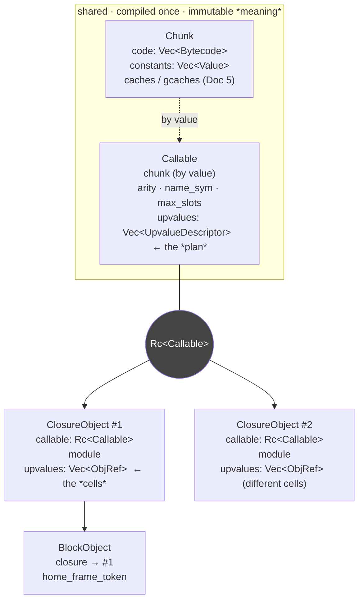

# Chunk, Callable, Closure, Block — the compiled artifact

> **VM track, Doc 2.** Prerequisite: [The Execution Loop](execution-loop.md) (Doc 1). That doc ran a
> `while` loop over a `Vec<Bytecode>` and kept promising to explain the one value it hoisted out of
> the loop and guarded on — the `Rc<Callable>`. This doc is that promise. It is also where the word
> "closure" stops being one thing.

## The grip

Ask a working programmer what a compiled function *is*, and you get one box: code plus the variables
it captured, bundled together. That picture is correct about meaning and wrong about representation,
and the gap between them is this whole document.

Phalcom does not have "a compiled function." It has **four** things, stacked, each owning one axis of
the problem:

> **A `Callable` is the immutable recipe — bytecode, constant pool, and a capture *plan*. A
> `ClosureObject` is one instantiation of that recipe — the recipe plus a module plus the captured
> *cells*. A `BlockObject` is an instantiation stamped with the frame it was born in. And a
> `MethodKind` is the cap that says whether any of this is even bytecode, or a raw Rust function
> instead.**
>
> The recipe is **shared** (one `Rc`, many closures). The instantiation is **minted fresh** (once
> per evaluation). The stamp is what makes a **non-local return** possible. The cap is where
> **native** lives.

Hold those four verbs — *shared, minted, stamped, native* — and the type stack below re-derives
itself. Lose them and it is four Rust structs to memorize.

## Why one box is the wrong number

The one-box model — `⟨code, captured-values⟩`, a single heap object — is *semantically* complete.
Lexical scoping says a function value carries its captured bindings; a box with a code field and an
environment field says exactly that. For reasoning about what a program *means*, stop there.

It breaks on economics, not meaning. The instant a function literal can be evaluated **more than
once with different captures live at the same time** — a closure minted inside a loop, inside
recursion, inside anything the compiler cannot prove runs once — the one box forces you to copy the
*code* every time you only meant to mint new *state*. The instructions don't change between one
evaluation and the next. The constant pool doesn't. The *shape* of what gets captured doesn't. Only
the captured values do. A representation that fuses invariant-code with per-instance-state has no
way to say "these 99% of the bits are shared across a thousand instances" — so every instantiation
pays for all of it.

This is not a new observation. It is the old **FUNARG problem** — a function value that escapes the
call that made it needs its captured environment to outlive that call's stack frame — and the fix
every serious implementation converged on is to split the one box in two: an immutable **code
template** compiled once and shared, and a small **instance** minted per evaluation holding only what
varies. (How a captured *cell* itself survives its home frame — open vs. closed upvalues — is the
subject of the closures/upvalues doc, not this one. Here we care only about *which layer the cells
hang off*, not how they are kept alive.)

Two languages worth keeping in view, because Phalcom's stack is theirs almost line for line:

- **Lua** splits a `Proto` (the shared function prototype: code, the `k` constant array, and upvalue
  descriptors) from a `Closure` (a `Proto` plus its filled-in upvalue cells). This is the cleanest
  real instance of the split, and the vocabulary — *prototype* vs *closure* — is the one to borrow.
- **CPython** splits a **code object** (`co_code`, `co_consts`, `co_names`) from a **function
  object** (a code object + `__closure__` cells + `__globals__`). It also names the two things
  Phalcom's instance carries besides the recipe: the captured cells and the module link.

Phalcom takes the split — and then takes it two layers further than either. Here is the whole stack.

## Four types, three boundaries



The load-bearing shape: **one recipe, refcount-shared; many instances, each with its own cell
vector; a stamp added only when an instance becomes a first-class block.** Read the layers
bottom-up — each exists because the one below it couldn't carry what the next needs.

---

## Layer 1 — `Chunk`: the code and its constant pool

`chunk.rs::Chunk` (~L44):

```rust
pub struct Chunk {
    pub code: Vec<Bytecode>,          // Doc 1: the typed-enum instruction vector
    pub constants: Vec<Value>,        // the constant pool
    pub spans: Vec<SourceRange>,      // ip -> source range, for diagnostics
    pub caches:  Vec<Cell<Option<InlineCache>>>,   // ← lie, see below
    pub gcaches: Vec<Cell<Option<GlobalCache>>>,   // ← lie, see below
}
```

Doc 1 covered `code`. The new field is **`constants` — the constant pool** — and it earns a section
because the reason it exists is not obvious.

**Why a side array instead of baking literals into the instructions?** A bytecode wants fixed,
narrow instructions that decode uniformly. Literals refuse to cooperate: a string, a big float, an
interned symbol, even a *nested closure template* are all different sizes, some unbounded. So the
instruction carries a small **index** and the actual `Value` lives in `constants`. `Constant(idx)`
pushes `constants[idx]`; but the pool holds far more than user literals — it is where an opcode finds
any operand too big to inline:

| opcode | what it reads from `constants[idx]` |
|---|---|
| `Constant(idx)` | a literal `Value` — pushed directly |
| `GetGlobal` / `SetGlobal` / `DefineGlobal` | the global's **name**, an interned `Symbol` |
| `Class(idx)` / `Method(sel_idx, _)` | a class name / a method **selector** `Symbol` |
| `Invoke(argc, sel_idx)` | the message **selector** `Symbol` (read on cache miss) |
| `Closure(idx)` | a **whole template `ClosureObject`** (see Layer 3) |

*(dispatch.rs, arms at `:572`, `:624`, `:633`, `:741`, `:918`, `:419`, `:583` — full enumeration in
the source map.)*

That last row is the surprise worth keeping: a nested function's entire compiled template sits in its
enclosing function's constant pool as just another `Value`. Functions nest the way literals nest.

Two payoffs fall out of "all literals live in one typed array." First, **the GC gets root
enumeration for free** — to find every heap value a piece of code keeps alive, the collector walks
`constants`; it never has to understand instruction encoding or risk reading an integer operand as a
pointer. (Trace does exactly this — `trace.rs` walks `closure.callable.chunk.constants`.) Second, the
pool *could* deduplicate identical literals to one slot.

**Predict-then-check.** `System.print("hello")` on two lines — one repeated string literal. Does the
constant pool hold `"hello"` once or twice?

Lua dedups within a `Proto`; CPython dedups within a code object. If you predicted "once," you
predicted those languages. Phalcom holds it **twice**:

```
Constants:
  [1] <obj ObjRef(1531v1)>    # first "hello"
  [4] <obj ObjRef(1532v1)>    # second "hello" — a *different* heap object
```

`add_constant` (`chunk.rs:85`) is an unconditional `push` — no lookup, no equality check. No dedup
shipped. (A `ConstKey` dedup was specced under U-COMPILE; it is not at HEAD. Stated as an absence,
not a design principle — the pool is simply built by a compiler that doesn't bother, which is
wasteful in pool size and wrong in nothing: executing `Constant(1)` vs `Constant(4)` never cares
whether the slots happen to be equal.)

> **Lie A.** `caches` and `gcaches` are "just two more parallel arrays." True as far as the shape
> goes — same length as `code`, indexed by `ip`. But *why* they are `Cell<Option<..>>` (interior-
> mutable memo slots on an otherwise-frozen artifact), and how inline caching and global-slot caching
> actually work, is **Doc 5 (caches & fusion)**. Until then: they are runtime memo scratch, deletable
> without changing any result. We return to this as a tension at the end.

---

## Layer 2 — `Callable`: the recipe

A `Chunk` alone can't be shared *and* carry per-call metadata cleanly, so it is wrapped:

```rust
// callable.rs::Callable (~L21)
pub struct Callable {
    pub chunk: Chunk,                        // by value — the Callable OWNS its code
    pub max_slots: usize,                    // stack frame size to reserve
    pub num_upvalues: usize,
    pub upvalues: Vec<UpvalueDescriptor>,    // the capture PLAN, not the captures
    pub arity: usize,
    pub name_sym: Symbol,
}
```

Two things to notice, because both are load-bearing and neither is obvious.

**The `Chunk` is held by value, not by `Rc`.** The recipe *owns* its code outright. The sharing
happens one layer up, around the whole `Callable` — which means a single shared pointer covers the
code, the constant pool, and both side tables at once. (This is why the `Rc` went where it did; hold
that thought for the next section.)

**`upvalues` here is a `Vec<UpvalueDescriptor>` — a plan, not a payload.** A descriptor is
`{is_local: bool, index: usize}` (`callable.rs:10`): *"capture one variable; it's either a local of
the immediately-enclosing frame at this slot, or an upvalue of the enclosing closure at this
index."* It describes the **shape** of capture — how many, and where each is found — fixed at compile
time, identical no matter how many times or in what state the recipe is instantiated. That is
*exactly* what makes it shareable: shape is invariant; values are what vary; values cannot live here
without destroying the sharing. The values — the actual cells — live one layer up, on the instance.
(What a cell *is* and how it survives its frame: the upvalues doc.)

Now the correction the naive picture demands. **A `Callable` is purely a bytecode recipe. It has no
"native" variant.** It is a plain struct, not an enum; every field is bytecode data. So:

> **Predict-then-check.** `1 + 2` sends `+` to a number, and `Number>>+` is written in Rust, not
> Phalcom. Where in this stack is the native `+`? Is its `Callable` a "native `Callable`"?

There is no `Callable` for `+` at all. Native code never enters the recipe/instance/stamp stack — it
lives in the **cap**, `MethodKind`, which we reach at the top. The bytecode layers know nothing about
native and never check for it. (Full treatment below; the point here is only that the expectation
"the recipe is bytecode-or-native" is wrong — the recipe is *always* bytecode.)

### Why the recipe is shared by `Rc` — paying off Doc 1's Lie #1

Doc 1 hoisted an `Rc<Callable>` out of the dispatch loop and guarded on `closure_id`, and promised
this doc would say why it is an `Rc`. Here is the why, and it is measured, not architectural.

The instance holds its recipe as `Rc<Callable>` (`closure.rs:28`). Before perf-log cut **004
(U-HOTPATH)**, `ClosureObject` owned its `Callable` *by value*, so the `Bytecode::Closure` opcode
deep-copied the entire thing — code array, constant pool, side tables — **on every evaluation of a
block literal**. In Skynet (one block literal, evaluated 1.1 million times) that was 1.1M chunk
copies. Switching the field to `Rc<Callable>` made each materialization a refcount bump instead:

- Skynet user time **3.11s → 2.19s (−30%)**, RSS **3.73 GB → 1.37 GB (−63%)**.
- Honest cost, recorded in the same note: the extra pointer hop to reach the chunk through the `Rc`
  regressed non-block-heavy sends **5-7%** (`bare_send`, `arith_send`, `binary_trees`) — which is
  precisely the regression Doc 1's chunk-pointer **hoist** exists to claw back. The hoist and the
  `Rc` are two halves of one trade.

So the layer split *(recipe vs instance)* is deliberated design; *which layer got the `Rc`* is a hot-
path optimization with a scoreboard entry. The doc that told you closures were cheap to mint was
telling the truth only after cut 004.

---

## Layer 3 — `ClosureObject`: one instantiation

The recipe is shared and value-free. Running code needs the opposite: a per-evaluation object
carrying *this* activation's captures and *this* module. That is the instance:

```rust
// heap/closure.rs::ClosureObject (~L24) — a heap Object, unlike the two layers below it
pub struct ClosureObject {
    pub callable: Rc<Callable>,   // the shared recipe
    pub module:   ObjRef,         // where this closure resolves globals
    pub upvalues: Vec<ObjRef>,    // the FILLED cells — one per UpvalueDescriptor
}
```

`upvalues: Vec<ObjRef>` is the descriptor plan made concrete: one real heap cell per descriptor. The
`module` handle rides here and not on the recipe for the CPython reason — two closures over
syntactically identical code compiled in different modules must resolve their globals independently,
so the module link cannot be shared on the template.

### The hard case: one static opcode, many live instances — and methods that skip it

The instruction that turns recipe into instance is `Bytecode::Closure(idx)`. It is worth tracing in
full, because it does something a reader's model does not predict: **it does two jobs at once, and
one whole category of closures never runs it at all.**

```rust
// dispatch.rs :577 — abridged to the load-bearing lines
Bytecode::Closure(idx) => {
    let template = callable.chunk.constants[idx as usize];      // the template lives in the pool
    let Value::Obj(template_id) = template else { /* internal error */ };

    let descriptors = self.heap.closure(template_id).callable.upvalues.clone();  // the PLAN
    let callable    = Rc::clone(&self.heap.closure(template_id).callable);       // share, don't copy
    let module      = self.heap.closure(template_id).module;

    let mut upvalues = Vec::with_capacity(descriptors.len());   // the CELLS, minted now
    for desc in &descriptors {
        let cell = if desc.is_local {
            self.capture_upvalue(stack_offset + desc.index)          // grab a live stack slot
        } else {
            self.heap.closure(closure_id).upvalues[desc.index]       // forward from my own upvalues
        };
        upvalues.push(cell);
    }

    let new_closure = self.heap.alloc(Object::Closure(Box::new(
        ClosureObject { callable, module, upvalues })));             // job 1: the instance
    let token = self.current_frame_token().expect("closure created inside a frame");
    let block = self.heap.alloc(Object::Block(BlockObject::new(new_closure, token)));  // job 2: the stamp
    self.stack.push(Value::Obj(block));
}
```

Read the two jobs. **Job 1** walks the descriptor plan and allocates a fresh `ClosureObject` with a
freshly filled cell vector — the `Rc::clone` shares the recipe, the loop mints the captures. **Job
2** immediately wraps that instance in a `BlockObject` (Layer 4) and pushes *the block*. There is no
separate "make a block" opcode: `Closure` is it. (Confirmed against `bytecode.rs` — no
`Bytecode::Block`/`MakeBlock` exists.)

Now the part that breaks the model. **A method body never executes this opcode.** A method's
`ClosureObject` is built *once, at compile time*, directly (`class_decl.rs:495`, `compile_block`) —
because a method captures no upvalues (its `self` arrives in local slot 0, not through capture), so
there is nothing to fill in per-activation and nothing to stamp. For a method, template *is*
instance; the template/instance distinction collapses to a single object. The whole
mint-fresh-per-evaluation dance in the opcode above exists **only for block literals**, whose
enclosing-scope captures aren't known until the block is reached inside a live frame.

That asymmetry is the real content of "recipe vs instance": it is visible precisely where it *doesn't*
happen.

### Predict-then-check: the block in the loop

Put a block literal inside a loop that runs three times:

```phalcom
var fns = List.new()
for (n in numbers) {       // numbers = [1, 2, 3]
  fns.add({ n })           // a block literal, capturing this iteration's n
}
```

Before reading on: across the three iterations, **what is allocated fresh each time, and what is
shared across all three?** Name each of the four types.

Disassemble it and the loop body holds exactly **one** `Closure` instruction:

```
0033: Closure(19)          # the one static block-minting site
0034: Invoke(1, 20)        # fns.add(...)
...
0042: Loop(-18)            # back-edge to the cursor re-test at 0025
```

One static `Closure(19)`. The `Loop` back-edge re-executes it once per element. So per iteration:

- **`Callable` — shared.** All three blocks `Rc::clone` the *same* recipe. One code array, one
  constant pool, three refcount bumps. (This is cut 004 doing its job.)
- **`ClosureObject` — minted fresh, ×3.** Three distinct heap instances.
- **The upvalue cell for `n` — minted fresh, ×3.** Each instance captures *this iteration's* `n`
  through its own cell, which is why the three blocks observe `1`, `2`, `3` and not three copies of
  the final value. (The `CloseUpvalue` at `0036`/`0043` in the full disasm is what makes each
  iteration's cell independent — mechanism deferred to the upvalues doc.)
- **`BlockObject` — minted fresh, ×3**, each stamped with the frame token live at that iteration.

If you predicted "the whole closure is one shared object" — that is the one-box model, and the loop
would give you three references to one thing observing one `n`. If you predicted "everything is
copied" — that is the pre-004 world, and it cost 3.73 GB. The layer split is exactly the seam between
what a thousand instances share and what each one owns.

---

## Layer 4 — `BlockObject`: the stamp

```rust
// heap/block.rs::BlockObject (~L18) — Copy, cheap to mint
pub struct BlockObject {
    pub closure: ObjRef,              // the instance from Layer 3
    pub home_frame_token: FrameToken, // the activation this block was born in
}
```

A `BlockObject` adds exactly one thing to a `ClosureObject`: the identity of the **home frame** — the
specific live activation the block was created inside. It is the sole carrier of that token: neither
`Callable` nor `ClosureObject` has a frame-token field, and — per the asymmetry above — a method's
closure never gets wrapped in one.

Why a block needs it: a **non-local return**. A `^`-style return written inside a block does not
return from the block; it returns from the *method activation the block was created in*, however many
calls deep the block is actually running when it fires. To find and unwind to that activation, the
block must carry its identity — stamped at creation, in job 2 of the `Closure` opcode. This is the
Smalltalk home-context mechanism (a block remembers its creating method activation so `^` can unwind
to it), and Phalcom's realization of it is **ADR-0013**.

> **Lie C.** A `FrameToken` is "just a number stamped on the block." It is not just a number — it is
> a `(home-frame, generation-counter)` pair, and the generation counter is what turns "this block
> outlived its home frame" from silent memory corruption into a clean `DeadFrameError`. ADR-0013
> rejected the naive alternative (a raw frame pointer, no generation) for exactly that reason. What a
> `FrameToken` is, how it is generated, and how a stale one is caught is **Doc 6 (frame identity)**.

The object-model framing behind all this is **ADR-0006**: `Function` is an abstract root, and `Block`
and `Method` are **siblings** — neither a subtype of the other — precisely because a method carries a
selector a block doesn't and a block carries a home frame a method doesn't. Forcing either to
subclass the other would mean one carrying a field meaningless to it. They share the `ClosureObject`
representation and diverge exactly at the stamp.

---

## The cap — `MethodKind`: where native actually lives

The whole four-layer stack answers "what is a *bytecode* function." It says nothing about native
code, because native code is not in the stack. It is one variant up, at the point where a class
decides how to invoke a method at all:

```rust
// method/object.rs::MethodKind (~L17)
pub enum MethodKind {
    Closure(ObjRef),          // bytecode — a handle to a ClosureObject (Layer 3)
    Primitive(PrimitiveFn),   // native — a bare Rust fn pointer, no closure, no capture, no chunk
}
```

`PrimitiveFn` is `fn(&mut VM, &Value, &[Value]) -> PhResult<Value>` — a raw function pointer with no
recipe, no instance, no constant pool. This is the answer to the fork the theory left open: native is
represented as a **sibling to the whole bytecode stack**, not as a variant *inside* the code object.

The trade this buys and costs is worth naming, because it is a real fork with real occupants on both
sides. The **sibling** choice (Phalcom, and CPython — `PyFunctionObject` vs `PyCFunctionObject` are
genuinely different C types) keeps the code layer *pure*: every consumer of a `Callable`/`Chunk` can
assume bytecode, constant pool, capture plan — full stop, no defensive tag-check anywhere in that
layer. The cost is a fork duplicated at the dispatch point — `MethodKind` has to be matched wherever a
method is invoked. The **variant** choice (one lineage puts a bytecode-or-native tag *inside* the
method's implementation object and writes everything above it blind to the tag) buys one uniform
representation at the cost of making every future code-layer concern — disassembly, introspection,
serialization — know that "native" exists. Phalcom bought code-layer purity and pays at the call
site.

---

## The tension the layers leave behind: frozen code, mutable memo

One honest loose end, promised back at Lie A. The recipe is described throughout as **immutable —
frozen after compile.** And yet `Chunk` carries `caches` and `gcaches`, which are
`Cell<Option<..>>` and get *written at runtime*, through a shared `&Chunk` borrow, from inside the
dispatch loop. A frozen artifact that mutates. Which is it?

Both, at different levels of description — and seeing why is the point. The **code** — instructions,
constants, capture plan, everything that determines what the function *means* — is frozen; nothing in
that set changes after compilation, and that is what makes an `Rc<Callable>` safe to share across
every instance without synchronization. What sits beside the code is not code: it is a **side table
of interior-mutable memo cells**, observationally invisible to anything that cares only what the
function computes. Delete the caches, force every lookup to miss, and every result is identical — just
slower. "Frozen after compile" is a claim about *meaning*; the `Cell`s are a claim about *bits that
carry no meaning*. They do not contradict; they describe different layers. *How* those memo cells
work — inline caches keyed on receiver class, global-slot caches version-guarded against
redefinition, and the superinstruction fusion that rewrites the code array in place — is **Doc 5**.

---

## A fiber and a collector, in one breath each

- **Fiber.** An instance's filled cells are `ObjRef`s to heap `Upvalue`s, and an *open* one is
  `Upvalue::Open { fiber: ObjRef, slot }` (`upvalue.rs`) — it names *which fiber's* stack slot, not a
  raw pointer, because the VM swaps its live stack per fiber (Doc 1's fiber note). So an instance's
  captures can point into a parked fiber's stack. Mechanism: upvalues doc.
- **GC.** `ClosureObject` and `BlockObject` are traced heap objects; `Callable`/`Chunk` are plain
  Rust structs reached *through* the `Rc` from every instance. Tracing a closure walks its module,
  its cells, and `callable.chunk.constants` — so the constant pool is the single place every literal
  a function keeps alive is enumerable (the root-finding payoff from Layer 1). Collector internals:
  the GC doc.

---

## What you can now re-derive

Delete the type definitions. Given only these pressures, rebuild the stack:

1. *One immutable code body, N simultaneously-live closures over it, each with different captures.* →
   Split the shared, value-free **recipe** (`Callable`, owning its `Chunk`) from the per-evaluation
   **instance** (`ClosureObject`, holding the filled cells + module). The capture **plan**
   (`UpvalueDescriptor`) is compile-time shape, so it rides the recipe; the **cells** are per-instance
   value, so they ride the instance.
2. *A block literal in a hot loop must be cheap to mint a million times.* → Share the recipe by
   `Rc`, so materialization is a refcount bump, not a chunk copy. (Measured: cut 004, −63% RSS on
   Skynet. This is Doc 1's hoisted `Rc<Callable>`.)
3. *A `^`-return inside a block must reach the method it was written in.* → Stamp the instance with
   its home frame → `BlockObject`. Only blocks need it, so only blocks carry it, and `Block`/`Method`
   are siblings (ADR-0006), not one atop the other.
4. *A method can be Rust, not Phalcom.* → Don't pollute the recipe with a native variant; fork one
   layer up, at `MethodKind`. The bytecode stack stays pure.
5. *Literals and names are too big and too GC-relevant to inline.* → A **constant pool** on the
   `Chunk`: opcodes carry indices, the collector walks one typed array. (Phalcom doesn't dedup it —
   an absence, not a principle.)

Five pressures, four types, one `Rc`. That is the compiled artifact.

---

## Anchors

Symbol-first; line numbers approximate and will drift, symbols will not.

- `chunk.rs::Chunk` (~L44) — code + `constants` pool + `spans` + `caches`/`gcaches`.
  `Chunk::add_constant` (~L85) — the no-dedup `push`.
- `callable.rs::Callable` (~L21) — the recipe; `chunk` by value. `callable.rs::UpvalueDescriptor`
  (~L10) — the capture plan.
- `heap/closure.rs::ClosureObject` (~L24) — the instance; `callable: Rc<Callable>` at L28.
- `heap/block.rs::BlockObject` (~L18) — the stamp; `home_frame_token`.
- `method/object.rs::MethodKind` (~L17) — the cap; `Closure(ObjRef)` vs `Primitive(PrimitiveFn)`.
- `vm/dispatch.rs` `Bytecode::Closure` (~L577) — recipe→instance→block, in one arm.
- `compiler/lib/class_decl.rs` (~L495) — a method's `ClosureObject`, built once at compile time.
- perf-log **004-hotpath-rc-callable.md** — the `Rc` share and its numbers. ADR-0006 (Function root;
  Block/Method siblings), ADR-0013 (frame-token non-local return).

**Forward pointers (lies to be destroyed):** the `caches`/`gcaches` side tables and superinstruction
fusion → Doc 5 (caches & fusion). `FrameToken` internals and `DeadFrameError` → Doc 6 (frame
identity). Open/closed upvalue *cells* → the closures/upvalues doc. This doc destroyed Doc 1's Lie #1
(the hoisted `Rc<Callable>`).
