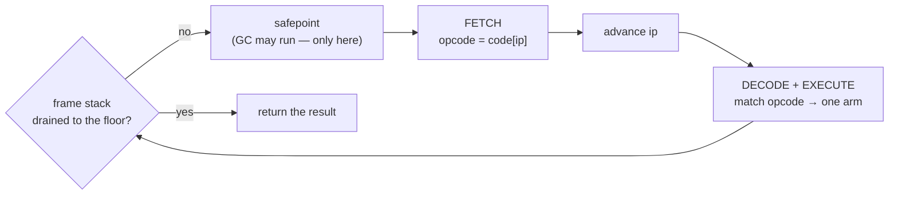

# The Execution Loop

*VM track, Doc 1 — the group entry and the map. Read this first; every other doc in
this track is one arm of the loop it describes.*

---

## The grip

Running a Phalcom program is one `while` loop matching a flat array of typed opcodes
against a stack. Fetch the opcode at a moving index, `match` on it, push and pop one
value stack, advance, repeat — until the *frame* stack drains to a floor. That loop is
[`VM::run_until_inner`](../../../phalcom-core/src/vm/dispatch.rs) (`dispatch.rs::VM::run_until_inner`
@ ~L477), and nothing magic runs underneath it. A method call, a closure, a garbage
collection — each is *one arm* of that `match`, and the loop is the whole engine.

That is the claim this document has to earn, because it is the frame you will hang the
other five docs on. When Doc 4 explains how `3 + 4` becomes a method lookup, it is
explaining one arm. When the upvalues doc explains how a captured variable survives its
frame, it is explaining two arms. If you hold *"it is a loop over a match, and everything
is an arm"* the whole way through the track, no later doc can lose you — you will always
know where you are.

Hold two variables in your head and you can track the entire machine: **where the
instruction pointer `ip` points**, and **what shape the value stack is in**. Every design
choice below is a different answer to *"what happens to those two things after one trip
through the loop."*

A caution the word "bytecode" will try to plant, uprooted immediately and paid off in
full under [Decode is free](#decode-is-free-because-bytecode-is-not-bytes): Phalcom is a
"bytecode VM," but its bytecode is **not a byte stream**. It is a typed enum vector. Keep
that suspicion in your pocket.

---

## A software CPU

The fetch-decode-execute cycle is older than any software VM — it is borrowed wholesale
from the instruction cycle of a hardware CPU, and the borrowing is not a metaphor. A
bytecode interpreter *is* a CPU implemented in software, whose instruction set nobody
built silicon for. **Fetch** the instruction at `ip`. **Decode** which operation it names.
**Execute** it — mutating VM state, and as part of executing, moving `ip` (by default to
the next slot, or, if the instruction was a jump, to wherever it points). Every bytecode
VM's main loop is a restatement of this cycle. The idiom crystallized in C as

```c
while (true) {
    switch (*ip++) {
        case OP_ADD: /* ... */
        case OP_JUMP: /* ... */
    }
}
```

and it shows up, convergently, in nearly every bytecode VM built since Smalltalk-80's 1983
"Blue Book" specified an interpreter in exactly this shape. It is close to the only sane
way to write "walk a flat list, branch on what you find" in a language with structured
control flow.

As a shape — the one picture worth holding, because everything below is an annotation on it:



That is Phalcom's loop order exactly: check the halt, service GC on the coherent back-edge,
fetch, step `ip`, `match`. Every section of this document zooms into one box of that ring.

Phalcom's version of that loop, stripped to its skeleton (`dispatch.rs::VM::run_until_inner`,
verified at HEAD):

```rust
fn run_until_inner(&mut self, base_frames: usize) -> PhResult<Value> {
    let mut hoisted: Option<(ObjRef, Rc<Callable>)> = None;   // (a lie; see below)
    loop {
        if self.frames.len() <= base_frames {                 // ── HALT: a drain, not an end
            let result = self.stack.pop().unwrap_or(Value::Nil);
            return Ok(self.surface_absence(result));
        }
        self.service_gc_safepoint();                          // ── the one coherent point

        let frame = *self.frames.last().unwrap();
        let ip = frame.ip;
        // ... resolve the code array for this frame (the `hoisted` line, a lie for now) ...

        let opcode = callable.chunk.code[ip];                 // ── FETCH: one indexed load
        self.frames.last_mut().unwrap().ip += 1;              // ── advance ip past it

        match opcode {                                        // ── DECODE + EXECUTE
            Bytecode::Constant(idx) => { /* push a constant */ }
            Bytecode::Pop           => { /* discard top     */ }
            Bytecode::Invoke(..)    => { /* send a message   */ }
            // ... 34 more arms ...
        }
    }
}
```

Everything in this document is a reading of one of those lines. Two of them are marked as
**lies** — deliberate simplifications this track pays off later:

> **Lie #1 — `hoisted` / `let callable = …`.** "The loop reads its code array" is not the
> whole truth; it hoists a shared `Rc<Callable>` across iterations and refreshes it with a
> one-compare guard, for a measured reason. Why, and what a `Callable` even is, is *Chunk,
> Callable, Closure* (Doc 2). Until then: the loop has a code array; ignore how it gets it.

> **Lie #2 — the `Invoke` arm "sends a message."** A send does not just "run a method." It
> pushes a resumable **frame** onto that frame stack the halt check watches, which is why
> the halt is a drain in the first place. *Frames and the Call Stack* (Doc 3) owns that;
> *Message Send* (Doc 4) owns the lookup.

Now the reading, one line at a time.

---

## How a source string reaches the loop

Before the loop can spin, a program has to become a code array with a frame sitting on top
of it. The path is five hops, each verified at HEAD in `interpret.rs` and `dispatch.rs`:

```
interpret_source ─► compile_closure ─► run_in_module ─► run ─► run_until ─► run_until_inner
   (drive)            (parse+compile)   (push frame 0)  (=run_until(0))  (fiber wrapper)  (the loop)
```

1. `interpret.rs::VM::interpret_source` (@ ~L186) — the top-level driver the CLI and REPL
   call. It stores the source, then compiles and runs.
2. `interpret.rs::VM::compile_closure` (@ ~L142) — parses and compiles the whole program
   into a single top-level **closure** (a code array plus its module). No execution yet.
3. `interpret.rs::VM::run_in_module` (@ ~L163) — clears the value and frame stacks (this is
   the *outermost* entry), then **pushes frame 0**: one `CallFrame` pointing at the
   top-level closure, `ip = 0`. Then calls `run`.
4. `dispatch.rs::VM::run` (@ ~L204) is literally `self.run_until(0)`.
5. `dispatch.rs::VM::run_until` (@ ~L221) is the fiber wrapper (one paragraph near the end);
   for a top-level program it calls straight into `run_until_inner(0)`.

So by the time the loop starts, there is exactly one frame, `ip` is 0, and the value stack
is empty. The loop takes it from there.

---

## Decode is free, because "bytecode" is not bytes

Here is the suspicion from the grip, paid off. Fetch is this single line
(`dispatch.rs::VM::run_until_inner` @ ~L544):

```rust
let opcode = callable.chunk.code[ip];
```

`ip` indexes `chunk.code`, and `code` is not a `Vec<u8>`. It is a `Vec<Bytecode>`
(`chunk.rs::Chunk` @ ~L45), where `Bytecode` is a Rust enum whose variants carry their
operands as **payload fields**, not as trailing bytes (`bytecode.rs::Bytecode` @ ~L48):

```rust
pub struct Chunk {
    pub code: Vec<Bytecode>,
    // ...
}

pub enum Bytecode {
    Constant(u16),
    Invoke(u8, u16),
    SuperSend(u8, u16, u16),   // the widest variant, ~8 bytes
    // ... 34 more ...
}
```

One indexed load pulls the **whole** instruction — discriminant *and* operands — into
registers, sized to the widest variant. Then `match opcode` (@ ~L570) switches on the
discriminant, and the operands are already in registers from the same load. There is **no
second read** for an operand, because a `Bytecode` value already *is* the entire
instruction. The `Bytecode::Jump` variant says so in its own source comment: *"a `Chunk` is
a `Vec<Bytecode>`, not a byte stream, so there is no fixed-width encoding to economize."*

This is why "decode" costs almost nothing here — not because of any clever dispatch trick,
but because the representation has already decoded for you. In a real byte-stream VM (the
JVM, CPython), "decode" is a genuine step: read a byte, and if the opcode takes an argument,
read the next byte(s) and reassemble them. Phalcom skips that step by never encoding into
bytes in the first place.

> This is the recurring Phalcom trap: **a lineage label names the architecture, never the
> representation.** "Bytecode VM" tells you the *shape* — a compile step, a flat instruction
> array, a dispatch loop. It tells you nothing about whether that array is bytes or typed
> values, and the consequences live entirely in that second question. (The upvalues doc hits
> the same trap from the other side: Phalcom is "Lua-style" architecturally and Lua's inverse
> representationally. Same lesson, different mechanism — see
> [*Upvalues*](upvalues.md).)

The word "bytecode" is used throughout this track, because it is the field's word for the
architecture. Read it as "compiled instruction stream," never as "array of bytes."

---

## The one real fork: where do operands live?

The fetch-decode-execute *cycle* is not a decision — it is the shape of every bytecode
interpreter. But the *machine model* underneath it is a genuine fork with real occupants,
and it is the one place this document spends design-space depth. The question: when one
instruction produces a value a later instruction needs, where does the value sit in the
meantime?

**A stack machine** keeps operands on an implicit **operand stack**. Instructions don't
name their inputs — `Add` says only "pop two, push their sum." Loading a named value still
takes an instruction, but combining values does not. The compiler that emits this is almost
embarrassingly simple: a post-order walk of the expression tree, because "where does the
value live" is always "on top." The JVM, CPython, Smalltalk-80, and Wren all occupy this
branch across four eras — it is not a beginner's choice. The bill comes due in instruction
*count*: every intermediate value costs a push and later a pop, and each is a full trip
through the loop.

**A register machine** names its operands explicitly by virtual-register index, right in
the instruction: `Add r3, r1, r2` means "r3 := r1 + r2," no implicit state. Instructions
get fatter but each does more, and values already resident in registers need no load step.
The occupants are Lua (5.0 onward), Dalvik, and LuaJIT. The bill: the compiler now has to
solve **register allocation** — which register holds which live value, when lifetimes
conflict — real work the stack machine gets to skip.

The load-bearing data point is **Lua's switch from a stack VM to a register VM at 5.0
(released 2003)** — "the first register-based virtual machine to have a wide use," per its
implementers' paper [*The Implementation of Lua 5.0*](https://www.lua.org/doc/jucs05.pdf)
(Ierusalimschy, de Figueiredo, Celes). Lua did not design register-first from a clean sheet
the way Dalvik did; it *lived* with a stack VM in production for several major versions,
then rewrote specifically because instruction-count analysis showed the register model would
win. That makes it the one piece of *empirical* evidence in this space rather than a priori
taste — a real, widely embedded language paying a compiler-complexity cost, after already
shipping the simpler alternative.

The difference is countable. Take `a + b * c` (multiply first). As stack bytecode:

| `ip` | instruction | stack after (top at right) |
|---|---|---|
| 0 | `Load a` | `[a]` |
| 1 | `Load b` | `[a, b]` |
| 2 | `Load c` | `[a, b, c]` |
| 3 | `Mul` | `[a, b*c]` |
| 4 | `Add` | `[a + b*c]` |

Five instructions, five dispatches. As register bytecode, with `a`, `b`, `c` already in
registers:

| `ip` | instruction | effect |
|---|---|---|
| 0 | `Mul r3, rb, rc` | `r3 := b * c` |
| 1 | `Add r4, ra, r3` | `r4 := a + r3` |

Two instructions, two dispatches. Same semantics, 5 dispatches versus 2 — the exact ratio
Lua's implementers were looking at. Note what it does *not* show: how expensive one dispatch
is. A stack machine with cheap dispatch and a register machine with expensive dispatch could
come out even. That is the next section.

**Phalcom is a stack machine** — you can watch it be one, further down, where the
disassembler turns `1 + 2 * 3` into exactly the `Constant`/`Constant`/send shape of the
left-hand table. But note the honesty here: **Phalcom did not hold a stack-vs-register
bake-off.** There is no ADR weighing the two, and no evidence anyone agonized. It is a stack
machine because it is in the Smalltalk/Wren lineage, where the object model wants a
send-centric loop (a point Smalltalk-80 will make concrete below). The design-space walk
above is *pedagogical* — it teaches you what the choice buys, so you can re-derive why a
stack machine is a coherent thing to be, not because Phalcom reasoned its way down that
branch. The genuinely deliberated decision at HEAD is narrower and sharper, and it is about
representation, not machine model. Here it is.

(One branch is cut, not weighed: **tracing and method JITs** — V8, LuaJIT's trace compiler,
PyPy, HotSpot. A JIT's move is to *stop running this loop* for hot code and run native code
it compiled instead — a second machine with its own design space (trace selection, guards,
deoptimization), not a variant reading of this one. Phalcom is a pure interpreter at HEAD, so
it never enters that space. That is why it is excluded here rather than folded in.)

---

## Dispatch, and a technique Phalcom cannot use

**Dispatch** is the step where an opcode value in hand becomes the handler for it running —
independent of *how*. There is a spectrum of techniques, and it is where you gain the
vocabulary most readers lack.

- **`switch` / `match`.** One `switch` (or, with pattern matching, one `match`), one case
  per opcode. Portable, simplest. A decent compiler turns a dense `switch` into a jump
  table, so the real cost is not comparisons — it is **branch-predictor pressure**. There
  is exactly one indirect branch in the whole loop, and it is asked on every iteration to
  predict a *different* target depending on which opcode comes next. Modern predictors key
  substantially off the *address of the branch instruction*; one physical branch site
  modelling "what follows an `Add`" and "what follows a `Jump`" at once mispredicts far more
  than a site that only ever predicts one thing.
- **Direct / token threading.** Give each handler its *own* branch: each ends by jumping
  directly to the next handler (direct threading stores handler addresses in the code array;
  token threading keeps small integers and indexes a table). Now there are many branch
  sites, each seeing a narrower, more predictable "what comes next" — because in real
  programs certain opcodes really do tend to follow certain others.
- **Computed goto** (labels-as-values) is the GCC/Clang extension that makes threading
  expressible inside one C function: take a label's address with `&&label`, jump to a
  computed one with `goto *target`. **CPython** gates this behind `--with-computed-gotos`
  (a build option since 3.1, on by default where the compiler supports it since 3.2) and
  measured it a real win over plain `switch` — for exactly the branch-predictor reason above.

Now a prediction to make before reading on.

> Computed goto is the classic dispatch speedup, reached for by serious byte-code VMs, and
> CPython found it worth shipping. Phalcom does not use it. **Predict which is true:** (a)
> Phalcom's authors simply have not gotten to it; or (b) something about Phalcom's
> representation forecloses the technique outright.

The answer is (b), and it is the whole reason the representation section came first.
Computed goto needs the "code" to be a raw, indexable address space — a byte or word stream
you walk by adding a known width to a pointer, decode by reading a fixed-size cell, and jump
into via a runtime-computed value. That is precisely what a byte-opcode array is. It is
*not* what a `Vec<Bytecode>` is. A `Bytecode` value is a materialized, self-describing
variant — its discriminant already tells you which operation this is the moment you hold the
value. There is no byte offset to compute a jump target from, and the decode the technique
exists to skip **has already happened by construction**. Whatever dispatches on the
discriminant is a `match`, and whether the *host* Rust compiler lowers that `match` to a
jump table is its own optimization decision — the source cannot force it the way `&&label` /
`goto *x` lets C force it.

This is not a gap in Phalcom's ambition. It is a documented **finding**. When someone tried
to port a Wren-style operand-folding superinstruction (`LOAD_LOCAL_0`, the byte-stream
trick), inspection killed it, and the reason was written down in
[*Bytecode representation vs. borrowed VM techniques*](../../design-notes/bytecode-representation-and-borrowed-techniques.md)
§B1: *"`Vec<Bytecode>` is not a bytestream, and the difference eats a class of techniques…
There is no second read for `GetLocal0` to delete — the load it would remove is the load
that delivered the opcode itself, and that one is not skippable."* On dispatch specifically,
§B3: reaching for the predictor win *"means threaded dispatch… a distinct, invasive change
with its own risk profile — not a side effect of adding opcode variants."*

So the honest shape of it: Phalcom uses a plain `match` and pays one indirect branch. That
is not a considered rejection of threading on elegance grounds — it is the technique that
*fits* the representation, and the faster techniques are foreclosed by that representation
until someone does the invasive rewrite. The `Vec<Bytecode>` itself is the idiomatic Rust
choice — a typed enum vector, the thing you would reach for without thinking. Its foreclosing
of computed goto was **discovered, not designed**. (One adjacent technique *does* survive,
because it cuts *dispatches* rather than *fetches*: superinstruction **fusion**. You will
see a fused instruction in the disassembly below, and *Inline Caches & Fusion* (Doc 5) owns
it.)

---

## The halt is a drain, not an end

Look again at the top of the loop:

```rust
if self.frames.len() <= base_frames {
    let result = self.stack.pop().unwrap_or(Value::Nil);
    return Ok(self.surface_absence(result));
}
```

The loop **never asks whether `ip` reached the end of the code array.** (Reading the whole
~730-line loop body confirms it: `ip` is compared against nothing but per-opcode bounds
checks — never against `code.len()`.) It asks whether the *frame* stack has shrunk to a
floor, `base_frames`. Two designs answer "when does the loop stop?" and this is the second:

- **(a) Run off the end.** Compare `ip` against the code length each iteration; stop when
  the array is exhausted. Natural for "compile one script, run it top to bottom."
- **(b) Drain to a frame floor.** Keep a stack of call frames. A call pushes a frame and
  retargets `ip` into the callee; a `Return` pops one. The loop was *entered* remembering a
  frame-stack depth — a floor — and it steps until a `Return` drops the count back to that
  floor. Then control leaves the loop, back to whatever invoked it.

Phalcom is (b), and the payoff of (b) is **re-entrancy: one loop, many callers.** Because
the stopping condition is relative to a floor supplied at entry, the *identical* loop runs
an entire top-level program (`base_frames = 0`, drain to empty) or a single nested
activation (`base_frames = current depth`, drain exactly one frame and return). You can see
both in the source. `run()` is `run_until(0)`. And when a native primitive needs to run one
imported module's top level mid-execution, `interpret.rs::VM::import_module` does exactly the
(b) move (verified at HEAD):

```rust
let base_frames = self.frames.len();          // remember the floor
// ... push one fresh frame for the imported unit ...
let result = self.run_until(base_frames);     // drain exactly that one activation
```

A fresh frame goes on top of the caller's live frames; `run_until` runs until *that* frame
pops, leaving everything below untouched. Block application does the same. Model (a) has no
equivalent move — "the end of the array" is a property of one whole program, not something
you can parameterize per nested call. The frame-drain halt is what lets native Rust code
call back into interpreted Phalcom as an ordinary occurrence, using the same loop.

Now the second prediction — and this one you can check against real output. Here is the
actual disassembly of `1 + 2 * 3` (dumped live with `phalcom disasm`, output verbatim):

```
Bytecode:
  0000: Constant(0)              # push 1
  0001: Constant(1)              # push 2
  0002: InvokeConst(2, 1, 3)     # fused: push 3, then send `*` to 2  → 6
  0003: Invoke(1, 3)             # ??? 
  0004: Invoke(1, 4)             # send `+` to 1 with 6              → 7
  0005: Return                   # pop 7, yield it
```

> Instruction `0003` is an `Invoke` — a send. The program computes `7` correctly. **Does
> `0003` execute?**

It does not, and two of this document's threads explain why together. First,
fusion: `InvokeConst` at `0002` is a *superinstruction* — the compiler fused a `Constant`
with the `Invoke` that followed it into one dispatch, and left the original `Invoke` sitting
at `0003` as **dead code** (fusing this way keeps every existing jump offset in the chunk
valid). The fused arm advances `ip` by 2, stepping straight over `0003`. Second — and this
is why the dead instruction is *harmless* rather than a bug — even if control somehow never
reached `0003`, the loop would not care: it has no end-of-code check to trip over trailing
or dead instructions. It runs until `0005: Return` drops the frame count to the floor. `ip`
walking "off the end" is not a concept this loop has. The program halts because its last
frame returned.

That is the grip in miniature: a dead instruction sits inert in the flat array, the fused
send skips it, and the drain — not the array length — ends the run. Free decode, fusion, and
the drain halt, all visible in six lines of real output.

(The simplest version of the same predict-then-check, for the stack rather than the halt:
two statements `1` then `2` compile to `Constant(0)` / `Pop` / `Constant(1)` / `Return` —
the first statement's value is pushed and immediately `Pop`ped as a discarded
expression-statement result, and you can predict the stack `[1] → [] → [2] → yield 2` from
the pop/push arity of each arm alone.)

---

## The map: every opcode, and which doc owns it

This is the reason Doc 1 comes first. The loop's `match` has 37 arms; here is all of them,
each tagged with the doc that owns its detail. This table is your index into the whole
track — when a later doc says "the `SuperSend` arm," this is where you find out it lives at
`dispatch.rs` ~L863 and belongs to *Message Send*.

| Opcode | ~L | What the arm does | Owned by |
|---|---|---|---|
| `Constant(idx)` | 571 | push a constant-pool value | **this doc** — stack basics |
| `Nil` / `True` / `False` | 617–619 | push `None` / `true` / `false` | **this doc** |
| `Pop` | 620 | discard the top | **this doc** |
| `Dup` | 1015 | duplicate the top (`[a] → [a, a]`) | **this doc** |
| `WrapSome` | 1019 | wrap the top in a fresh `Some` | **this doc** |
| `Jump(offset)` | 1162 | unconditional relative jump | **this doc** — control flow |
| `JumpIfFalse(offset)` | 1163 | pop a `Bool`, branch if false | **this doc** |
| `JumpIfNone(offset)` | 1177 | pop, branch if identically `None` | **this doc** |
| `Loop(offset)` | 1183 | backward jump (same handler as `Jump`; a distinct opcode only so a disassembly reads as a loop) | **this doc** |
| `GetLocal(slot)` / `SetLocal(slot)` | 720/731 | read/write a local — a *window* into the value stack | *Frames* (Doc 3) |
| `GetSelf` | 941 | push the receiver at the frame's base | *Frames* (Doc 3) |
| `GetField(slot)` / `SetField(slot)` | 945/962 | read/write an instance or class field | *Frames* (Doc 3) |
| `NewInstance` | 990 | allocate an instance | *Frames* (Doc 3) |
| `Return` | 1093 | pop the frame, close upvalues, yield or continue | *Frames* (Doc 3) |
| `ReturnNonLocal` | 1110 | unwind eagerly to a block's home frame | *Frames* (Doc 3) / *[Frame Identity](frame-identity.md)* (Doc 6) |
| `Invoke(arity, sel)` | 1024 | dynamic send: IC probe → lookup → `doesNotUnderstand` | *Message Send* (Doc 4); cache: Doc 5 |
| `InvokeLocal` / `InvokeConst` | 1036/1046 | fused `GetLocal`/`Constant` + `Invoke`, one dispatch | Doc 4; fusion: Doc 5 |
| `SuperSend(argc, sel, defining)` | 863 | send starting above a statically-known class | *Message Send* (Doc 4) |
| `Method(sel, is_static)` | 917 | attach a method to a class (bumps the world version) | Doc 4; cache invalidation: Doc 5 |
| `GuardBool(offset)` / `GuardBlock(offset)` | 1184/1191 | deopt guards for inlined sacred sends | *Caches & Fusion* (Doc 5) |
| `Closure(idx)` | 577 | materialize a closure from a template, capturing upvalues | [*Upvalues*](upvalues.md) |
| `GetUpvalue` / `SetUpvalue` / `CloseUpvalue` | 1052/1071/1088 | read / write / heap-promote a captured cell | [*Upvalues*](upvalues.md) |
| `GetGlobal(idx)` / `SetGlobal(idx)` / `DefineGlobal(idx)` | 632/685/623 | read/write/bind a module or core global | compiler & globals |
| `Class(idx)` | 740 | create or reopen a class | compiler & globals |
| `Import(idx)` | 794 | resolve and run an imported module (re-entrant) | compiler & globals |
| `MakeFamily(name_idx)` | 805 | build a bound `::` method reference | compiler & globals |
| `FinalizeClass` | 856 | rebuild a class's flattened lookup index | compiler & globals |

37 arms. The bulk of them defer — which is the point. The loop is small; the machine is the
sum of what its arms do, and each arm has a doc. The two arms with the most behind them,
`Invoke` and `Method`, are where dispatch and the class hierarchy of the
[metaclass tower](../object-model/metaclass-tower.md) meet the loop; *Message Send* picks up
there.

---

## The one coherent point

Between the halt check and the fetch sits a single line whose placement is a real design
decision, not an accident:

```rust
self.service_gc_safepoint();
```

A garbage collector needs a moment when the VM's roots — the value stack, the frame stack —
are **coherent**: every live value sits somewhere the collector knows how to find, with
nothing live parked in an ordinary Rust local it cannot see. Mid-opcode is often not such a
moment. Consider an arm that pops two operands into Rust locals, computes, and pushes a
result: for the instructions between the pops and the push, operands have left the stack the
collector scans and live only in locals it does not. Collect there and they could be freed
out from under a running instruction.

The one point where this is guaranteed safe is the loop's **back-edge** — top of the next
iteration, `ip` freshly advanced, no opcode mid-flight, every live value committed to a
stack slot or frame field and nowhere else. That point has a name: a **safepoint**. Phalcom
makes it the *only* place automatic collection runs. This is verifiable: `service_gc_safepoint`
has exactly one call site (this one), and allocation itself never collects — `Heap::insert`
only *latches* a `gc_pending` flag when the heap crosses its threshold (its own comment:
*"LATCH ONLY — never collect here (Invariant L)"*), and the actual sweep waits for the next
back-edge. The loop's comment states the discipline directly:

> *"Safepoint: the only place collection runs. Here `stack`/`frames` are coherent — no opcode
> is mid-flight with a value popped into a Rust local… keeping the whole read-decode-execute
> sequence GC-free is what makes that independent of the collector's future shape."*
> (`memory-management.md` §4, "Invariant L")

The consequence is worth stating plainly: **the execution loop's shape is already half of a
garbage-collection design.** By collecting only at a point the loop visits every iteration
anyway, Phalcom buys root coherence for free — no stack maps, no explicit root registration,
no instruction rewritten to make its partial state observable. (The collector itself is the
memory-management doc's subject; here it is only where and why it is *allowed to look*.)

---

## One honest paragraph about fibers

The loop documented here, `run_until_inner`, is deliberately **fiber-unaware** — its own
doc comment says so. The outer `run_until` (@ ~L221) is the fiber wrapper: at the top level
it loops on `run_until_inner`'s result and, when a fiber's activation drains, either delivers
its value across a fiber switch or drains a ready-queue, then loops again. None of that is
this doc's job — it belongs to the fibers doc. But one line of the loop only makes sense with
fibers named. Recall Lie #1, the hoisted `Rc<Callable>`: its refresh guard compares the
frame's `closure_id` and *deliberately not* its `ip`. The reason is a fiber switch, which
swaps `self.frames` **wholesale**. A `Callable` is a property of a closure, so any frame
reached with a matching `closure_id` is entitled to the same code array — even one belonging
to a different fiber — while `ip` and the frame base are re-read from the live frame every
iteration regardless. Guarding on `closure_id` stays correct across a switch; hoisting `ip`
would not, and the source comment flags that as a named bug the guard exists to avoid. That
is the whole fiber content of this doc; *[Frame Identity](frame-identity.md)* (Doc 6) and the fibers doc carry the
rest.

---

## What you can now re-derive

You did not have to memorize any of this. Given the constraints, it falls out:

- *Why is "decode" nearly free?* Because the instruction is a typed enum value, already
  decoded by the type system the moment it is loaded — there are no bytes to parse.
- *Why can't Phalcom use the classic computed-goto speedup?* Because that technique needs a
  byte offset to compute a jump target from, and a `Vec<Bytecode>` has none — the decode it
  skips has already happened.
- *Why does the same loop run a whole program and a single nested call?* Because it halts on
  a frame-stack **drain to a floor** supplied at entry, not on reaching the end of the code —
  so the floor is all that changes between the two.
- *Why is garbage collection safe to run there and only there?* Because the back-edge is the
  one point where nothing is mid-flight and the stack is the whole truth.

Hold the grip — *a loop over a match, and everything is an arm* — and the rest of this track
is thirty-six arms, one at a time. The next doc, *Chunk, Callable, Closure* (Doc 2), opens
the thing the loop reads — and pays off Lie #1.

---

### Anchors (symbol-first; line numbers drift, symbols do not)

- `dispatch.rs::VM::run_until_inner` — the loop (~L477); fetch ~L544; `match` ~L570; drain ~L491; safepoint call ~L505; hoist guard ~L512–536.
- `dispatch.rs::VM::run` (~L204) = `run_until(0)`; `dispatch.rs::VM::run_until` (~L221) — the fiber wrapper.
- `interpret.rs::VM::interpret_source` (~L186) → `compile_closure` (~L142) → `run_in_module` (~L163); re-entrant `run_until` in `import_module` (~L265).
- `bytecode.rs::Bytecode` (~L48) — the enum; `chunk.rs::Chunk` (~L45) — `code: Vec<Bytecode>`.
- `gc.rs::VM::service_gc_safepoint` (~L152); `heap/mod.rs::Heap::insert` — the latch (Invariant L).
- Design note: [`bytecode-representation-and-borrowed-techniques.md`](../../design-notes/bytecode-representation-and-borrowed-techniques.md) §B1/§B3/§B4. Perf discipline: [ADR-0051](../../adr/accepted/0051-performance-strategy-measure-first-tiered-optimization.md) (measure-first).

*All Phalcom source claims verified against HEAD by disassembling and running real `.ph`
programs; the `1 + 2 * 3` and two-statement listings above are verbatim tool output.
Comparative facts — Lua 5.0's register switch, CPython's computed-goto build option — are
cited to primary sources. Doc kind: **mechanism**. Simplifications are marked as lies with
forward pointers, per this track's spiral convention.*
