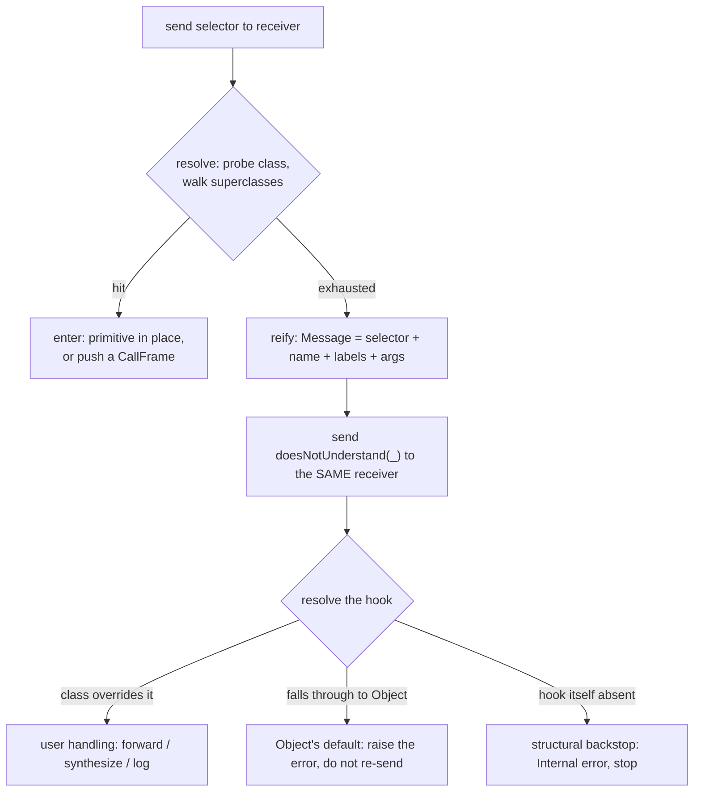

# Message Send

> **A call site names a *selector*, not a method.** Between the text `p.foo()` and the code that
> runs sits one runtime decision — walk the receiver's class chain, find the method, enter it — and
> *both* "which code runs" and "does a frame even appear" are settled **after** the call site, by the
> receiver, never by the caller.

[The Execution Loop](execution-loop.md) showed the VM as one `while` loop over a `match`. [The
Compiled Artifact](compiled-artifact.md) showed *what* runs — a `Callable` recipe instantiated into
a `ClosureObject`. [Frames](frames.md) showed *where* it runs — a `CallFrame` pushed onto
`VM::frames`, its caller the slot one below. Frames left one thing forward-pointed: *what a call site
actually does to push that frame.* That is this doc. It is the OO heart of the VM, and it is smaller
than its reputation — a hash and a loop — but the **shape** of that hash-and-loop decides which whole
categories of language feature (monkeypatching, proxies, `method_missing`, reflection) are even
available, before a line of syntax is designed.

The target, as always: by the end you should be able to throw away `send.rs` and rebuild the send
from two facts about what a call site is *allowed* to know.

## The one question: when is `foo` tied to a method?

Source says `p.foo()`. Somewhere between that text and a running method body, something decides which
code answers. Name that decision **selector-to-method binding**, and keep it strictly apart from a
decision it is constantly confused with: *type checking* asks "is this call sensible?"; *binding*
asks "which body runs?" A language can check types at compile time and still bind the body at send
time — Java verifies some type in `p`'s hierarchy declares `foo`, then defers *which override* runs
until the runtime class is known. The two axes are independent. This doc is about binding time only.

There are three honest answers, with real occupants on each branch. To see why anyone would pick a
*slower, later* branch, the faster earlier ones have to be argued for, not strawmanned.

### (a) Static / early binding — resolve to an address, once

The compiler (or linker) resolves the call straight to a fixed code address; the runtime never
revisits it. This is not a marginal case — it is how the overwhelming majority of calls in all
software ever written resolve: plain C calls, non-virtual C++ members, ordinary function calls
everywhere.

The case for it is not just speed (a single jump), it is what speed *unlocks*: a statically-bound
target can be **inlined**, so the compiler sees through the call boundary — constant-folds across it,
kills dead branches on the far side, keeps values in registers instead of spilling them. Neither
other branch gets this for free, because in both the target genuinely isn't known yet, and you
cannot inline a name you cannot yet read. A second, underrated win: a name that doesn't resolve is a
**compile/link error** — an entire failure category (send to a name nothing implements) is retired
before the program is ever runnable.

The bill: the target is frozen with no reference to runtime data. No receiver can steer which code
runs (no polymorphism through this mechanism), and a call site, once compiled, can never be
retargeted — you cannot define the callee later and have this site notice.

### (b) Vtable / offset binding — resolve to a *slot number*

Don't bake an address; bake a **fixed slot index** into a per-class table whose *contents* vary.
Each polymorphic object reaches a table — the **vtable** — and a call becomes "read the receiver's
table, index the slot the compiler already picked, call through it." C++ `virtual`, the JVM's
`invokevirtual`, Go interface calls (via an **itable**) live here.

This is the classic answer to "real subtype polymorphism without a lookup cost that grows with the
hierarchy." One pointer-chase plus one index: bounded, predictable, cache- and branch-predictor
friendly. And it is genuine dispatch — a `Shape*` pointing at a `Circle` calls `Circle::draw`; the
same static type pointing at a `Square` calls `Square::draw`, decided by which vtable the object's
header points at. The *slot* is static; the *code in it* is dynamic. That buys back nearly all of
static binding's speed while restoring the polymorphism it forecloses.

The bill is the layout commitment under the speed: the number and order of slots is fixed when the
*class* compiles. So you cannot hand an already-compiled class a new method and have already-compiled
callers find it — there is no slot for it (**monkeypatching foreclosed by representation**, not by a
rule someone could relax). And a genuine *miss* — a selector the class does not implement — cannot
arise at the vtable layer at all, because the compiler proved the slot existed before it let the call
compile. This branch's failure is a **link error** or a **compile-time type error** — never something
a *running* program catches and answers.

### (c) Dynamic dictionary lookup — resolve to nothing but a name

Compile only the **selector**. At send time take the receiver's actual class, probe *its* per-class
**method dictionary** (selector → method), and on a miss climb to the superclass and probe again,
until a hit or the chain runs out. Smalltalk, Objective-C, Ruby, Python (with caveats) live here.

This binds latest: nothing is settled until the instant of the send, against the exact receiver in
hand. So a method can be defined — or redefined — on a class *after* every caller was compiled, and
every caller picks up the new answer next time it runs, because none of them cached a commitment.
And the receiver's class decides not only *which* code answers but *whether* any does — a failure to
answer is not a compiler oversight but a **first-class runtime event**, an ordinary further message
the receiver can intercept. That reframing of "no such method" from impossible-state to catchable-
event is this branch's real prize (its own section below).

The bill is not subtle: a hash probe plus a possible chain-walk on *every* send. Naively, that is not
a rounding error against a direct call — it can be one to two orders of magnitude dearer per send
*(a general property of unoptimized dictionary dispatch, not a measured Phalcom figure)*. Worse, the
world it describes genuinely changes at runtime, so any shortcut that remembers "selector S ⇒ method
M for class C" owes an **invalidation** story the instant that stops being true. The industrial
answer that pulls the steady state back toward vtable speed is the **monomorphic inline cache** —
named here as vocabulary only. <a id="lie-1"></a>**Lie #1:** this doc will describe lookup as if it
walks the chain on *every* send. It does not — after the first send at a site, an inline cache
short-circuits the walk. The cache (and the `world_version` that invalidates it) is the entire
subject of **Doc 5 (caches & fusion)**. Read every "walk the chain" below as "walk it the first time."

### Where these three came from — the honest caveat

Phalcom is branch (c). But it did **not** run a static-vs-vtable-vs-dictionary bake-off and pick
dictionary. There is no ADR for that choice. Phalcom is dictionary-dispatch by **lineage** —
Smalltalk by way of Wren — the same way [the execution loop](execution-loop.md) is a stack machine
by lineage. The three-way walk above is **pedagogical scaffolding**: the space of what *could* have
been, so the representation below is re-derivable rather than arbitrary. The choice Phalcom actually
*deliberated* is finer, sits entirely *inside* branch (c), and comes later in this doc — after you
have seen the machine it refines.

## Predict before you read

Here is the whole coarse fork as one prediction. **You write `p.foo()`. The compiler sees the
selector `foo`. What does the emitted instruction's operand hold — a resolved method handle, a
vtable slot number, or the selector?**

Answer before scrolling. The grip already contains it, and a reader who derives it owns the
representation instead of being handed it.

...

**The selector — nothing more.** The opcode is `Bytecode::Invoke(u8, u16)`
(`phalcom-core/src/bytecode.rs::Bytecode::Invoke` @ L111):

```rust
/// Calls a method directly on a receiver, bypassing property lookup.
/// 0: number of arguments
/// 1: index of selector constant
Invoke(u8, u16),
```

A `u8` argument count and a `u16` index into the chunk's **constant pool** — and the constant at that
index is a `Symbol` (a selector), not a method, not a class, not an offset. Nothing is resolved at
compile time; the compiler interns a selector string and records its index, full stop. *(The
instruction also owns an inline-cache slot, but that slot is keyed by the instruction's position in a
parallel `Chunk::caches` array, not encoded in the operand — Lie #1, Doc 5.)* If you predicted "the
selector, because a call site that named the method couldn't be late-bound," you have already
re-derived why branch (c) compiles the way it does: **to keep binding late, the site must stay
ignorant.**

## The two moves: resolve, then enter

A send is two decoupled steps, usually run back-to-back with nothing visible between them — but the
interesting machinery lives *at the seam*, so separate them.

**Resolve** is a pure question: given a selector and the receiver's class, which method — if any?
Phalcom's answer is `Value::lookup_method` (`phalcom-core/src/value/mod.rs` @ L170) delegating to a
plain loop, `lookup_method_in_hierarchy` (`phalcom-core/src/heap/class.rs` @ L74):

```rust
pub fn lookup_method_in_hierarchy(heap: &Heap, mut class: ClassId, selector: Symbol) -> Option<ObjRef> {
    loop {
        let current = heap.class(class);
        if let Some(&method) = current.methods.get(&selector) {
            return Some(method);
        }
        match current.superclass {
            Some(superclass) => class = superclass,
            None => return None,
        }
    }
}
```

That is the whole resolver. `current.methods` is `IndexMap<Symbol, ObjRef>` — a selector-keyed map
whose value is a *handle* to a `MethodObject`, not the method inline. `superclass` is
`Option<ClassId>` — a `Copy` arena handle (ADR-0009), `None` only at the tower's apex, `Object`.
One hashmap probe per class, climb on miss, `None` at the top. That is it.

The climb is a straight line because Phalcom is **single-inheritance**: every class has exactly one
parent, so "walk up" has one unambiguous order and nothing to decide. Multiple inheritance is what
breaks that — a class with several parents sharing an ancestor (the diamond) has no single upward
path, which is why multiple-inheritance languages must compute a linearization (an **MRO**, via **C3**
in Python) before resolve can even start. Phalcom needs no such machinery, and the loop above is the
proof: there is nowhere in it to *choose* a parent. That is the entire payoff of the single-
inheritance constraint, cashed out in five lines.

**Enter** is what happens once resolve returns a method — and it holds the corollary that surprises
people.

## The enter fork: not every send pushes a frame

Second prediction, quicker. **Every send runs a method body. Does every send push a `CallFrame`?**

...

**No.** Enter forks on the *kind* of method resolved, and only one arm pushes a frame. The method
handle points at a `MethodObject` whose `kind` is (`phalcom-core/src/method/object.rs::MethodKind`
@ L17):

```rust
pub enum MethodKind {
    /// Phalcom code compiled to bytecode, by ClosureObject handle.
    Closure(ObjRef),
    /// A native Rust function for a core-library method.
    Primitive(PrimitiveFn),
}
```

`call_method` (`phalcom-core/src/vm/send.rs::VM::call_method` @ L19) is where the fork lives. The
**`Closure`** arm is what [Frames](frames.md) named the "method push site": it builds a `CallFrame`
via `new_call_frame` and pushes it onto `self.frames`, then returns *without running anything* — the
[execution loop](execution-loop.md) drains the new frame on its next turns.

```rust
MethodKind::Closure(closure_id) => {
    let context = callee.to_context(&self.heap);
    // ... (variadic packing elided) ...
    let new_frame = self.new_call_frame(closure_id, context, 0, stack_offset, Some(source_range));
    self.frames.push(new_frame);
    Ok(())
}
```

The **`Primitive`** arm does the opposite: it calls the native Rust function *in place*, on the host
call stack, and never touches `self.frames` at all:

```rust
MethodKind::Primitive(native_fn) => {
    // arguments copied into a small on-stack buffer (INLINE_ARGS = 8; ADR-0051) ...
    let result = native_fn(self, &receiver, &args[..arity]);
    // ... place result back on the value stack ...
}
```

So `1 + 2` — which is a *send*, of selector `+(_)` to `1` with argument `2`, resolved by the exact
same `lookup_method` walk as any user method — resolves to a `Primitive` and runs zero Phalcom
frames. **The frame push is one arm of `call_method`, not a property of "calling."** This is the tie
back to Frames: the four frame-push sites that doc counted are exactly the places a `Closure` (or
module/block/fiber entry) is entered; a primitive is none of them. Live confirmation — the result is
real, and there is no user frame behind it:

```
$ phalcom -i 'System.print(1 + 2)'
3
```

<a id="lie-2"></a>**Lie #2:** the primitive arm is drawn as "call, place result." Its real return
handling branches three ways — `switch_pending` (a fiber switch fired inside the primitive → the
**concurrency doc**), the ordinary case, and `frames.len() < frames_before` (a non-local `return`
unwound through the primitive → **[Doc 6 (frame identity)](frame-identity.md)**). Both edge branches are frame-identity /
fiber territory; treat the primitive here as "runs native, returns a value."

## The hard case: a send that resolves to nothing

The textbook hit — resolve finds a method, enter runs it — is the case your intuition already
handles. The case worth tracing is the one the coarse fork advertised as branch (c)'s prize: the
**miss**. When the chain-walk exhausts every superclass without a hit, what happens is *not* a bare
crash. Watch it first:

```
$ phalcom -i 'System.print(42.flibbertigibbet())'
42 does not understand 'flibbertigibbet()'
```

`Number` has no `flibbertigibbet()`; neither does anything above it. Yet the program didn't panic —
it produced a *message about* the failure. That is reification, and it is the highest-teaching-value
idea in this doc: **the dispatch mechanism has no privileged, inaccessible failure mode.** A missed
send bottoms out in *another ordinary send*, so the error channel *is* the send mechanism, applied to
itself once more.

The full miss order is in `invoke_at` (`phalcom-core/src/vm/dispatch.rs::VM::invoke_at` @ L398),
which is `Invoke`'s handler. Stripped of the cache machinery (Lie #1), its spine is four steps in
order:

1. **Inline-cache probe** — *Lie #1, Doc 5. Skip it.*
2. **Exact-selector lookup** — `receiver.lookup_method(self, selector_sym)`, the chain walk above.
3. **Variadic probe** — if the exact selector missed *and* it is an all-positional selector, derive
   `name(*)` and walk once more, so a variadic method `sum(*)` can catch `sum(1,2,3)`. *(Also cache-
   backed — Doc 5. Present it as "one more targeted walk.")*
4. **`doesNotUnderstand(_)` forward** — only if all three miss.

Step 4 is `forward_does_not_understand` (`phalcom-core/src/vm/send.rs` @ L181), and it is worth
reading in full because it *is* the trace:

```rust
pub(super) fn forward_does_not_understand(&mut self, receiver_idx: usize, selector: Symbol, source_range: SourceRange) -> PhResult<()> {
    let receiver = self.stack[receiver_idx];
    let args: Vec<Value> = self.stack[receiver_idx + 1..].to_vec();
    self.stack.truncate(receiver_idx + 1);
    let message = self.new_message(selector, &args);      // reify the failed send
    self.stack.push(message);

    let dnu_str = crate::method::encode_selector("doesNotUnderstand", &[None], SignatureKind::Method(1));
    let dnu_sym = self.get_or_intern(&dnu_str);
    match receiver.lookup_method(self, dnu_sym) {          // resolve the hook — an ordinary send
        Some(method) => self.call_method(&receiver, method, 1, source_range),
        None => Err(RuntimeError::Internal("doesNotUnderstand(_) missing from Object — kernel invariant violated".into()).into()),
    }
}
```

The failed send is packaged into a `Message` object — `new_message` (@ L138) builds a four-slot
instance: `selector` (the interned `Symbol`), `name` (the bare method name), `labels` (a list, one
per argument), and `args` (the argument values). Then `doesNotUnderstand(_)` is looked up and entered
**through the identical `lookup_method` + `call_method` machinery as any other send** — no separate
error path. `Object` defines the default handler, which formats the line you saw.

### The recursion hazard, and how Phalcom closes it

The hook is itself dispatched by an ordinary send. So what stops the report of a miss from *itself*
missing and re-reporting, forever? Look at the `None` arm above. If `doesNotUnderstand(_)` is somehow
absent from the receiver's whole chain, the function does **not** re-send it — it raises
`RuntimeError::Internal` and stops. The guard is **structural**: a distinct terminal `Err`, not a
depth counter or a re-entrancy flag. The design rests on two things together — the *floor* (`Object`,
the apex every single-inheritance chain reaches, carries the default handler by construction, so the
hook's own lookup is guaranteed to hit) and the *backstop* (if that floor is ever violated, the
`None` arm fails loudly instead of recursing). The code comment states the intent outright: "a
missing dNU is never itself re-sent as a dNU." This one is genuinely designed, not a happy accident —
the honest label matters, because the next fork is the opposite story dressed the same way.



## The fork Phalcom actually deliberated: what goes in the key

Committing to a per-class dictionary settles *when* binding happens; it does **not** settle *what
identifies an entry*. That is the real decision, and unlike the coarse fork it has an ADR — **ADR-0012**.

Two answers. **Arity-only:** the key is (name, argument count). A method `move` taking two arguments
is one slot, regardless of what the arguments are called. **Full label-encoded:** the key is the
whole surface shape, labels included — Smalltalk's selectors are literally `at:put:`, where the
colons *are* the arity spelled out, and same-name-same-arity-different-labels are different selectors.

Why labels earn real weight: `move(to:, duration:)` versus `move(dx:, dy:)` — same name, same arity,
genuinely different operations. Under arity-only keying these **collide into one slot**; last
definition silently wins, or the language must forbid the pattern — which is the whole point of
keyword syntax as a readability device. Phalcom keys on the full encoding. `encode_selector`
(`phalcom-core/src/method/mod.rs::encode_selector` @ L102) is the sole encoder:

```rust
SignatureKind::Method(0)  => format!("{name}()"),
SignatureKind::Method(_)  => format!("{name}({})", comma_form_slots(labels)),
SignatureKind::Setter     => format!("{name}=(_)"),
SignatureKind::Subscript(_) => format!("[{}]", comma_form_slots(labels)),
SignatureKind::Variadic(_)  => format!("{name}(*)"),
// ... Initializer, Getter ...
```

`comma_form_slots` emits `_` for a positional argument and the label text for a keyword one. So
`move(to,duration)` and `move(_,_)` encode to *distinct strings*, intern to *distinct symbols*, and
land in *distinct dictionary slots*. The sharpest consequence is what it does to **overloading**: a
statically-typed language resolves an overloaded call with a whole compile-time phase (gather
candidates, filter by arity/types, rank, bake the winner in — the source of ambiguous-call errors).
If the selector *already* encodes the labels, that phase **does not exist** — the parser produced a
different key for each shape, so "pick the overload" and "look up the selector" are the same single
act. `foo(_)` and `foo(_,_)` coexisting is not overload resolution; it is two keys.

The cost doesn't vanish, it *moves* — from a compile-time algorithm to a **design discipline**: every
place a selector is produced (call site, method install, `perform`, the dNU forward) must encode it
*identically*, because a near-miss is now a silent dictionary miss, not a compile error caught by a
forgiving second pass. And this is the honesty beat the recursion guard set up. ADR-0012's
**rejected** alternative was exactly arity-only dispatch — and it was rejected not on elegance but on
**scars**: three shipped defects the forge audit pinned in this code — **F1** (`Invoke` swallowed
`call_method`'s `Result`, silently eating primitive errors), **F7** (a 0-argument `new()` mis-tagged
as `Method(1)`), **F8** (a divergent encoder that interned `">( _)"` with a stray space, a slot that
could never be hit). That last one is the discipline's bill made real: two code paths built "the same"
selector differently and produced an unreachable method. Label-encoding is the deliberated choice;
its cost is that the encoder must be the *only* encoder, which is why ADR-0012 mandates exactly one.

## The comparisons that earn their place

Everything above is generic to branch (c). These languages enter only because each names something
Phalcom does anonymously, took another branch with the bill attached, or is the ancestor.

**Smalltalk — the ancestor.** Gives the vocabulary the whole doc runs on: *selector*, *method
dictionary*, *`doesNotUnderstand:`*, the reified *`Message`*. And **`perform:`** — a plain method
taking a selector *as data* and doing the send the compiler would otherwise emit. That "do a send" is
expressible as an ordinary method is the proof of how uniform this model is: Phalcom has the same
surface as `Object.perform(_)` / `perform(_,_)`, backed by `send_dynamic` (`vm/send.rs` @ L218),
which re-enters the loop rather than pushing onto the current one. Confirmed live:
`a.perform(Symbol.new("add(_,_)"), [3, 4])` → `7`, resolved through the same lookup as a literal send.
Even `3 + 4` is, in the pure model, a send — Phalcom honors that (it *is* a send) and, like every
production Smalltalk, cashes it out as a VM primitive so arithmetic doesn't pay a dictionary walk.
The `MethodKind::Primitive` arm *is* that shortcut, sitting on the same conceptual model.

**Objective-C — the send made literal.** The sharpest artifact in the space: every message compiles
to a call to one real C function, `objc_msgSend(id self, SEL op, ...)` — receiver, selector, rest,
exactly what resolve-then-enter needs. It collapses "send a message" from an abstraction into a
function you could call by hand. Its `SEL` is interned precisely so selector comparison — the thing
the dictionary probe does constantly — is a pointer compare, not a string compare; Phalcom's interned
`Symbol` keys are the same move. Its miss path (`forwardInvocation:` with a reified `NSInvocation`) is
Smalltalk's `Message` adapted to a static host — the direct cousin of Phalcom's four-slot `Message`.

**C++ virtual — the other branch, billed.** The standing occupant of (b): `obj->vptr[slot](obj, …)`.
Its monkeypatch bill is concrete — the **fragile base class problem**: insert or reorder a virtual in
a shipped base class and every independently-compiled subclass's slot indices shift silently.
Phalcom's `IndexMap` dictionary has no fixed slot layout to break, which is *why* the reopen-a-class
fixture works — late binding is the same property viewed from the other side.

**Ruby — open classes and the invalidation bill.** `method_missing` is `doesNotUnderstand:` under
another name. Ruby earns its place for the *bill*: **any** class, including `Integer`, can be reopened
mid-run, so anything that remembers "selector S ⇒ method M" must invalidate the instant a class is
reopened. That is the direct line from "open classes" as a feature to "cache invalidation" as a
mandatory cost — and it is exactly the pressure Phalcom's `world_version` answers, which is **Doc 5**.
The reopen fixture makes it visible: redefining `label()` on a reopened `Widget` prints `v1` then
`v2` — the second send sees the new method precisely because no call site ever cached a commitment.

**Cut, and why:** *Java* (`invokevirtual` is C++'s vtable story again — no new position; `invokedynamic`
is a late-binding escape hatch on a static language, one sentence at most). *JavaScript prototype
chains* (a structurally different question — delegation from the receiver's own prototype, not a
separate class dictionary; folding it in would teach a wrong generalization). *Python's
`__getattr__`/MRO* (used above only for the single fact that MRO exists because multiple inheritance
forces a total order — Phalcom needs none, so it earns one sentence, not a section).

## What you can now re-derive

Delete `send.rs`. From two constraints —

1. **binding must stay late** (so the language keeps polymorphism, monkeypatching, and a catchable
   miss), which forces the call site to name **only a selector** — no method, no offset; and
2. **a selector must distinguish keyword shapes** (ADR-0012), which forces the key to encode name +
   labels, so `foo(_)` and `foo(_,_)` are different methods with no overload-resolution phase —

you can rebuild the send: a call site holds a selector-constant index (constraint 1); at send time
you **resolve** by walking the receiver's single-inheritance chain probing a selector-keyed
dictionary; you **enter** by forking on method kind — a primitive runs in place (no frame), a closure
pushes one; and a resolve that comes back empty is not a crash but a *reified `Message` sent back to
the receiver* as `doesNotUnderstand(_)`, terminating structurally at `Object`'s floor. Six behaviors,
one selector, from two premises — and only *one* of the two (the key encoding) was ever deliberated;
the rest is what dictionary dispatch is.

---

## Anchors

- `phalcom-core/src/bytecode.rs::Bytecode::Invoke` (@ L111) — the operand: `(u8 arity, u16
  selector-constant index)`, no method handle. Dispatch arm in `vm/dispatch.rs` (~L1024).
- `phalcom-core/src/vm/dispatch.rs::VM::invoke_at` (@ L398) — the send handler; the four-step miss
  order (cache → exact → variadic → dNU). Steps 1 and 3 are cache-backed (Lie #1 → Doc 5).
- `phalcom-core/src/vm/send.rs::VM::call_method` (@ L19) — the enter fork on `MethodKind`. Primitive
  runs native in place (no frame); `Closure` builds + pushes a `CallFrame` (the Frames push site).
- `phalcom-core/src/method/object.rs::MethodKind` (@ L17) — `Closure(ObjRef)` vs `Primitive(PrimitiveFn)`.
- `phalcom-core/src/value/mod.rs::Value::lookup_method` (@ L170) → `heap/class.rs::lookup_method_in_hierarchy`
  (@ L74) — the single-inheritance chain walk; `MethodsMap = IndexMap<Symbol, ObjRef>` (@ L17).
- `phalcom-core/src/method/mod.rs::encode_selector` (@ L102) — the sole selector encoder (ADR-0012);
  `move(to,duration)` vs `move(_,_)` as distinct keys.
- `phalcom-core/src/vm/send.rs::VM::new_message` (@ L138) — the four-slot `Message`;
  `forward_does_not_understand` (@ L181) — the dNU forward and its structural recursion backstop.
- `phalcom-core/src/vm/send.rs::VM::send_dynamic` (@ L218) / `invoke_method_object` (@ L259) — the
  reflective `perform`/`invokeOn` surface, re-entering `run_until` (not the compiled `Invoke` path).
- ADR-0012 (label-encoded selectors & IC-ready dispatch) — the deliberated key-encoding choice, with
  the F1/F7/F8 scar. ADR-0040 (SuperSend), ADR-0063 (constructors are ordinary class-side methods),
  ADR-0060 (`[]` is a real selector) — supporting, deferred.

## Forward pointers

- **Doc 5 (caches & fusion)** — destroys Lie #1: the inline cache, `world_version` invalidation (the
  Ruby-open-class bill paid), the variadic cache, and the `InvokeLocal`/`InvokeConst`
  superinstructions that fuse a load into the send.
- **[Doc 6 (frame identity)](frame-identity.md)** — destroys Lie #2's non-local-return branch: what `generation` and the
  frame token do when a `return` unwinds through a primitive.
- **SuperSend** (`Bytecode::SuperSend`, ADR-0040) — its own opcode: the walk starts *above* a
  statically-named defining class, not the receiver's class. Mechanism deferred.
- **The concurrency doc** — Lie #2's `switch_pending` branch: a fiber switch firing inside a primitive.
