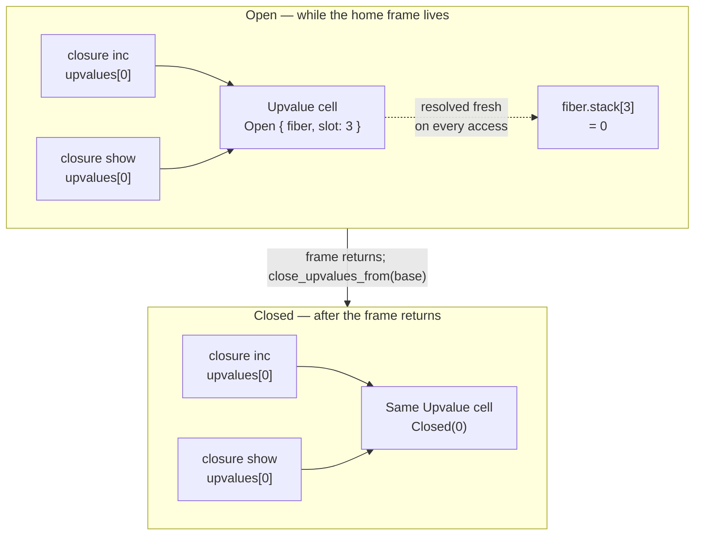

# Upvalues: variables that outlive their frames

> **Status.** Describes Phalcom at HEAD (`f874e6c`). The mechanism is complete and
> ADR-backed ([ADR-0013](../../adr/accepted/0013-closure-upvalues-and-frame-token-return.md),
> Accepted 2026-07-11). Every source claim below was read at HEAD; every behavioural claim
> was produced by running the cited `.ph` fixture. Nothing here is aspirational.

## A frame is a loan

When a call begins, its parameters and locals need somewhere to live for exactly as long as
the call lasts. The stack is the obvious home: pushing is a bump, popping is a bump, and the
frame's lifetime is precisely the call's lifetime. That efficiency rests on a tacit contract —
*nothing outside the call keeps a reference to what's inside it past the moment the call ends.*
The frame is a loan. It is called back at `return`, and every local's storage is repossessed
with it.

A closure is a promise to break that contract. It captures a **variable**, not a value: later
reads and writes inside the closure and later reads and writes of the same name in the
enclosing code are supposed to see each other. While the enclosing call is still on the stack,
the promise is free — the storage is right there. But a closure can be returned, stored in a
list, handed to a fiber. Then the promise and the loan collide directly. The variable must go
on living; the frame that housed it is gone.

That collision is the whole subject. Everything below answers one question: **what do you do
with a variable whose lexical home dies before its last reader does?**

## Naming it: the upward funarg problem

The historical name is the **upward funarg problem**, and "upward" carries the weight, because
there are two shapes and only one is hard.

A **downward funarg** flows *down* the stack — passed in, called, discarded inside the callee's
own activation. `list.map(f)`: `f` runs while both its defining frame and `map`'s frame are
live. Reaching the enclosing variable means following a pointer to a frame that is provably
still there. Algol-family languages handled this adequately in the 1960s.

An **upward funarg** flows *up and out* — returned from its defining call, or stored somewhere
that outlives it. By the time it runs, the frame it needs is gone. This is the only direction
that forces a decision.

The term traces to Joseph Weizenbaum's work on early Lisp implementations in the late 1960s;
the canonical treatment is Joel Moses's 1970 MIT AI Lab memo, *The Function of `FUNCTION` in
LISP, or Why the FUNARG Problem Should Be Called the Environment Problem*. Moses's reframing is
worth keeping, because it survives every implementation detail below: the difficulty was never
that a function got passed as an argument — that's just data movement. It's that a function
value carries an **environment**, and *how long that environment must survive, and who owns it*,
is a question about storage lifetime. Every design here is an answer to that.

## The question that decides everything

Before the mechanisms, the fork that actually matters — because it is the one Phalcom resolves
differently from the language it otherwise copies, and every other difference falls out of it:

> A captured variable needs to be *reachable* from a closure. **What do you reach it with?**
>
> An **address** — a pointer to the storage. Direct, one dereference, no interpretation needed.
> But an address is only meaningful while the thing it points at stays put. Anything that
> moves memory — a growing stack, a compacting collector, a fiber switch — must find every
> address and fix it.
>
> Or a **name** — a description of *where the variable lives*, resolved fresh on every access.
> `(this fiber, slot 5)`. Nothing to invalidate, because there was never an address to
> invalidate. But every access must now interpret the name, which costs a branch.

Lua chose the address. Phalcom chose the name. Hold that; the rest of this document is that
sentence unpacked.

## The design space

Six real answers. Each was attractive to whoever picked it. None is free.

### Refuse it

The cheapest answer: make the hard case not compile. If a closure may only capture variables
that are never reassigned after binding, then capture-by-value and capture-by-reference become
observationally identical — nothing after capture ever changes. No runtime machinery, no
allocation, no ownership question, because the compiler deleted the question.

This is Java's rule: a captured local must be `final` or **effectively final** (assigned once,
never reassigned, keyword optional — the relaxation shipped with lambdas in Java 8). It is a
principled position, not laziness. Java captures and passes by value *consistently, everywhere*.
Allowing a lambda to capture a mutable local by reference would introduce the single place in
the language where a local's storage is silently aliased by two running pieces of code — and
since Java lambdas routinely escape to other threads via `Runnable`, that alias immediately
raises memory-model questions (two threads observing one unsynchronised captured cell) that
nothing else in Java's design has to answer. Refusing it declines to open a door that would
have been expensive to hold open correctly.

The bill arrives the moment a program wants shared mutable state anyway:

```java
int count = 0;
Runnable r = () -> count++;      // compile error: count is not effectively final

final int[] count = {0};
Runnable r = () -> count[0]++;   // legal: the *reference* is effectively final
```

The one-element array is not a workaround to a missing feature — it is proof of the feature's
necessity. It is a hand-built heap cell, allocated explicitly because the language wouldn't
allocate one implicitly. The refusal doesn't remove the need for a mutable box that outlives a
frame. It makes the programmer build the box.

### Chain the frames: static link and display

Give each frame a pointer to its lexically enclosing frame; resolve a captured variable by
walking that chain. This is the **static link** — one word per frame, `N` hops to reach `N`
levels up. The **display** refines it: an array with one slot per lexical *level*, so any
enclosing level is one index instead of a walk, at the cost of maintaining the array per call.
Both reach the enclosing environment by following pointers through *other stack frames*, never
by copying anything out.

Elegant for its target. Algol 60 and Pascal both allow nested procedures, and both intend a
downward funarg. No allocation, no boxing, no "captured" vs "uncaptured" distinction at all —
every local is uniformly reachable through the chain.

The bill: a static link is valid only while the frame it names is valid. It is correct *only*
downward. Let a nested procedure escape and the link points at popped storage that now belongs
to someone else. This is why classical Pascal and Algol 60 simply **would not let you return a
procedure** — the representation made the case unsafe, so the language removed the case. Not a
bad idea; an idea that only ever worked for the direction that was never hard. (GCC's
nested-function extension reintroduces exactly this hazard, and dangling trampolines are its
well-known consequence.)

### Box the dangerous ones: assignment conversion

Decide at compile time which variables are dangerous — captured by an inner function **and**
reassigned — and give exactly those a heap cell from birth instead of a stack slot. Every
access, inside or outside the closure, goes through the cell. Nothing on the stack ever needs
finding later, because the shared mutable part was never on the stack.

This is **assignment conversion**, the Scheme compiler literature's term. The analysis is
sharper than "box everything captured": a variable captured but never reassigned is safe to
copy, because no write can ever make the copy stale. That selectivity distinguishes real
assignment conversion from the cruder version some interpreters ship, which boxes every
captured variable because determining mutability needs an analysis pass they skip.

The bill: the decision is made at *declaration*, from static analysis of the body — not from
whether a capturing closure ever actually escapes. A closure invoked and discarded inside its
own creating call still forces the box, if the analysis can't prove it never escapes, which in
a language with first-class function values is usually not provable. **You pay for the
possibility of escape, not the fact of it.**

### Make every activation a citizen: Smalltalk's contexts

The radical answer: delete the asymmetry. Don't put activation records on a stack at all. A
method activation is a `MethodContext`, a block activation a `BlockContext` — ordinary heap
objects, ordinary GC lifetime, first-class enough to inspect and resume in a debugger. A block
capturing an enclosing variable holds a reference to the context object; the variable is a slot
on that object, live exactly as long as the object is reachable. **The upward funarg problem
cannot arise**, structurally, because no storage ever had a lifetime shorter than the object's.

This deserves respect rather than dismissal, and it deserves it *specifically here*, because it
is the branch a Smalltalk-lineage object model would reach for by default. Everything else in
such a model is already a GC'd heap object — why should an activation record be special?
Uniformity is a real virtue: debuggers, continuations, and schedulers that treat frames as
ordinary objects get their features nearly free instead of needing bespoke reification.

The bill is an allocation on **every call**, captured or not. Production Smalltalks didn't
simply eat it — Deutsch and Schiffman's 1984 implementation (famous for inline caching, but
this matters as much) keeps contexts in a stack-shaped region for the common case and promotes
one to a real independent heap object only when something actually outlives the assumption that
it wouldn't. Pause on that: it is **structurally the same move** as the open/closed distinction
below — behave like a stack allocation until proven otherwise, pay promotion only when forced.
Smalltalk needed the idea at whole-activation granularity decades before Lua needed it at
single-variable granularity.

One thing must be said plainly, because Phalcom is a Smalltalk-style language that did **not**
take this branch: *"Smalltalk-style object model" and "heap-allocate every activation" are two
separate axes.* A language can adopt message-send dispatch, classes and metaclasses, everything-is-
an-object — and decide independently how activation records are represented. Believing everything
is an object does not force frames to be heap objects from birth. Phalcom keeping frames on a
stack and reifying only the captured variables is not a betrayal of its ancestry; it is
separating two decisions that Smalltalk-80 happened to bundle.

### Copy at creation: flat closures

Make the closure self-contained from birth: one field per free variable, copied in at creation.
No chain to walk, no list to search — the closure already holds everything it will ever need,
indexed directly by the compiler. This is the ML-family and Chez Scheme representation.

Attractive for the mirror-image reasons: no per-access indirection through an enclosing frame,
excellent locality (free variables sit contiguously inside the closure), and — this matters —
**the closure never holds a pointer into a stack**, so a moving collector has nothing special
to do for it.

The bill has two parts. First, copying preserves semantics only for variables never mutated
after capture; anything mutably *shared* cannot be copied, because a copy severs the connection
at the instant it's made. So a flat-closure design still needs static analysis to find the
mutably-shared variables and represent *those* as explicit cells, copying the **reference** into
the closure. That is assignment conversion, required again — flat closures don't dodge the
by-value/by-reference question, they relocate it to compile time. Second, nested capture must
copy **through every intermediate level**: if an inner-inner function needs a grandparent's
variable, the intermediate closure must carry the reference too, just to have something to hand
down — even though its own body never touches it.

Two terms worth fixing, because they recur: a **linked closure** reaches a free variable by
following a pointer outside itself; a **flat closure** carries everything in its own storage.

### Keep it on the stack until it can't be: the upvalue

The last branch keeps a captured variable on the stack for exactly as long as the stack is
where it belongs, and moves it — once, at a nameable moment — the instant that stops being
true. **Open** while the frame lives; **closed** after. This is Lua's design, Lua's term, and
the branch Phalcom takes. It is also where Phalcom and Lua stop agreeing.

## What a copy cannot give you

Before the mechanism, the stakes — because "capture by value" gets described as a smaller,
simpler version of "capture by reference," a subset missing a nice-to-have. It is not a subset.
It is a *different answer*, and the wrong one doesn't degrade gracefully; it silently produces
two variables where the program's structure implies one.

C++ spells both modes out, which makes the distinction impossible to paper over:

```cpp
std::function<int()> get;
std::function<void()> inc;

void by_reference() {
    int x = 0;
    get = [&]() { return x; };    // both capture a reference to the same x
    inc = [&]() { ++x; };
}

void by_value() {
    int x = 0;
    get = [=]() { return x; };     // a copy, frozen here
    inc = [x]() mutable { ++x; };  // its *own separate* copy
}
```

After `by_value()`, running `inc(); inc(); get();` yields **0**, not 2. The two closures never
shared anything, despite being built from the same variable, in the same scope, one line apart.

This is the semantic every capture-by-reference language gives you by default, and the one
Java's effectively-final rule and C++'s `[=]` refuse: two closures over one enclosing variable
are two views onto **one** variable, not two copies that started equal. An implementation that
can't tell these apart hasn't dropped a feature — it has silently changed what "the same
variable" means. This is the **identity invariant**, and it makes the mechanism below a
correctness question, not a performance one.

## Lua's answer: an address, and a trick to hide it

An upvalue in Lua is, in essence:

```c
struct UpVal {
    Value *location;        // where to read/write — the entire interface
    Value  closed_storage;  // used only once location points here
    UpVal *next_open;       // link in the open list — open state only
};
```

**Open**: `location` points into a live stack slot. The upvalue owns nothing; it borrows.
**Closed**: `location` points at `closed_storage` — *a field inside the same struct*. The
upvalue now owns the value, and the stack is irrelevant to it.

Closing is two assignments:

```c
uv->closed_storage = *uv->location;         // copy the live value out, before it's gone
uv->location       = &uv->closed_storage;   // repoint into itself
```

The second line is the trick: `uv` now points at a field of itself. And the trick buys exactly
one thing, which is the entire reason it exists:

```c
Value get(UpVal *uv)          { return *uv->location; }
void  set(UpVal *uv, Value v) { *uv->location = v; }
```

**No branch.** Not a cheap branch, not a well-predicted branch — *absent*. `GETUPVAL` and
`SETUPVAL` dereference one pointer unconditionally and are correct whether the variable is
still on a stack or has been closed for a thousand calls. Closing changes *where the pointer
points*, never *how you read*. Every consumer is written once and is correct in both states
forever.

That is a beautiful piece of engineering, and it is worth understanding precisely, because
Phalcom **declines it** — and you cannot see why until you see what it costs.

An open `UpVal` holds a raw pointer **into the stack**. That is fine only while the stack never
moves. It doesn't stay fine:

- **Stack growth.** Lua's stack is a growable array. When it reallocates, every open upvalue's
  `location` points at freed memory. Lua handles this — reallocation walks the open list and
  rewrites every pointer — but *that walk is a permanent tax on stack growth*, and it exists
  solely because upvalues hold addresses.
- **A moving collector.** Same problem, same fix, same tax.
- **Coroutines.** Each has its own stack. The pointer works, but nothing in the upvalue records
  *which* stack it points into — the address is the only identity it has.

So the branchless read is not free. It is paid for by every subsystem that moves memory, each
of which must know that open upvalues exist and must repair them. Lua accepts that trade
because Lua's C implementation can hold raw pointers cheaply and its stack-relocation path is
one well-tested function.

Phalcom cannot make that trade, and wouldn't want to.

## Phalcom's answer: a name

```rust
// phalcom-core/src/heap/upvalue.rs::Upvalue
pub enum Upvalue {
    Open {
        /// The fiber whose stack holds the home slot.
        fiber: ObjRef,
        /// The absolute slot index on that fiber's stack.
        slot: usize,
    },
    Closed(Value),
}
```

Two states, one transition — the shape is Lua's. The **representation is Lua's opposite**.
There is no `location`. There is no pointer at all. `Open` holds a *name*: which fiber, which
slot. Every access re-derives the storage from that name.

Here is the read, at `phalcom-core/src/vm/dispatch.rs`, the `Bytecode::GetUpvalue` handler
(~L1052):

```rust
Bytecode::GetUpvalue(idx) => {
    let cell = self.heap.closure(closure_id).upvalues[idx as usize];
    let value = match *self.heap.upvalue(cell) {
        Upvalue::Open { fiber, slot } => {
            if fiber == self.current {
                self.stack[slot]                       // the running fiber's live stack
            } else {
                self.heap.fiber(fiber).stack[slot]     // a parked fiber's stack
            }
        }
        Upvalue::Closed(value) => value,
    };
    let value = self.surface_absence(value);
    self.stack.push(value);
}
```

**The read path branches.** Once on `Open` vs `Closed`, and again inside `Open` on whether the
owning fiber is the running one. `SetUpvalue` (~L1071) mirrors it exactly. Phalcom pays two
branches on every captured-variable access where Lua pays none.

What it buys is not small:

| | Lua | Phalcom |
|---|---|---|
| Open holds | `Value*` — an **address** | `(fiber, slot)` — a **name** |
| Closed | self-pointing struct | `Closed(Value)` enum variant |
| Read | one deref, branchless | match, up to two branches |
| Stack reallocates | must walk the open list and rewrite every pointer | **cannot break it** — no pointer exists |
| Moving/compacting GC | must find and fix open upvalues | nothing to fix |
| Which stack? | the address implicitly *is* the answer | `fiber` says so, explicitly |
| `unsafe` needed | raw pointers, by construction | zero |

The stack-realloc hazard — the classic self-referential-`Vec` trap that a Rust implementation
would have to fight with `unsafe`, pinning, or `Rc<RefCell<_>>` — **does not exist here, and was
not solved**. It was dissolved. `self.stack` is a `Vec<Value>` that may grow and move whenever
it likes; no upvalue notices, because no upvalue ever held an address into it. That is not a
mitigation. It is an absence of the thing that needed mitigating.

And `fiber: ObjRef` is not overhead — it is the field that makes cross-fiber capture
*expressible*. A closure resumed on a different fiber from the one whose stack holds its home
slot still reads the right storage, because the name says which stack. Lua's raw pointer gets
this right by accident of pointing; Phalcom's name gets it right on purpose, and can *say* so.

### Why Rust forced this, and why that's not the whole reason

Phalcom is written in Rust, and Lua's self-pointing struct is precisely the shape the borrow
checker exists to reject. A naive port reaches for `Rc<RefCell<Value>>` per cell and inherits
double-borrow panics; a determined port reaches for raw pointers and `unsafe` and inherits
Lua's fix-up tax without Lua's decades of testing.

Phalcom took neither, because the heap had already answered this question for everything else.
Every cross-object link in the runtime is an `ObjRef` — a generational `slotmap` key, `Copy`,
index-plus-generation, resolved through one arena. From `phalcom-core/src/heap/mod.rs`:

> "keys (`ObjRef`) are `Copy` and generational, so a stale handle resolves to a clean `None`
> rather than undefined behavior (no use-after-free); interior mutability lives here, in the
> arena, instead of in a per-object `RefCell`, which removes the double-borrow panic hazard
> entirely."

So `Upvalue::Open { fiber: ObjRef, slot: usize }` isn't a concession to the borrow checker. It
is the *house style*, applied one more time.

### The rhyme — and this is the mental tool

Three mechanisms, three places where Phalcom must refer to something that can die:

| Refers to | Named by | Dead handle yields |
|---|---|---|
| Any heap object (`ObjRef`) | index + **generation** | `None` — no use-after-free |
| A block's home frame (`FrameToken`) | frame index + **generation** | `DeadFrameError` — a catchable error |
| A captured variable (`Upvalue::Open`) | fiber handle + slot index | resolved fresh; nothing to dangle |

**Phalcom never holds an address for something that can die. It holds a name, and checks.**

That single sentence is worth more than any diagram in this document. It is one idea, applied
three times, and once you have it, three separate mechanisms collapse into one thing you
already understand. When the codebase looks like it has many moving parts, it usually has one
part, moved.

The two states, then, are not "pointer vs owner" — that was Lua's framing, forced by Lua's
representation. In Phalcom they are simply **where the variable lives**: still in a stack, and
therefore nameable by slot; or moved to the heap, and therefore nameable only by itself. Lua's
self-pointing trick is a *representation trick to hide that distinction from the read path*.
Phalcom declines the trick and lets the distinction show.



Both halves show the **same cell**. That is the point being drawn: `inc` and `show` never stop
referring to one shared object. Only what that object *is* changes, once.

## The identity invariant, and the map that enforces it

Two closures capturing the *same* variable must end up holding the *same* cell — not two cells
that happen to start equal. Violate it and every closure gets a private view; a write through
one is invisible to the other from the first instruction. That is the by-value failure mode from
C++'s `[=]`, reintroduced by accident in a design built to avoid it.

Enforcing it needs a find-or-create. That is the **only** reason the open-upvalue map exists:

```rust
// phalcom-core/src/vm/mod.rs
pub(crate) open_upvalues: BTreeMap<usize, ObjRef>,
```

```rust
// phalcom-core/src/vm/dispatch.rs::VM::capture_upvalue  (~L61)
fn capture_upvalue(&mut self, stack_index: usize) -> ObjRef {
    if let Some(&existing) = self.open_upvalues.get(&stack_index) {
        return existing;                     // <- the invariant, in one line
    }
    let cell = self.heap.alloc(Object::Upvalue(Upvalue::Open {
        fiber: self.current,
        slot: stack_index,
    }));
    self.open_upvalues.insert(stack_index, cell);
    cell
}
```

Keyed by absolute stack slot. A second closure capturing the same live local gets back the same
`ObjRef`. Verified live —
`phalcom-core/tests/lang/blocks/blocks_shared_upvalue_two_closures.ph`:

```
var count = 0
let inc = { count = count + 1 }
let show = { count }
inc.call(); inc.call(); System.print(show.call())    // 2
inc.call(); System.print(show.call())                // 3
```

Two independently created closures observe each other's mutations. The cell is aliased, not
copied.

**Why `BTreeMap` and not Lua's linked list.** Lua threads open upvalues on a list sorted by
stack level, so closing a frame is a prefix walk that stops at the first index below the base.
Phalcom needs the same "everything at or above this base" query and gets it from an ordered map
instead — sorted by construction, and `range(from..)` is the same query in a shape that needs
no manual link maintenance.

**Why the map is keyed by slot alone, and why that forces a per-fiber mirror.** A slot index is
only meaningful relative to *one* stack. Two fibers each with an open cell at slot 5 would
collide in a single map. So `VM::open_upvalues` is strictly the **running fiber's** map, and
every `FiberObject` carries its own `open_upvalues: BTreeMap<usize, ObjRef>`
(`phalcom-core/src/heap/fiber.rs` ~L78) — the parked mirror, swapped in and out as fibers become
current. Note the division of labour: the *cell* knows its fiber (`Open { fiber, .. }`), the
*map* does not, because the map is always implicitly the current one.

## Closing: at scope exit, not only at return

```rust
// phalcom-core/src/vm/dispatch.rs::VM::close_upvalues_from  (~L79)
fn close_upvalues_from(&mut self, from: usize) {
    let to_close: Vec<usize> = self.open_upvalues.range(from..).map(|(&idx, _)| idx).collect();
    for idx in to_close {
        let cell = self.open_upvalues.remove(&idx).expect("open upvalue present");
        let value = self.stack[idx];
        *self.heap.upvalue_mut(cell) = Upvalue::Closed(value);
    }
}
```

One line does the promotion: `*self.heap.upvalue_mut(cell) = Upvalue::Closed(value)`. The cell
*becomes* the other variant, in place, in the arena. Every closure holding that `ObjRef`
observes the change — not because anything notified them, but because they never held anything
but the name of the cell. Compare Lua's two-line pointer shuffle: same effect, and Phalcom's
version cannot be got wrong by pointing at the wrong field.

Closing fires at four sites, all in `vm/dispatch.rs`:

| Trigger | Closes from |
|---|---|
| `Bytecode::CloseUpvalue(slot)` — compiler-emitted, at scope exit | `stack_offset + slot` |
| `Bytecode::Return` | the popped frame's `stack_offset` |
| `Bytecode::ReturnNonLocal` | the home frame's offset — every unwound frame, one call |
| `VM::unwind_to` — exception unwind | the snapshot `stack_len` |

**Closing is not return-only.** The compiler proactively emits `CloseUpvalue` at ordinary block
exit, and only for locals it marked captured — `compiler/lib/scope.rs::Compiler::end_scope`
(~L91):

```rust
while func.num_locals > 0 && func.locals[func.num_locals - 1].depth > scope_depth {
    func.num_locals -= 1;
    let local = func.locals.pop().unwrap();
    if local.is_captured {
        to_close.push(func.num_locals as u16);
    }
}
for slot in to_close {
    self.emit(Bytecode::CloseUpvalue(slot), range);
}
```

`Return` closes the range again unconditionally as a backstop. That is safe because
`close_upvalues_from` *removes* what it closes, so re-scanning an already-closed range is a
no-op — the operation is idempotent by construction, which is the sort of property worth
noticing, because it is why two overlapping close paths can coexist without a correctness
argument between them.

## The compiler already knows

The runtime mechanism only runs because the compiler decided, ahead of time, which variables are
free in which function and where each comes from. The resolution is naturally recursive: "free
here" bottoms out in either "local to my immediate parent" or "free in my parent too" — and the
second case means *ask again, one level out*.

```rust
// phalcom-core/src/compiler/lib/scope.rs::Compiler::resolve_upvalue_in  (~L149)
fn resolve_upvalue_in(&mut self, func_idx: usize, name: Symbol) -> Option<usize> {
    if func_idx == 0 { return None; }
    let enclosing = func_idx - 1;

    // 1. A local of the enclosing function -> capture it directly.
    if let Some(slot) = self.resolve_local_in(enclosing, name) {
        self.functions[enclosing].locals[slot].is_captured = true;
        return Some(self.add_upvalue(func_idx, slot, true));
    }
    // 2. Otherwise an upvalue of the enclosing function -> chain through it.
    if let Some(upvalue_idx) = self.resolve_upvalue_in(enclosing, name) {
        return Some(self.add_upvalue(func_idx, upvalue_idx, false));
    }
    None
}
```

Two things to notice. `is_captured = true` is the flag `end_scope` reads later — this is the
moment the compiler decides a local will need closing, and it is the *only* reason uncaptured
locals pay nothing. And the recursion walks `self.functions` — a **stack indexed by integer
position**, not parent pointers, explicitly to avoid aliasing `&mut` references
(`compiler/lib/state.rs` doc, ~L24). The same house style again: name a thing by its index, not
its address, and the problem disappears.

The result is baked into a descriptor:

```rust
// phalcom-core/src/callable.rs::UpvalueDescriptor
pub struct UpvalueDescriptor {
    /// True if the variable is in the immediately enclosing stack frame.
    pub is_local: bool,
    /// Stack index (if is_local) or index into the outer closure's upvalue list (if not).
    pub index: usize,
}
```

`add_upvalue` (~L172) dedupes within one function's compile pass. Be precise about what that
buys: it stops *one function's bytecode* from listing the same free variable twice. It says
nothing about two *different* closures wanting the same live variable at runtime — that is
`capture_upvalue`'s find-or-create, at a different time, by a different mechanism. Together they
are the full identity invariant: statically, one function never lists a variable twice;
dynamically, no two closures ever get two cells for one slot.

### Nested capture

```rust
// Bytecode::Closure handler, vm/dispatch.rs ~L577 — the payoff of is_local
for desc in &descriptors {
    let cell = if desc.is_local {
        self.capture_upvalue(stack_offset + desc.index)              // find-or-create vs the stack
    } else {
        self.heap.closure(closure_id).upvalues[desc.index]           // copy a handle I already hold
    };
    upvalues.push(cell);
}
```

A grandparent's variable, reached through an intermediate that never uses it, resolves through
the recursion: the intermediate gets an `is_local: true` descriptor it never reads, purely so
the inner function has something to alias; the inner gets `is_local: false`, chaining through
the intermediate's own list. **Multi-level capture is never a reach across several frames.** It
is a chain of one-hop aliases: exactly one find-or-create against the stack, at the innermost
function actually adjacent to the variable's home frame, then pure handle-copying at every level
beyond.

Verified — `tests/lang/blocks/blocks_nested_closure_capture.ph`:

```
let makeAdder = { base => { n => n + base } }
let addTen = makeAdder.call(10)
System.print(addTen.call(5))     // 15
System.print(addTen.call(32))    // 42
```

The inner block reads `base` from the outer block's frame, which is long dead by the time
`addTen` runs. Chained capture and open→closed promotion, both proved by one program.

## Tracing a close

The transition is the one genuinely stateful thing here, so it is the one place a trace earns
its keep. Take the shared-counter program above; `count` lives at slot `S`.

| # | Action | `stack[S]` | `open_upvalues` | Cell |
|---|---|---|---|---|
| 1 | frame pushed, `count = 0` | `0` | `{}` | doesn't exist yet |
| 2 | `{ count = count + 1 }` → `Closure` | `0` | lookup `S`: miss → alloc → insert | `Open { fiber: F, slot: S }` |
| 3 | `{ count }` → `Closure` | `0` | lookup `S`: **hit** → reuse | `Open { .. }` — *no second cell* |
| 4 | both blocks returned | `0` | `{S → cell}` | `Open` — both `upvalues[0]` are the same `ObjRef` |
| 5 | frame returns; `close_upvalues_from(base)` ranges `S..` | `0` (about to die) | `{S → cell}` → `{}` | **`Closed(0)`** |
| 6 | frame popped; slot `S` reused by the caller | *(irrelevant now)* | `{}` | `Closed(0)` |
| 7 | `inc.call()` → `GetUpvalue` reads `Closed(0)`, `SetUpvalue` writes | n/a | `{}` | `Closed(1)` |
| 8 | `show.call()` → reads | n/a | `{}` | `Closed(1)` |

Row 3 is the identity invariant caught in the act: the lookup finds exactly the cell row 2
created. Rows 7–8 use the *identical* `GetUpvalue`/`SetUpvalue` bytecode as before row 5 —
nothing in either closure changed at the transition. The `match` arm they take changed, and
nothing else.

Had row 3 allocated a second cell, row 5 would close *two* independent cells; `inc`'s writes
would land in one, `show`'s reads in the other, and the program would print `0` forever —
exactly C++'s `[=]` failure, reintroduced by a broken implementation of the design built to
prevent it.

## The loop beat: `for` is fresh, `while` is shared

This is the most famous closure bug in programming, and Phalcom has a deliberate answer that is
*different for each loop form*. You have hit this bug:

```js
var fns = [];
for (var i = 0; i < 3; i++) fns.push(() => console.log(i));
fns.forEach(f => f());   // 3, 3, 3
```

`var` declares **one** binding for the whole loop, hoisted, outliving it. All three closures
capture that one variable; by the time any runs, it holds its final value. In this document's
terms: exactly what happens if you never close the loop variable's cell between iterations and
let every closure share one perpetually-open cell over one perpetually-reused slot. `let`
(ES2015) fixes it by specifying a **fresh lexical environment per iteration**, the previous
value copied forward. Go shipped the identical bug from 2009 and changed the default to a fresh
per-iteration variable in **Go 1.22 (2024)** — the same confusion, independently rediscovered
and independently fixed, a decade apart, in languages with no shared lineage. That is strong
evidence it is not a JavaScript mistake. It is what "share one binding across a loop" costs
anywhere.

**Phalcom's `for` gets fresh bindings** — and the mechanism is worth studying, because it does
not allocate a new slot:

```rust
// phalcom-core/src/compiler/lib/loops.rs::Compiler::compile_for  (~L165)
// U-ITER-FIX item 3 (spec §3.3): the loop variable is one local slot rebound every
// iteration via `SetLocal` below — without this, every closure the body captured it in
// would share the *same* open upvalue cell and all observe the loop's final value.
if self.functions.last().unwrap().locals[binding_slot].is_captured {
    self.emit(Bytecode::CloseUpvalue(binding_slot as u16), range);
}
```

The binding is still **one physical stack slot**, reused every iteration. Freshness comes
entirely from *proactively closing* whatever cell was opened over that slot **before** the next
iteration's `SetLocal` overwrites it. Closing detaches the cell from the slot; the next
iteration's capture finds no entry at that index and lazily opens a brand-new one. Each
iteration gets its own snapshot without anyone allocating a fresh binding. `continue` jumps to
exactly this close, so a closure captured before a `continue` still gets its own cell.

Verified — `tests/lang/iteration/for_loop_var_capture_freshness.ph` prints `0 1 2`. Not the bug.

**Bare `while` shares one binding** — no such machinery, by design.
`tests/lang/iteration/while_loop_var_shared_across_iterations.ph` prints `3 3 3`, and that is
its *tested, intended* behaviour, the deliberate counterpoint to `for`.

Now the part worth stopping on. C# hit this too, and fixed it — C# 5.0 (2012) made a rare
**breaking change** to `foreach`, giving each iteration a fresh variable. But it pointedly did
**not** change the C-style `for` loop, then or since. The stated rationale: a `for` counter is
declared once in the header and *visibly mutated by the loop's own increment* on every pass. The
language's contract for that variable is already "one variable, reassigned each pass." A closure
observing that mutation is behaving *consistently* with what the loop plainly does. Changing it
would mean the loop mutates `i` for its condition and increment but somehow not for a closure
watching it — a worse inconsistency than the one it fixes. `foreach` exposes no such contract:
conceptually each iteration *hands you a new element*, so a fresh variable is consistent with
what the construct already means.

Phalcom drew **the same line**. `for (x in xs)` hands you an element — fresh binding. A bare
`while` with your own `var i` that you visibly increment yourself — one variable, shared, exactly
as the code reads. Two languages, no shared lineage, no shared implementation, converging on the
same principle:

> **The construct that hands you an element gets a fresh binding. The construct where you
> visibly mutate your own counter does not.**

That is not a coincidence, and it is not implementation convenience. It is what falls out when
you ask *what the loop's own syntax already promises about that variable* — and it means
Phalcom's split, which could look like an inconsistency, is the more defensible position than
blanket freshness would be.

## Fibers: whose stack

Cross-fiber capture is live at HEAD, not planned, and it is what `Open`'s `fiber` field exists
for. `tests/lang/concurrency/concurrency_fiber_captures_enclosing_local.ph`:

```
class Gen {
  static run() {
    var x = 7
    let f = Fiber.new {
      Fiber.yield(x)   // read x while gen's frame is parked
      x = 99           // write it back into gen's parked stack
    }
    System.print(f.call())   // 7
    f.call()                 // resume: runs x = 99
    return x                 // 99 — gen observes the cross-fiber write
  }
}
```

A fiber body reads *and writes* a live local of a **parked, different** fiber's frame, through
one shared cell, and the write is observed back on the original fiber. This is the `else` arm of
the `GetUpvalue` handler — `self.heap.fiber(fiber).stack[slot]` — earning its branch. The second
branch on the read path isn't overhead; it's the feature.

Fiber teardown is handled where it matters: an uncaught fiber failure explicitly clears its
parked `frames`, `stack`, **and** `open_upvalues` (`vm/dispatch.rs` ~L305) once it can never
resume — pure retention otherwise.

## Non-local return: trap, don't corrupt

Once closures outlive frames, a `return` inside a block that means "return from my *enclosing
method*" has a failure mode: the method may already be gone. The right answer is not to do
nothing, and absolutely not to jump into whatever now occupies that stack position — it must
**trap**.

Phalcom uses the rhyme again. `FrameToken { frame_index, generation }` stamps every `CallFrame`
at creation with a monotonic generation; a `BlockObject` carries its home frame's token.
`ReturnNonLocal` (~L1110) checks *before* touching anything:

```rust
let is_live = self.frames
    .get(token.frame_index)
    .is_some_and(|home| home.generation == token.generation);
if !is_live {
    return Err(RuntimeError::DeadFrameError.into());
}
```

Verified — `tests/lang/runtime-errors/runtime_non_local_return_dead_frame.ph` escapes a block
containing `return` out of its creating method and invokes it later:

```
non-local return from a block whose home method frame is no longer alive (DeadFrameError)
```

A clean catchable error, matching Smalltalk-80's `BlockCannotReturn`. Note this is a *separate*
mechanism from capture — different data, same policy. Index plus generation. Name, then check.

## The garbage collector

An `Open` cell roots its owning fiber, so the `FiberObject` — and transitively its parked stack —
cannot be collected while an open upvalue still names it (`heap/trace.rs` ~L150):

```rust
Object::Upvalue(upvalue) => match upvalue {
    Upvalue::Open { fiber, slot: _ } => push(*fiber),
    Upvalue::Closed(value) => trace_value(*value, push),
},
```

Compare what Lua's collector must do: find every open upvalue and *fix its pointer* when the
stack moves. Phalcom's collector only has to **mark** — there is nothing to fix. That is the
name-over-address trade collecting its dividend in a third subsystem.

## What this costs

Being honest about the bill, since every other branch got the same treatment:

- **Two branches per captured read**, forever, where Lua pays none. Real, on the hot path,
  unavoidable given the representation.
- **A find-or-create on every closure creation**, even when it finds. A hot loop building a
  closure per iteration pays the `BTreeMap` lookup every time — the identity invariant correctly
  prevents a redundant *allocation*, but the search still runs. This is why "closures in a hot
  loop" is a recurring caution across every ecosystem sharing this design.
- **Two indirections per access**: `ObjRef` → arena → cell, then name → stack. Lua has one.
- **A per-fiber mirror to maintain** across switches, because the map is keyed by slot alone.

What it precludes, which matters more than what it costs: the branchless read is now
**unreachable** without changing the representation. Any future fast path — inline-caching an
upvalue access, unboxing a captured local, specializing `Closed` reads — has to work with a
`match`, not around it. Conversely, the design *keeps* open a moving/compacting collector, which
Lua's representation would tax on every stack relocation. Given [ADR-0050](../../adr/) ships
mark-sweep today and compaction is a live future option, that is the more valuable half of the
trade to have kept.

## Scars and cousins

Earning their place by one of four tests — took the other branch and can show the bill; carry a
dated scar; name something Phalcom does anonymously; or are an ancestor that explains the shape.

- **Lua** — ancestor and name-giver. Phalcom's *architecture* is Lua's (two states, find-or-create,
  recursive resolve, `is_local` descriptors); its *representation* is Lua's inverse. Nearly this
  whole document is that contrast.
- **JavaScript** — the loop-capture scar everybody has, and `let`'s per-iteration binding as the
  spec-level fix. Above.
- **C#** — **display class**: the compiler-synthesized class with one field per captured
  variable, which its lambdas share. Mechanically the identity invariant, minus the transition,
  because it's a heap object from birth. And the C# 5 `foreach` break, above.
  *Vocabulary trap worth naming*: Algol's **display** (per-level frame pointers, stack lifetime,
  O(1) access to enclosing frames) and C#'s **display class** (a heap object that *replaces*
  stack storage) share a word and are not the same mechanism.
- **Java** — the refusal branch, argued honestly above.
- **Smalltalk** — the opposite pole, and Phalcom's own lineage declining to follow it. Deutsch–
  Schiffman's lazy context promotion is the open/closed idea at whole-activation granularity,
  decades early.
- **Swift** — `@escaping` puts in the **type system** exactly the question Phalcom answers in the
  **runtime**: does this closure outlive its creating frame? Asked once, statically, at the API
  boundary, instead of per-variable at frame death. Swift buys the ability to skip bookkeeping
  for the common non-escaping case (`map`, `filter`, comparators), and pays by making every
  programmer annotate the boundary and every caller honour it. Same fork, one layer up.
- **Python** — **cell** (`PyCellObject`), listed in `co_cellvars` on the enclosing code object
  and `co_freevars` on the nested one, accessed via `LOAD_DEREF`/`STORE_DEREF` instead of
  `LOAD_FAST`. Selective, like real assignment conversion. `nonlocal` arrived only in Python 3.0
  (PEP 3104) to close a real gap: closures could always *read* an enclosing local, but a bare
  `x = x + 1` silently declared a new local instead of writing the enclosing one. There was no
  way to write, for a decade.
- **C++** — `[&]` captured, then returned, is a raw pointer into a dead frame: undefined
  behaviour, no detection, no fix-up. This is *precisely* what a close operation buys — the
  missing step, at exactly the moment of return, that copies the value out before its storage
  disappears. `[=]` avoids dangling by reintroducing the by-value problem.
- **Rust** — earns its place here, though a pure-theory treatment would cut it, because it is the
  **forcing function**. The borrow checker rejects Lua's self-pointing struct by construction;
  `move`/`Fn`/`FnMut`/`FnOnce` make capture mode explicit; and lifetime analysis turns C++'s
  `[&]`-then-return from UB into a compile error. Phalcom's whole representation is what happens
  when Lua's design meets a language that won't let you hold that pointer — and the answer turned
  out to be better than a workaround.

**Cut**: *Ruby* (reference capture adds nothing past Python's cells; `proc`/`lambda` non-local
return adds nothing past `DeadFrameError`). *Go* (a coda to the JS loop scar — a second instance
strengthens the point but introduces no mechanism). *Algol/Pascal as a second pass* (already
discharged as the static-link ancestor). *Common Lisp* (the funarg literature is covered under
its own name; a dialect section would add no mechanism past assignment conversion).

## Source map

| What | Where |
|---|---|
| The cell | `heap/upvalue.rs::Upvalue` |
| Closure's cell handles | `heap/closure.rs::ClosureObject::upvalues` |
| Compile-time descriptor | `callable.rs::UpvalueDescriptor` |
| Block = closure + home token | `heap/block.rs::BlockObject` |
| Find-or-create | `vm/dispatch.rs::VM::capture_upvalue` (~L61) |
| Close a range | `vm/dispatch.rs::VM::close_upvalues_from` (~L79) |
| Live map | `vm/mod.rs::VM::open_upvalues` |
| Parked mirror | `heap/fiber.rs::FiberObject::open_upvalues` (~L78) |
| Read / write | `vm/dispatch.rs`, `GetUpvalue` (~L1052) / `SetUpvalue` (~L1071) |
| Materialize a closure | `vm/dispatch.rs`, `Bytecode::Closure` (~L577) |
| Recursive resolve | `compiler/lib/scope.rs::Compiler::resolve_upvalue_in` (~L149) |
| Dedup | `compiler/lib/scope.rs::Compiler::add_upvalue` (~L172) |
| Scope-exit emission | `compiler/lib/scope.rs::Compiler::end_scope` (~L91) |
| Per-iteration close | `compiler/lib/loops.rs::Compiler::compile_for` (~L165) |
| Captured flag | `compiler/lib/state.rs::Local::is_captured` |
| GC trace arm | `heap/trace.rs` (~L150) |
| Rooting | `vm/gc.rs::VM::collect_roots` |
| Opcodes | `bytecode.rs`: `Closure`=19, `GetUpvalue`=20, `SetUpvalue`=21, `CloseUpvalue`=22 |
| Dead-frame trap | `frame.rs::FrameToken`; `vm/dispatch.rs::ReturnNonLocal` (~L1110) |

Anchors are **symbol-first**; line numbers are a convenience and will rot. If a symbol is gone,
the anchor is wrong — that is the intended failure mode.

**Fixtures** (all under `phalcom-core/tests/lang/`): `blocks/blocks_shared_upvalue_two_closures.ph`
· `blocks/blocks_nested_closure_capture.ph` · `blocks/blocks_escape.ph` ·
`blocks/blocks_mutation_visible_in_enclosing_scope.ph` · `iteration/for_loop_var_capture_freshness.ph`
· `iteration/while_loop_var_shared_across_iterations.ph` ·
`concurrency/concurrency_fiber_captures_enclosing_local.ph` ·
`runtime-errors/runtime_non_local_return_dead_frame.ph`

Every output quoted in this document came from running the fixture, not from reading the code.
