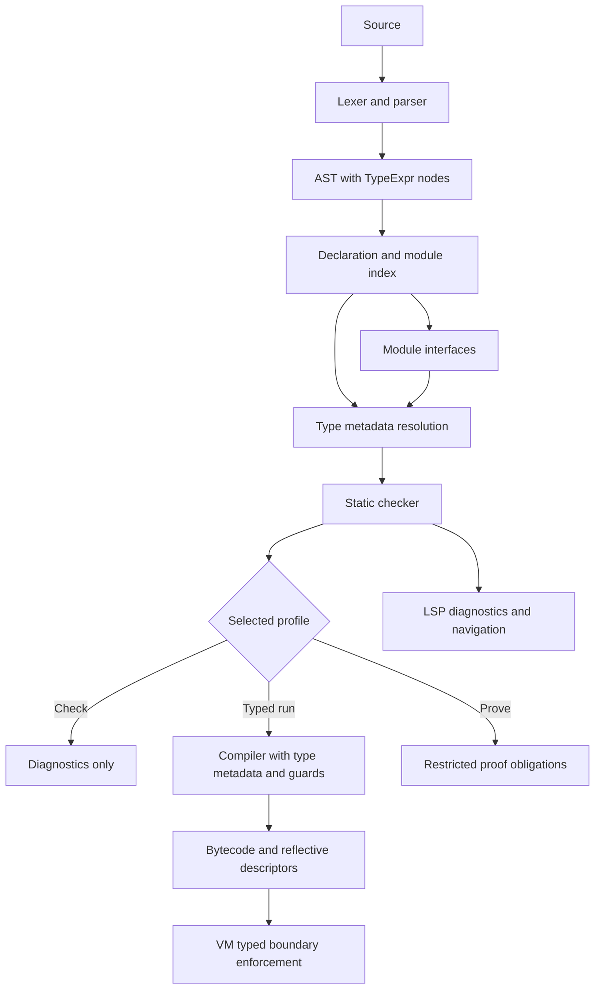

# Optional Reflective Typing: Architecture Compatibility Analysis

## Metadata

| Field | Value |
|---|---|
| Status | Draft architecture analysis; not an implementation commitment |
| Inspected date | 2026-08-13 |
| Scope | `phalcom-core/src/`, `phalcom-ast/src/`, `phalcom-lsp/src/`, CLI, runtime metadata, GC, bootstrap, and typing specifications |
| Repository state | Source inspection only; no source files changed by this analysis |
| Primary question | Can Phalcom add optional, non-erased, reflective typing with typed execution, CLI checking, static analysis, and bounded proving without making implicit dynamic typing the default? |

## Executive Summary

Phalcom can support the requested system, but not as a small checker bolted onto the current compiler. The runtime already has several favorable properties: stable heap handles, reflective class and method objects, a centralized method activation path, class-side identity, source spans, inline-cache versioning, and a precise tracing collector. These make retained type descriptors and optional runtime enforcement architecturally feasible.

The current implementation is nevertheless dynamic-first. Compilation goes directly from parsed AST to VM-coupled bytecode; the AST has no type-expression nodes; `phalcom check` performs syntax checking only; `MethodObject::Signature` contains selector and arity information but no type signature; and the VM has no type descriptor object or type guard. The current LSP shape inference is explicitly advisory and is not a formal type system.

The recommended architecture separates four concerns. First, source annotations are retained as immutable reflective metadata. Second, a VM-independent checker analyzes declarations, modules, expressions, calls, protocols, generics, and flow. Third, an explicit typed execution profile adds runtime checks at typed boundaries. Fourth, a restricted proving mode establishes type and flow obligations only under declared closed-world assumptions. Dynamic behavior remains available as an explicit compatibility profile or explicit `Dynamic` escape, but strict typed projects do not silently downgrade unresolved code to dynamic behavior.

This approach is compatible with ordinary selector dispatch only if types never become selector keys. It is incompatible with the older experimental erasure invariant once typed execution adds guards or runtime contracts. The newer typing specification already supports reflective metadata and non-dispatching type descriptors, but runtime enforcement, generic value witnesses, typed/untyped boundaries, and proving policy require a new decision layer.

## 1. Scope and Terminology

“Optional typing” has several meanings that must not be conflated:

1. **Optional syntax:** a declaration may omit an annotation.
2. **Retained metadata:** an annotation remains observable through reflection after compilation.
3. **Static checking:** a checker rejects invalid typed programs before execution.
4. **Typed execution:** the VM enforces selected type obligations while running.
5. **Proving:** a stronger static mode establishes specified obligations under explicit assumptions.

The requested design requires all five dimensions to be specified independently. Retaining annotations does not automatically imply runtime checking. Conversely, runtime checking does not automatically provide a sound whole-program proof when values can cross `doesNotUnderstand`, `perform`, reflection, native code, or dynamic module boundaries.

“No default dynamic typing” should mean that strict typed execution never silently treats unresolved code as `Dynamic`. It should not mean that the existing dynamic runtime must disappear immediately. A practical migration has an explicit legacy dynamic profile and a strict typed profile that is the default for new projects or language editions.

## 2. Repository Evidence and Current State

### 2.1 Front end currently has no type representation

`ParameterDef` stores the local name, external label, rest mode, and source range, but no annotation field. [`phalcom-ast/src/ast.rs:419-434`](</Users/altunhasanli/dev/phalcom/phalcom/phalcom-ast/src/ast.rs:419>) `MethodDef`, `GetterDef`, and `SetterDef` likewise store selectors, bodies, static status, constructor status, attributes, and ranges without parameter or result types. [`phalcom-ast/src/ast.rs:459-512`](</Users/altunhasanli/dev/phalcom/phalcom/phalcom-ast/src/ast.rs:459>) `LetBinding` stores only binding kind, pattern, initializer, and range. [`phalcom-ast/src/ast.rs:532-553`](</Users/altunhasanli/dev/phalcom/phalcom/phalcom-ast/src/ast.rs:532>)

The expression tree also has no `TypeExpr` branch. [`Expr`](</Users/altunhasanli/dev/phalcom/phalcom/phalcom-ast/src/ast.rs:654>) represents executable expressions only: literals, variables, sends, properties, indexes, blocks, method references, and products. A type-expression tree must remain separate from executable expressions so type syntax is not accidentally compiled as ordinary sends.

The lexer already recognizes `:`, `->`, `<`, `>`, and `?`, but these tokens have existing meanings or parser ambiguities. The class parser currently accepts only `class Name`, an optional superclass, and a body. [`phalcom-ast/src/parser.rs:1066-1112`](</Users/altunhasanli/dev/phalcom/phalcom/phalcom-ast/src/parser.rs:1066>) Parameter parsing deliberately rejects the old colon-style declaration form and requires label/local-name syntax without `:`. [`phalcom-ast/src/parser.rs:1689-1706`](</Users/altunhasanli/dev/phalcom/phalcom/phalcom-ast/src/parser.rs:1689>) Type syntax therefore needs an intentional grammar design, not only new AST fields.

### 2.2 Compilation is directly coupled to the VM

The compiler documentation describes an AST-to-bytecode compiler that materializes constants on the VM heap while emitting bytecode. [`phalcom-core/src/compiler/lib/mod.rs:1-9`](</Users/altunhasanli/dev/phalcom/phalcom/phalcom-core/src/compiler/lib/mod.rs:1>) `Compiler<'vm>` owns `&mut VM`, compilation state, binding facts, class context, loop context, and source information. [`phalcom-core/src/compiler/lib/mod.rs:54-174`](</Users/altunhasanli/dev/phalcom/phalcom/phalcom-core/src/compiler/lib/mod.rs:54>) It contains boundedness and definite-binding facts, but no type environment, declaration graph, subtype relation, or checker diagnostics.

The runtime entry point confirms the current pipeline: register source, call `parse_source`, construct `Compiler`, compile the program, and return a closure. [`phalcom-core/src/interpret.rs:133-143`](</Users/altunhasanli/dev/phalcom/phalcom/phalcom-core/src/interpret.rs:133>) No type pass occurs between parsing and code generation.

### 2.3 Bytecode and callable metadata contain no types

`Chunk` stores instructions, constants, source spans, source identity, and inline/global caches. [`phalcom-core/src/chunk.rs:42-68`](</Users/altunhasanli/dev/phalcom/phalcom/phalcom-core/src/chunk.rs:42>) It has no type side table. `Callable` stores bytecode, slots, upvalues, arity, parameter shape, selector name, and local names. [`phalcom-core/src/callable.rs:19-37`](</Users/altunhasanli/dev/phalcom/phalcom/phalcom-core/src/callable.rs:19>) Its parameter metadata describes call shape, not value types.

The bytecode set contains ordinary local/global/field access, sends, returns, closures, guards for sacred control-flow paths, and collection construction, but no type-check instruction. [`phalcom-core/src/bytecode.rs:93-210`](</Users/altunhasanli/dev/phalcom/phalcom/phalcom-core/src/bytecode.rs:93>) Typed execution can add explicit guard opcodes or call a trusted checker, but either choice is a new compiler/VM contract.

### 2.4 Dispatch is selector-based and should remain so

`Signature` currently contains the canonical selector, selector kind, positional arity, and rest layout. [`phalcom-core/src/method/mod.rs:82-121`](</Users/altunhasanli/dev/phalcom/phalcom/phalcom-core/src/method/mod.rs:82>) Selector encoding is centralized in `encode_selector`. [`phalcom-core/src/method/mod.rs:124-143`](</Users/altunhasanli/dev/phalcom/phalcom/phalcom-core/src/method/mod.rs:124>)

Type annotations must not be added to selector identity. A method declared as `move(_: Int)` must have the same selector identity as the corresponding untyped method. Type-based overloads would require a second dispatch key, invalidate one-probe lookup, complicate open families, and change the language from message dispatch to type-directed dispatch.

The type signature should therefore be an optional metadata field associated with the method, not part of `encode_selector`, `Signature::selector`, inline-cache keys, or method-table indexing.

### 2.5 Runtime reflection already provides strong attachment points

`Object` is an exhaustive tagged heap enum containing classes, methods, modules, closures, instances, collections, fibers, families, and compiler builders. [`phalcom-core/src/heap/object.rs:21-139`](</Users/altunhasanli/dev/phalcom/phalcom/phalcom-core/src/heap/object.rs:21>) It has no `TypeDescriptor`, `Protocol`, or `TypeParameter` variant.

`ClassObject` already stores methods, rest methods, field slots, static slots, class-name indexes, retained attribute values, and attribute-freezing state. [`phalcom-core/src/heap/class.rs:25-75`](</Users/altunhasanli/dev/phalcom/phalcom/phalcom-core/src/heap/class.rs:25>) `MethodObject` already stores a signature, holder, access owner, contract metadata, retained attributes, and frozen-state information. [`phalcom-core/src/method/object.rs:167-205`](</Users/altunhasanli/dev/phalcom/phalcom/phalcom-core/src/method/object.rs:167>)

These fields make reflection-compatible type metadata feasible. Dedicated typed fields are preferable to placing type descriptors only in the generic attribute vector: type metadata has stronger ownership, immutability, identity, and validation requirements than ordinary user attributes.

### 2.6 Runtime activation and storage are enforceable, but currently unchecked

The VM has a common method activation path for closures and shape-aware native primitives. [`phalcom-core/src/vm/send.rs:238-323`](</Users/altunhasanli/dev/phalcom/phalcom/phalcom-core/src/vm/send.rs:238>) Reflected method invocation also funnels through `invoke_method_object`. [`phalcom-core/src/vm/send.rs:747-775`](</Users/altunhasanli/dev/phalcom/phalcom/phalcom-core/src/vm/send.rs:747>) These are good locations for argument-boundary enforcement.

Field storage is direct. `Bytecode::SetField` writes the value into an instance or class slot without a type check. [`phalcom-core/src/vm/dispatch.rs:1603-1647`](</Users/altunhasanli/dev/phalcom/phalcom/phalcom-core/src/vm/dispatch.rs:1603>) Return handling surfaces the value and unwinds the frame without a type check. [`phalcom-core/src/vm/dispatch.rs:1769-1785`](</Users/altunhasanli/dev/phalcom/phalcom/phalcom-core/src/vm/dispatch.rs:1769>) Typed execution would need explicit checks at these boundaries, including `ReturnNonLocal`, native returns, upvalue stores, globals, collection mutation, and reflected calls.

### 2.7 Heap and GC are compatible with descriptor graphs

The collector performs precise non-moving mark-sweep tracing through explicit `Object` arms. [`phalcom-core/src/heap/trace.rs:71-233`](</Users/altunhasanli/dev/phalcom/phalcom/phalcom-core/src/heap/trace.rs:71>) New type objects can participate in recursive descriptor graphs, including owner-to-parameter and parameter-to-owner relationships, if each edge is traced and rooted correctly.

Adding descriptor variants will require exhaustive updates to object accessors, debug/display paths, heap kind reporting, tracing, tests, and bootstrap. A Rust-only side table would avoid new `Object` variants but would weaken reflective identity and make GC ownership less clear.

### 2.8 Module loading is execution-oriented

`import_module` resolves and registers a module before compiling it, then compiles and re-entrantly executes its top-level closure. [`phalcom-core/src/interpret.rs:211-281`](</Users/altunhasanli/dev/phalcom/phalcom/phalcom-core/src/interpret.rs:211>) This is appropriate for runtime imports but unsuitable for a static checker that must analyze an entire import graph without executing top-level code.

Typed checking requires a separate source/module analysis loader with declaration indexing, interface construction, cycle handling, and no top-level execution. The runtime module registry and the checker module graph should not be the same mutable object, although both can share canonical module identities and source-resolution rules.

### 2.9 CLI `check` and compile modes are not typing modes

The CLI currently describes `Check` as lexing and parsing only. [`phalcom-core/bin/phalcom/cli.rs:96-149`](</Users/altunhasanli/dev/phalcom/phalcom/phalcom-core/bin/phalcom/cli.rs:96>) `cmd_check` calls `parse_source` and emits syntax diagnostics, without compiling, resolving imports, or running semantic analysis. [`phalcom-core/bin/phalcom/cli.rs:271-310`](</Users/altunhasanli/dev/phalcom/phalcom/phalcom-core/bin/phalcom/cli.rs:271>)

The existing `--release`, `--unchecked`, and `--strip-contract-metadata` flags concern contract weaving and metadata retention. [`phalcom-core/bin/phalcom/cli.rs:14-57`](</Users/altunhasanli/dev/phalcom/phalcom/phalcom-core/bin/phalcom/cli.rs:14>) They should not be repurposed for typing.

### 2.10 LSP inference is useful but not formal typing

The current LSP `ValueShape` model tracks observed runtime shapes such as instances, class objects, products, collections, callables, families, and bounded unions. It explicitly states that this is advisory runtime knowledge and deliberately not a language type. [`phalcom-lsp/src/semantic/facts.rs:1-52`](</Users/altunhasanli/dev/phalcom/phalcom/phalcom-lsp/src/semantic/facts.rs:1>)

Inlay hints expose these observations with confidence levels and explicitly tell users that the result is editor inference, not a Phalcom annotation. [`phalcom-lsp/src/inlay_hints.rs:20-70`](</Users/altunhasanli/dev/phalcom/phalcom/phalcom-lsp/src/inlay_hints.rs:20>) This is a good basis for shared indexing, receiver-aware dispatch, flow provenance, and dependency invalidation, but formal declarations and proof obligations must use a separate type domain.

The LSP semantic files were already dirty and partially uncommitted at inspection time. They should be treated as active work, not as a shipped typing implementation.

## 3. Compatibility Assessment

| Layer | Assessment | Reason |
|---|---|---|
| Lexer | High | Most punctuation already tokenizes; grammar meaning remains to be defined. |
| AST/parser | Medium | Requires a dedicated `TypeExpr` tree and changes to declaration grammar. |
| Static checker | Medium-high | Can be added as an independent phase, but requires module indexing and semantic infrastructure. |
| Compiler | Medium | Current compiler is VM-coupled and has no type environment; typed code generation needs a new mode. |
| Bytecode | Medium | Metadata-only typing needs no new opcode; typed execution needs guards or trusted runtime calls. |
| Dispatch | High if types remain non-dispatching | Existing selector identity and inline caches can remain unchanged. |
| Reflection | High | `ClassObject`, `MethodObject`, attributes, source ranges, and handles are suitable attachment points. |
| GC | Medium-high | Descriptor graphs fit the collector, but all new edges require exhaustive tracing. |
| Bootstrap | Medium-low | `Type`, `Protocol`, descriptor shells, and core annotations introduce initialization ordering. |
| Module checking | Medium-low | Runtime imports execute modules and need a separate analysis loader. |
| LSP | Medium-high | Existing semantic database is a useful foundation, but `ValueShape` must not become the formal type system. |
| Typed default policy | Low without migration | Existing source and runtime assume dynamic semantics; strict default requires a profile or edition transition. |
| Whole-program proving | Restricted | Open dispatch, reflection, dNU, native code, and fibers require a bounded closed-world subset. |

## 4. Proposed Semantic Architecture



### 4.1 Type metadata must be non-erased

Every declaration that carries an annotation should retain two related records:

1. **Source annotation record:** exact source spelling, source range, and absence/presence information.
2. **Resolved descriptor:** canonical runtime type expression used by reflection, checking, and optional enforcement.

Absent annotations should remain distinguishable from explicit `Dynamic`. The latest typing design records this requirement: reflection preserves absence as `None`, while a later checker may interpret absence according to its selected policy. [`docs/spec/typing/01-protocol-foundation.md:181-187`](</Users/altunhasanli/dev/phalcom/phalcom/docs/spec/typing/01-protocol-foundation.md:181>)

Suggested metadata associations:

| Declaration | Metadata |
|---|---|
| Class/protocol | generic signature, source metadata, type identity, protocol requirements |
| Method/getter/setter | parameter type list, result type, method type parameters, source ranges |
| Field | declared type, mutability, initialization policy |
| Callable/block | parameter and result types, capture/type environment |
| Module/global | exported type, binding policy, interface provenance |
| Type parameter | owner identity, declaration index, variance, bound or finite constraint |

The latest typing series already proposes first-class immutable `Protocol`, `TypeDescriptor`, and `TypeParameter` objects, while preserving normal selector identity and non-dispatching metadata. [`docs/spec/typing/STATUS.md:7-35`](</Users/altunhasanli/dev/phalcom/phalcom/docs/spec/typing/STATUS.md:7>) [`docs/spec/typing/STATUS.md:40-57`](</Users/altunhasanli/dev/phalcom/phalcom/docs/spec/typing/STATUS.md:40>)

### 4.2 Checker pipeline

The checker should not depend on executing the VM. Its core inputs should be parsed source snapshots, declaration indexes, module interfaces, and immutable type descriptors. A suitable sequence is:

1. Parse all reachable source units.
2. Index classes, protocols, methods, fields, globals, imports, and type parameters.
3. Allocate recursive declaration shells for protocols and generic owners.
4. Resolve type expressions and validate ownership, arity, bounds, and variance.
5. Build module interfaces before checking bodies.
6. Check expressions bidirectionally: synthesize types bottom-up and check against expected types top-down.
7. Record flow facts, callable summaries, dependencies, and proof obligations.
8. Emit diagnostics and an immutable typed analysis result.
9. Compile only after the selected checking policy succeeds.

This is compatible with the existing LSP semantic architecture, but the formal checker should be shared by CLI and LSP rather than duplicated inside either frontend.

### 4.3 Typed execution profiles

Use separate policy axes rather than one overloaded boolean:

| Profile | Static behavior | Runtime behavior |
|---|---|---|
| `strict` | Missing required boundary types and unresolved operations are errors. | Typed modules execute with boundary enforcement. |
| `check` | Analyze and report; no execution. | None. |
| `prove` | Require proof obligations to close under selected assumptions. | None. |
| `dynamic` | Existing behavior; no implicit type checking. | Existing dynamic sends and values. |
| `migration` | Warnings for unresolved or unannotated boundaries. | Dynamic execution, with optional metadata retention. |

Typed execution must not silently fall back to `dynamic` when a check fails. The typed runtime should either reject the module before execution or enforce the declared boundaries and report a typed runtime violation.

### 4.4 Runtime enforcement points

The first runtime implementation should enforce shallow, declaration-level obligations:

- method and constructor parameters on activation;
- method and constructor results on ordinary and non-local return;
- typed field writes;
- typed global and upvalue writes;
- typed closure/block arguments and results;
- reflected invocation through `Method` and `BoundMethod`;
- native primitive input and output boundaries.

The `call_method_with_selector_as` path is the principal method-entry seam. [`phalcom-core/src/vm/send.rs:259-323`](</Users/altunhasanli/dev/phalcom/phalcom/phalcom-core/src/vm/send.rs:259>) The implementation must also cover legacy primitives, closures invoked through `Function`, reflected calls, and family forwarding. A check placed only in ordinary bytecode `Invoke` would be bypassable.

For fields and mutable containers, enforcement must occur at writes, not only at reads. Otherwise a typed field or `List<Int>` can be corrupted through an untyped alias. The current direct slot writes and native collection methods therefore become typed boundary APIs.

### 4.5 Generics and reification choice

Generic annotations require an explicit runtime policy:

- **Static-only generic arguments:** cheap, but typed execution cannot claim element-level runtime safety.
- **Type witnesses:** containers or callable values retain a descriptor for their applied type; this is reflective and enforceable but changes representation and allocation.
- **Deep contracts:** every mutation and possibly every read validates elements; preserves existing representation but adds potentially large runtime cost.

The current typing design says applied types are synthetic descriptors and do not create reified generic instances. [`docs/spec/typing/STATUS.md:77-89`](</Users/altunhasanli/dev/phalcom/phalcom/docs/spec/typing/STATUS.md:77>) That decision is compatible with static checking, but not with a claim that `List<Int>` is dynamically enforced unless a later document adds witnesses or deep contracts.

## 5. Dynamic Boundaries and Soundness

Phalcom’s object model makes a completely sound optional type system difficult without a restricted typed subset. A method can be absent from the visible method table but supplied by `doesNotUnderstand`. `perform` can select a method dynamically. `Family` values defer selector resolution. Reflection and native primitives can bypass static assumptions. Method definitions can affect the VM world version and invalidate inline caches.

The typed system therefore needs explicit boundary rules:

1. `Dynamic` values permit arbitrary sends but produce no statically trusted result.
2. A typed method receiving `Dynamic` must either check or reject the value before using it as a more precise type.
3. `perform` produces `Dynamic` unless the selector is statically known and checked.
4. Structural protocol conformance must account for dNU and forwarding proxies. A declaration may be marked trusted, or strict typed mode may reject it.
5. Typed modules must declare whether dynamic imports and native calls are trusted, checked, or forbidden.
6. Method redefinition must reject incompatible typed metadata or invalidate all dependent analysis and runtime assumptions.

The older experimental typing note explicitly chose no runtime contracts and no soundness guarantee at dynamic boundaries. [`docs/spec/typing/typing.md:85-90`](</Users/altunhasanli/dev/phalcom/phalcom/docs/spec/typing/typing.md:85>) [`docs/spec/typing/typing.md:293-309`](</Users/altunhasanli/dev/phalcom/phalcom/docs/spec/typing/typing.md:293>) That is a coherent erasable design, but it does not satisfy typed execution with runtime enforcement.

## 6. Default Policy: Avoiding Implicit Dynamic Semantics

The strict policy should be project- or module-scoped rather than inferred ad hoc from individual annotations. A proposed policy is:

- New projects default to `typing = strict` in a project manifest or language edition.
- Existing projects retain an explicit `typing = dynamic` compatibility profile during migration.
- Annotations remain optional syntax, but strict mode rejects unresolved public signatures and unresolved uses unless the author writes `Dynamic`.
- Local inference may supply types where the checker can prove them.
- An explicit `migration` mode produces warnings while preserving dynamic execution.
- `phalcom run --typed` performs a whole-import-graph check before any module executes.
- There is no automatic “checker failed, run dynamically anyway” fallback.

This interpretation preserves optional annotations while ensuring that dynamic behavior is a declared capability rather than the silent default. Making strict typing the default for the current unannotated corpus would be a language migration, not a backward-compatible compiler feature.

## 7. CLI and Tooling Proposal

The existing syntax-only `check` command should gain semantic modes without changing its current diagnostic transport:

```text
phalcom check app.ph
phalcom check app.ph --types=strict
phalcom check app.ph --types=migration --format=json
phalcom prove app.ph --assume-sealed
phalcom run app.ph --typed
phalcom run app.ph --dynamic
```

Proposed CLI responsibilities:

| Command | Responsibility |
|---|---|
| `tokenize` | Lexer output only. |
| `parse` | AST output, including `TypeExpr`. |
| `check` | Syntax, declaration resolution, type checking, and diagnostics. No execution. |
| `prove` | Static proof obligations under explicit assumptions. No execution. |
| `run --typed` | Check full module graph, compile typed metadata/guards, execute. |
| `run --dynamic` | Explicit compatibility behavior. |
| `disasm` | Show bytecode plus optional type metadata and guard sites. |

JSON diagnostics should include diagnostic code, severity, source URI, source range, primary message, related declarations, inferred type, expected type, and the boundary assumption that caused a proof to stop.

## 8. Bootstrap, Security, and Optimization

### 8.1 Bootstrap

The VM bootstraps kernel classes and then compiles and runs `core.ph`. [`phalcom-core/src/vm/bootstrap.rs:152-221`](</Users/altunhasanli/dev/phalcom/phalcom/phalcom-core/src/vm/bootstrap.rs:152>) First-class type descriptors introduce ordering constraints: `Type`, `Protocol`, and descriptor base objects must exist before annotated core declarations can resolve, while recursive protocols and generic signatures require shells before completion.

A robust bootstrap sequence is allocate shells, bind trusted identities, index declarations, resolve references, freeze descriptors, then execute ordinary code. The current allocate-then-patch handle model can support this, but bootstrap must explicitly root partially initialized descriptors.

### 8.2 Security

Type metadata must not allow user code to forge trusted compiler authority. Protocol and type descriptors should be immutable after compiler completion. Manual descriptor construction, if exposed, must be validated and must not create authoritative compiler metadata merely by matching field names.

Native descriptors must state whether they are trusted declarations, runtime-checked boundaries, or dynamic escapes. A native method that lacks a verified type contract must not be treated as statically proven merely because it has a Rust function pointer.

### 8.3 Optimization

Typed metadata must not let the optimizer remove existing dispatch or deoptimization guards unless the typed profile establishes stronger closed-world assumptions. `VM::world_version` and inline caches already recognize that method redefinition invalidates cached lookup. Type assumptions need equivalent invalidation or must be limited to immutable/sealed declarations.

Metadata-only typed compilation can preserve existing bytecode. Typed execution with checks cannot preserve byte-identical erasure: the typed artifact necessarily contains guard sites or a runtime enforcement mode. This is the direct incompatibility with the experimental erasure rule. [`docs/spec/typing/typing.md:170-186`](</Users/altunhasanli/dev/phalcom/phalcom/docs/spec/typing/typing.md:170>)

## 9. Functional Requirements

| ID | Requirement | Priority | Acceptance criterion |
|---|---|---:|---|
| FR-1 | Parse type annotations without changing unannotated grammar behavior. | P0 | Existing parser corpus passes; typed fixtures produce `TypeExpr` nodes. |
| FR-2 | Preserve source annotation presence, spelling/range, and resolved descriptor identity. | P0 | Reflection distinguishes absent annotation from explicit `Dynamic`. |
| FR-3 | Keep type metadata out of selector identity and method dispatch. | P0 | Typed and untyped declarations with the same selector resolve through the same method key. |
| FR-4 | Check a complete import graph without executing top-level source. | P0 | `phalcom check` detects cross-file type errors and import cycles safely. |
| FR-5 | Run a program in explicit typed mode after successful checking. | P0 | `run --typed` rejects failed checks before execution and enforces typed boundaries. |
| FR-6 | Enforce method parameters/results, fields, globals, upvalues, closures, and native/reflected boundaries. | P1 | Negative runtime fixtures fail at the declared boundary with source-linked errors. |
| FR-7 | Define generic runtime semantics explicitly. | P1 | `List<Int>` tests state whether checking is static-only, witness-based, or deep-contract based. |
| FR-8 | Expose formal checker diagnostics through CLI and LSP. | P1 | CLI JSON and LSP diagnostics share stable codes and ranges. |
| FR-9 | Provide a restricted proving mode with explicit assumptions. | P2 | Proof output lists closed obligations and remaining dynamic/trusted boundaries. |
| FR-10 | Keep dynamic behavior explicit and prevent silent fallback from strict typed mode. | P0 | Failed strict checking terminates before execution. |

## 10. Non-Functional Requirements

| Category | Requirement |
|---|---|
| Semantic stability | Type annotations do not alter ordinary selector identity, method lookup, allocation, or field layout. |
| Reflection | Descriptor identity and source metadata remain stable for the lifetime of the loaded module. |
| Performance | Dynamic mode pays no type-check cost; typed mode pays only for declared/enforced boundaries. |
| Diagnostics | Every checker and runtime type error carries source range, expected type, found type, and boundary context where available. |
| GC correctness | Every descriptor edge is traced; recursive descriptor graphs cannot be collected prematurely. |
| Security | Untrusted runtime objects cannot forge authoritative compiler-owned type metadata. |
| Incrementality | LSP invalidates dependent type facts when declarations, method signatures, imports, or world assumptions change. |
| Compatibility | Existing dynamic programs remain runnable under an explicit compatibility profile during migration. |

## 11. Implementation Plan

### Phase 0: Ratify semantic decisions

Resolve whether “non-erased” means metadata retention only or metadata plus runtime enforcement. Supersede the old erasure invariant if typed execution is required. Define `Dynamic`, protocol conformance, generic runtime semantics, typed/untyped boundaries, method redefinition, and default project policy before implementation.

### Phase 1: Type-expression and descriptor foundation

Add `TypeExpr` AST nodes and parser support. Add declaration indexing, immutable descriptor structures, source metadata, protocol shells, generic parameter identity, heap accessors, GC tracing, and bootstrap support. No static rejection or runtime enforcement yet.

### Phase 2: VM-independent static checker

Implement module interfaces, type environments, subtype/consistency relations, bidirectional checking, local inference, callable summaries, and stable diagnostics. Add `phalcom check --types=strict` without executing source.

### Phase 3: Reflective integration

Attach resolved method, field, callable, class, protocol, and module metadata. Add reflection APIs and tests for absent annotations, generic signatures, protocol requirements, source locations, ownership, and immutability.

### Phase 4: Typed execution

Add typed compilation policy, guard bytecodes or trusted runtime checks, activation/return/field/global/upvalue enforcement, reflected-call enforcement, and native boundary contracts. Add `run --typed`; prohibit silent dynamic fallback.

### Phase 5: Generic and protocol runtime semantics

Choose type witnesses or deep contracts where runtime generic safety is required. Define structural protocol checks, trusted forwarding proxies, cache invalidation, and dynamic boundary behavior.

### Phase 6: Proving and default migration

Implement restricted proof obligations. Add manifest/language-edition policy, make strict typing default for new projects, and retain explicit dynamic compatibility for existing code until migration completes.

## 12. Testing Strategy

### 12.1 AST and parser tests

Cover annotations on locals, parameters, results, fields, getters, setters, constructors, class-side methods, blocks, protocols, generic declarations, nested types, `Dynamic`, and absent annotations. Add ambiguity tests for product labels, call labels, comparison operators, `?`, and `<...>`.

### 12.2 Checker tests

Test declaration indexing, imports, cycles, class-side types, `Self`, protocol conformance, generic bounds, variance, block inference, field initialization, definite assignment, dynamic boundaries, `perform`, dNU, method references, and reflection metadata.

### 12.3 Runtime tests

Test argument, result, field, global, upvalue, closure, native, reflected, family, and non-local-return enforcement. Test that dynamic mode has no new guard behavior and typed mode rejects before execution when static checking fails.

### 12.4 GC and bootstrap tests

Stress recursive protocols, mutually recursive type expressions, generic owners, descriptor cycles, module unloading or collection scenarios, partially initialized bootstrap shells, and descriptor reflection after collection.

### 12.5 CLI/LSP tests

Test `check`, `prove`, `run --typed`, `run --dynamic`, JSON diagnostics, import graph errors, LSP diagnostics, hover declared types, hover inferred shapes, inlay hints, completion, definition routing, and invalidation after signature changes.

### 12.6 Proving tests

Every proof result should classify obligations as proven, assumed, dynamically escaped, trusted, or unknown. No result should report whole-program safety when an unresolved dynamic/native/reflection boundary remains.

## 13. Risks and Mitigations

| Risk | Impact | Mitigation |
|---|---|---|
| Type annotations become accidental dispatch keys | Language and cache invariants break | Keep descriptors outside selector encoding and method-table keys. |
| Typed mode silently weakens to dynamic | Users believe code is proven when it is not | Strict mode fails before execution; require explicit `Dynamic`. |
| Generic types claim safety without runtime witnesses | Typed containers can be corrupted by aliases | Choose static-only, witnesses, or deep contracts explicitly per type. |
| dNU and reflection defeat static conformance | False proofs and runtime surprises | Trusted boundary markers or reject dynamic forwarding in strict mode. |
| Method redefinition invalidates type assumptions | Stale checker results and unsafe optimization | Enforce compatible replacement or invalidate dependent metadata. |
| Descriptor cycles are not GC-traced | Use-after-sweep or corrupted reflection | Add exhaustive tracing tests for every new object edge. |
| Bootstrap order becomes circular | Core startup failure | Allocate trusted shells, publish identities, resolve, then freeze. |
| LSP inference is mistaken for formal checking | Incorrect diagnostics and user confusion | Share indexing infrastructure, but separate `ValueShape` from formal types. |
| Current unannotated corpus fails strict mode | Migration blockage | Add explicit language edition/profile and migration diagnostics. |
| Runtime checks create unacceptable overhead | Typed programs become slow | Check only declared boundaries, cache descriptor relations, and measure typed mode separately. |

## 14. Alternatives Considered

### 14.1 Pure erasable checker

This is the smallest implementation and preserves byte-identical output. It is compatible with the older experimental typing design but does not satisfy reflective runtime metadata or typed execution. It remains useful as a migration or lint mode, not as the complete requested system.

### 14.2 Gradual contracts everywhere

This provides stronger typed/untyped guarantees but introduces boundary wrappers, higher-order proxying, deep collection checks, blame tracking, and significant runtime cost. It is possible, but it would be a much larger semantic commitment than optional reflective metadata plus typed module enforcement.

### 14.3 Type-directed dispatch

This would allow argument-type overloads but conflicts directly with Phalcom’s selector identity, inline caches, open families, reflection, and current message-oriented object model. It should not be used as an extension of this typing design.

### 14.4 Rust-only side-table metadata

This avoids heap object changes but weakens language-level reflection, descriptor identity, module ownership, and GC guarantees. It is acceptable for compiler-internal temporary facts, not for user-visible reflective annotations.

## 15. Open Questions Requiring Decisions

1. Is a missing annotation interpreted as `Dynamic` in strict mode, or is it an error except for inferred locals?
2. Are type descriptors ordinary Phalcom objects, trusted VM objects, or both?
3. Are protocols first-class descriptor objects as proposed by the current typing series?
4. Which generic types receive runtime witnesses?
5. Does typed execution enforce structural protocol conformance or only nominal/runtime class shape?
6. Can typed code call methods implemented by `doesNotUnderstand`?
7. Are `perform`, open `Family`, and reflection permitted in strict typed modules?
8. Are native methods required to publish checked type contracts?
9. Can methods be redefined after typed compilation, and what compatibility relation applies?
10. Is strict typing the default for all programs, or only new language editions/projects?
11. Does `prove` mean type-safety proof only, or does it include effects, termination, resource, and behavioral properties?
12. What is the representation and runtime cost budget for typed guards and type witnesses?

## 16. Final Assessment

The architecture is a good host for optional reflective typing but not yet a typed architecture. Its strongest compatibility seam is the existing reflective object model: `ClassObject`, `MethodObject`, source-aware callables, stable handles, and explicit method activation can carry descriptors without changing ordinary dispatch. Its weakest seams are the absence of a type-expression AST, the VM-coupled compiler, execution-oriented module loading, dynamic forwarding/reflection, generic collections without witnesses, and the lack of a project-level typing policy.

The correct implementation is a layered system: retained descriptors first, independent static checking second, explicit typed execution third, and restricted proving last. The default policy should make dynamic behavior explicit rather than silently fallback. Existing dynamic behavior can remain available as a compatibility profile, but a strict typed run must check the complete import graph before executing and must report every trusted or dynamic escape.

This design preserves Phalcom’s selector-based object model while giving annotations real reflective identity and giving users an explicit path from editor information to checked execution and bounded proof.
