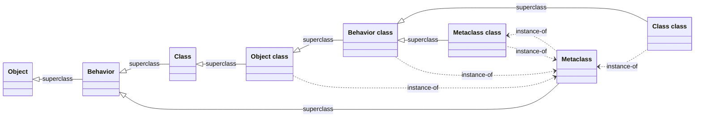

# Object Model

Part of the [Phalcom Language Specification](README.md). Status: Draft 0.1.

**Governing ADRs:**
[ADR-0002](../../adr/0002-metaclass-tower-parallel-rule.md) (metaclass tower parallel rule) ·
[ADR-0003](../../adr/0003-introduce-behavior-kernel-class.md) (Behavior kernel class) ·
[ADR-0009](../../adr/0009-handle-arena-heap.md) (handle/arena heap) ·
[ADR-0010](../../adr/0010-tagged-value-enum.md) (tagged Value enum)

This part defines the **kernel**: the class/metaclass tower and the catalog of
core classes. Surface semantics live in the sibling parts. It is reconciled with
the [Values & Absence](values-and-absence.md) decisions (private `nil` + `Option`,
abstract `Bool` with `True`/`False` subclasses ([ADR-0004](../../adr/0004-boolean-as-abstract-bool-with-true-false.md)),
`Block` as the closure class) and the instance-display decision in
[ADR-0015](../../adr/0015-object-default-tostring.md).

---

## 1. Principles

1. **Everything is an object.** `true`, `42`, `"hi"`, a block, a class, a method,
   a module — all respond to messages. (`nil` is the sole exception: it is a
   private VM sentinel, not a surface value — see [Values & Absence](values-and-absence.md).)
2. **Every object is an instance of exactly one class.** `value.class` is total.
3. **Every class is an object**, hence an instance of a class — its *metaclass*.
4. **Message send is the only computational primitive.** The compiler may
   *inline* some sends (`if`, `+`, `and`) but the semantics are method sends.
5. **Single inheritance.** One `superclass` per class; `Object` is the root.
6. **Uniform tower.** Class-side (`static`, `construct`) methods obey the same
   inheritance rules as instance-side methods, via the parallel metaclass
   hierarchy (§5, [ADR-0002](../../adr/0002-metaclass-tower-parallel-rule.md)). No class is special-cased to lack a metaclass.

---

## 2. Core rules

- Two relationships define the model:
  - **instance-of** (`x.class`): every object → its class. Never `nil`.
  - **inherits-from** (`C.superclass`): every class → its superclass, or *none*
    at the root (`Object`).
- **Method lookup** walks the *class* of the receiver up the `superclass` chain
  (see [Method Lookup](method-lookup.md)). It never consults the metaclass chain
  for an instance send, nor the instance chain for a class-side send.
- A class carries: a `name`, a `superclass`, a `metaclass` (its `.class`), a
  method dictionary keyed by **label-encoded selector symbol**
  (see [Messages & Selectors](messages-and-selectors.md)), and a fixed instance
  field layout (see [Classes §Fields](classes.md)).
- **Abstract** classes define protocol but are never the direct class of a live
  value (e.g. `Behavior`, `Number`). **Immediate/primitive** classes have live
  values in a non-`Instance` VM representation (e.g. `Float` → `f64`, `Int` →
  tagged `i64` / heap `LargeInt`).

---

## 3. Value representation

The VM's tagged value maps onto classes as follows. `x.class` is total for every
surface value; primitives bypass the generic instance representation.
**Ratified representation: [ADR-0010](../../adr/0010-tagged-value-enum.md).
Object references are `ObjRef` handles into the arena heap: [ADR-0009](../../adr/0009-handle-arena-heap.md).**

| Surface value | Class | Notes |
|---------------|-------|-------|
| `true` / `false` | `True` / `False` | abstract `Bool` with concrete singleton subclasses `True`/`False` ([ADR-0004](../../adr/0004-boolean-as-abstract-bool-with-true-false.md)); `true.class == True`. `ifTrue`/`ifFalse`/`and`/`or`/`not` live on `Bool`, inherited. |
| `42` | `Int` | exact, unbounded integer (§4 note; [ADR-0024](../../adr/0024-numeric-surface-split-int-float-and-division.md)) |
| `3.14` | `Float` | IEEE-754 `f64` (§4 note; [ADR-0024](../../adr/0024-numeric-surface-split-int-float-and-division.md)) |
| `"hi"` | `String` | immutable, interpolating |
| `#name` / selectors | `Symbol` | interned — see [Selectors, Symbols & References §2](selectors.md#2-symbol-literals-) for the name-symbol (`#name`) vs. selector-symbol (`#name(_,to,duration)`) distinction |
| `{ x => … }` | `Block` | closures / block literals |
| a compiled method | `Method` | reified send target |
| `(3, 4)` | `Tuple` | fixed-arity product |
| `[1, 2]` | `List` | |
| `{ a: 1 }` | `Map` | |
| `Set(1, 2)` | `Set` | |
| `1..5` | `Range` | |
| `Some(v)` / `None` | `Option` | the only expression of absence |
| a reified failed send | `Message` | see [Method Lookup](method-lookup.md) |
| a class | its **metaclass** | `Foo.class` → `Foo class` |
| a user instance | its stored class | |
| a module | `Module` | |

> **`nil` has no row.** It exists in the VM as an implementation detail
> (uninitialized slots, internal sentinels) with no surface class, no literal,
> and cannot be produced by user code. Absence is `Option`.

---

## 4. Core class catalog

Legend — **A** = abstract, **I** = immediate/primitive representation,
**U** = ordinary heap instance.

### Kernel (the metaclass tower)

| Class | Superclass | Kind | Role |
|-------|-----------|------|------|
| `Object` | *(none)* | U | Root. Universal protocol: `==`, `!=`, `class`, `isA(_)`, `hash`, `toString`, `perform(_,_)`, `respondsTo(_)`, `doesNotUnderstand(_)`. |
| `Behavior` | `Object` | A | Shared protocol/state of anything that *has instances*: method dictionary, `superclass`, `name`, allocation, reflection. Superclass of `Class` and `Metaclass`. |
| `Class` | `Behavior` | U | The class of every *named* class. |
| `Metaclass` | `Behavior` | U | The class of every *metaclass*; each metaclass has exactly one instance (its class). |

> `Behavior` is an object-model refinement ratified by [ADR-0003](../../adr/0003-introduce-behavior-kernel-class.md);
> the top-level spec is silent on it and neither requires nor forbids it. It exists
> to give `Class` and `Metaclass` a shared home for `new`/`construct`/reflection
> and to keep the tower uniform.

### Primitives & singletons

| Class | Superclass | Kind | Role |
|-------|-----------|------|------|
| `Bool` | `Object` | A | Abstract boolean ([ADR-0004](../../adr/0004-boolean-as-abstract-bool-with-true-false.md)). Holds the control-flow protocol — `not`, `and(_)`, `or(_)`, `ifTrue(_)`, `ifTrue(_)ifFalse(_)` — inherited by `True`/`False`. `ifTrue`/`ifFalse` return `Option`. No value is directly of class `Bool`. |
| `True` / `False` | `Bool` | I | The two concrete singleton boolean classes; surface classes of `true`/`false` ([ADR-0004](../../adr/0004-boolean-as-abstract-bool-with-true-false.md)). Empty bodies — all behaviour is inherited from `Bool`. |
| `Number` | `Object` | A | Abstract numeric root ([ADR-0024](../../adr/0024-numeric-surface-split-int-float-and-division.md)). Holds the shared arithmetic/comparison protocol; no value is directly of class `Number`. |
| `Int` | `Number` | I | Exact, **unbounded** integer — tagged `i64` immediate, auto-promoting to a heap `LargeInt` (bignum) on overflow ([ADR-0009](../../adr/0009-handle-arena-heap.md)). Never wraps or traps. |
| `Float` | `Number` | I | IEEE-754 `f64`. |
| `String` | `Object` | U/I | UTF-8 text. Immutable, interpolating. |
| `Symbol` | `Object` | I | Interned identifier / selector. |
| `Option` | `Object` | U | `Some(_)` / `None`. `ifSome(_)`, `ifNone(_)`, `map(_)`, `orElse(_)`, `unwrapOr(_)`, `isSome`, `isNone`. |

> **`Bool` tower note ([ADR-0004](../../adr/0004-boolean-as-abstract-bool-with-true-false.md)).**
> `Bool` is abstract; `true`/`false` are instances of the concrete singleton
> subclasses `True`/`False`, so `true.class == True` is **surface-visible**. The
> six control selectors (`not`/`and`/`or`/`ifTrue`/`ifFalse`/`ifTrue:ifFalse:`)
> are native primitives on `Bool` and reached by inheritance; on the hot path the
> sacred-selector inliner ([control flow](control-flow.md); ADR-0018) elides the
> send entirely. `True`/`False` have empty bodies.
>
> **Numeric note ([ADR-0024](../../adr/0024-numeric-surface-split-int-float-and-division.md)).**
> `Number` is **abstract**, with two concrete immediate subclasses: `Int` (exact,
> unbounded — tagged `i64` immediate boxing to a heap `LargeInt` on overflow) and
> `Float` (`f64`). `1` is an `Int`, `1.0` a `Float`; `1 == 1.0` is `true` and
> `2.hash == 2.0.hash` (value-based). `/` is **true division** (`Int / Int →
> Float`); `~/` is **floor integer division** (spelled `~/` because `//` is the
> line-comment token). Only the *surface* split is normative here — the substrate
> (bignum `Int`) is future implementation work ([deferred-work.md §3](deferred-work.md)).

### Callables & reflection

| Class | Superclass | Kind | Role |
|-------|-----------|------|------|
| `Function` | `Object` | A | The call protocol: `call`, `call(_)`, `arity`, `name`. Abstract root of everything callable ([Functions](functions.md)). |
| `Block` | `Function` | U | First-class closure / block literal. Adds non-local return + home frame. |
| `Method` | `Function` | U | A reified compiled method. `signature`, `holder`, `bind(_)`. Sibling of `Block`, not a subtype of it. |

### Collections

| Class | Superclass | Kind | Role |
|-------|-----------|------|------|
| `Tuple` | `Object` | U | Fixed-arity product type. |
| `List` | `Object` | U | Growable ordered sequence. |
| `Map` | `Object` | U | Hash map (keys use `hash`/`==`). |
| `Set` | `Object` | U | Hash set. |
| `Range` | `Object` | U | Numeric range `a..b` / `a...b`. |

### Runtime & namespaces

| Class | Superclass | Kind | Role |
|-------|-----------|------|------|
| `Module` | `Object` | U | A compilation unit / namespace. |
| `System` | `Object` | U | The runtime service surface (class-side): `print(_)`, `clock`, `gc`, scheduler ([System](system.md)). |

### Concurrency

| Class | Superclass | Kind | Role |
|-------|-----------|------|------|
| `Fiber` | `Object` | U | Cooperative coroutine; the sole concurrency primitive. `call`, `yield(_)`, `try`, `isDone` ([Fibers & Futures](concurrency.md)). |
| `Future` | `Object` | U | Pending async result over `Fiber`. `await`, `then(_)`, `isReady` ([Fibers & Futures](concurrency.md)). |

### Errors

| Class | Superclass | Kind | Role |
|-------|-----------|------|------|
| `Error` | `Object` | U | Root of raisable errors. `message`, `raise`. |
| `MessageNotUnderstood` | `Error` | U | Raised by the default `doesNotUnderstand(_)`. |
| `DeadFrameError` | `Error` | U | Non-local `return` to a frame that no longer exists ([blocks](blocks.md)). |
| `TypeError` | `Error` | U | Wrong receiver/argument type. |
| `ArgumentError` | `Error` | U | Bad argument value/arity. |
| `RangeError` | `Error` | U | Index / bounds violation. |

---

## 5. The metaclass tower

This is the part the top-level spec does not detail. It is the invariant the
current implementation violates.

### Rules

Let `X class` denote the metaclass of class `X`.

1. Every class `X` has **exactly one** metaclass `X class`, created with it.
2. `X.class == (X class)`. A class-side send to `X` looks up in `X class` and its
   superclass chain.
3. **Every metaclass is an instance of `Metaclass`**: `(X class).class == Metaclass`.
4. **The metaclass hierarchy parallels the class hierarchy:**
   ```
   (X class).superclass == (X.superclass) class
   ```
   anchored by the **root rule**:
   ```
   (Object class).superclass == Class
   ```
5. The tower is closed at the top by:
   ```
   Metaclass.class == (Metaclass class)
   (Metaclass class).class == Metaclass        // closes the loop
   ```

Rule 4 is what makes `static`/`construct` methods inherit. The current tree wires
every metaclass's superclass to `Class`, breaking it (see
[Implementation Status](implementation-status.md)).

### Diagram



### The apex: exact relationships

| object | `.class` (instance-of) | `.superclass` |
|--------|------------------------|---------------|
| `Object` | `Object class` | *(none)* |
| `Behavior` | `Behavior class` | `Object` |
| `Class` | `Class class` | `Behavior` |
| `Metaclass` | `Metaclass class` | `Behavior` |
| `Object class` | `Metaclass` | `Class` |
| `Behavior class` | `Metaclass` | `Object class` |
| `Class class` | `Metaclass` | `Behavior class` |
| `Metaclass class` | `Metaclass` | `Behavior class` |

Sanity checks that must hold after bootstrap:

- `Object.class.class == Metaclass`
- `Metaclass.class.class == Metaclass` (the closed loop)
- `Number.class.superclass == Object.class` (parallel rule; the current bug)
- Walking any metaclass's superclass chain terminates at `Class → Behavior →
  Object → (none)`.

---

## 6. Bootstrap construction order

The circularity is resolved by allocating first and wiring second.

1. **Allocate** the kernel classes and their metaclasses as bare objects with
   `class`/`superclass` unset: `Object`, `Behavior`, `Class`, `Metaclass` and
   `Object class`, `Behavior class`, `Class class`, `Metaclass class`.
2. **Wire instance-of:** every metaclass's `.class` = `Metaclass`;
   `Metaclass.class` = `Metaclass class`; each ordinary class's `.class` = its
   own metaclass.
3. **Wire superclasses (instance side):** `Object←none`, `Behavior←Object`,
   `Class←Behavior`, `Metaclass←Behavior`.
4. **Wire superclasses (metaclass side)** by rule 4: `Object class←Class`, then
   each other `X class ← (X.superclass) class`.
5. **Create remaining core classes** with a helper `(name, superclass)` that
   builds `name` and `name class` such that `name.class == name class`,
   `(name class).class == Metaclass`, and
   `(name class).superclass == superclass.class`.
6. **Install primitives** onto the instance side or the metaclass (class side).
7. **Run `verify_invariants()`** — assert every check in §5. This makes the tower
   self-checking and is the regression guard for all later changes.

---

## 7. Method resolution (summary)

Full algorithm in [Method Lookup](method-lookup.md). In brief:

- Methods are keyed by a **label-encoded selector symbol** (arity *and* labels),
  so `foo`, `foo()`, `foo(_)`, and `move(to,duration)` are distinct.
- **Instance send** starts at `recv.class`; **class-side send** starts at
  `Foo.class` (the metaclass). Both walk `superclass` identically.
- **`super`** starts at the superclass of the method's *defining* class.
- On exhaustion the send is reified as a `Message` and re-dispatched via
  `doesNotUnderstand(_)`.

---

## 8. Universal object protocol

Defined on `Object`, overridable everywhere:

| Signature | Meaning |
|-----------|---------|
| `class` | the receiver's class |
| `isA(_)` | is-kind-of test across the superclass chain |
| `==(_)`, `!=(_)` | identity by default; value types override |
| `hash` | consistent with `==` |
| `toString` | display representation |
| `respondsTo(_)` | does lookup succeed for a selector |
| `perform(_,_)` | reflective send (selector, args) |
| `doesNotUnderstand(_)` | hook on failed lookup, given a `Message` |

`Behavior` adds (inherited by `Class` and `Metaclass`): `name`, `superclass`,
`methods`, allocation, and the machinery behind `construct` ([classes](classes.md)).

---

See [Implementation Status](implementation-status.md) for how today's tree differs
from this target.
</content>
